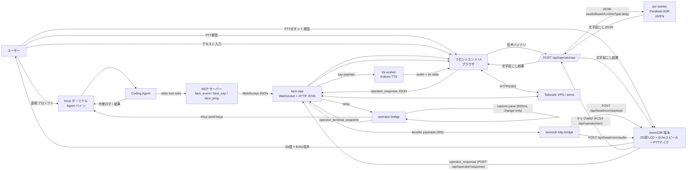
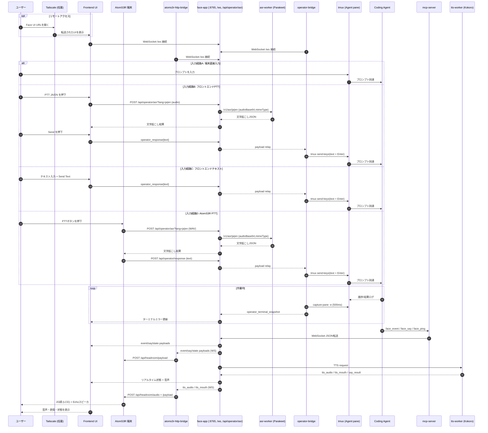

# minimum-headroom

<p>
  
  
</p>
<p>
  
  
</p>

[English](README.md) | [日本語](README.ja.md)

コーディングエージェント向けのフェイス・オペレーター支援アプリです。

## 目次

- [全体像（要点）](#ja-overview)
- [機能](#ja-features)
- [クイックスタート](#ja-quick-start)
- [エージェント設定](#ja-agent-setup)
- [詳細ガイド](#ja-detailed-guides)
- [ドキュメント索引](doc/README.md)

<a id="ja-overview"></a>
## 全体像（要点）

- **スマホから PC のコーディングエージェントを操作** — モバイルブラウザで承認・入力・音声コマンドを送信できます。
- **Claude Code、Codex CLI、Antigravity CLI に対応** — ターミナルで動くエージェントなら何でも使えます。
- **tmux operator bridge** がブラウザ UI とエージェントペイン間の入出力を中継します。
- **3D フェイス + TTS + MCP シグナリング** でエージェントに声と表情を与え、状態をリアルタイムに反映します。
- **M12 vision サブシステム** — AtomS3R-M12 カメラ、diffusiongemma (vLLM) captioner、階層化された situation memory、`GET /situation` による agent context 注入、M12 Echo Base への音声 alert を追加します。[M12 Vision Guide](doc/guides/m12-vision.md#japanese) と [vision-worker README](vision-worker/README.md) を参照。
- **マルチエージェント対応**（実験的） — 分離 worktree に helper を生成し、権限プリセットとミッション追跡で管理します。[マルチエージェントガイド](doc/guides/multi-agent.md#japanese)を参照。
- **Tailscale Serve** でスマホ/タブレットから安全にリモートアクセス。

<a id="ja-features"></a>
## 機能

- **オペレーター入力** — 端末直接入力、ブラウザ PTT（JA/EN ASR）、テキスト入力、Desktop `Space`/`Shift+Space` 長押し安全装置、キー操作（`Esc`, `↑`, `Select`, `↓`）
- **ターミナルミラー** — tmux 末尾出力の読み取り専用スナップショット（500ms、変更時のみ）。実機の幅そのままで描画され、長い行は横スクロール。タッチ端末では指の位置を中心にピンチズーム、ダブルタップで等倍復帰
- **マルチエージェント**（実験的） — Desktop タイルまたは Mobile リストから helper の生成/フォーカス/削除、権限プリセット、ミッション割当・配信、owner inbox。バックグラウンドの stuck-detector が各 helper の tmux pane を監視し、既知の CLI モーダル（承認プロンプト、モデルピッカー、利用上限通知、サーベイ）を検出すると owner inbox に自動で `blocked` レポートを投函するので、ポーリング不要で停止に気づけます。[マルチエージェントガイド](doc/guides/multi-agent.md#japanese)を参照。
- **M12 vision** — AtomS3R-M12 カメラ + diffusiongemma (vLLM) captioner、change-gated SQLite memory と段階的 summary、`GET /situation` digest 注入、correction、keyword watch、Echo Base 音声 alert を提供します。[M12 Vision Guide](doc/guides/m12-vision.md#japanese) を参照。
- **MCP シグナリング** — `face.event` / `face.say` / `face.ping` およびエージェントライフサイクルツール（`agent.list`, `agent.spawn`, `agent.focus`, `agent.delete`, `agent.assign`, `agent.assignment.list`, `agent.inject`, `agent.report`, `agent.pane_snapshot`, `agent.pane_send_key`, `owner.inbox.*`）
- **3D フェイス** — 眉・目・口・頭のアニメーション、状態モード（`confused`, `frustration`, `confidence`, `urgency`, `stuckness`, `neutral`）、ドラッグ制御、パネル切替
- **TTS** — Kokoro ONNX + Misaki 既定、任意 Qwen3-TTS 日本語 backend、鮮度優先発話ポリシー。[TTS and Speech Guide](doc/guides/tts-and-speech.md#japanese) を参照。
- **ASR** — Parakeet batch、任意 Voxtral realtime。[Operator Stack and ASR Guide](doc/guides/operator-stack.md#japanese) を参照。
- **Looking Glass** WebXR 対応経路

## システムフロー図

静的エクスポート: [High-Level Flow PNG](doc/diagrams/high-level-flow.png), [Sequence Timeline PNG](doc/diagrams/sequence-timeline.png), [High-Level Flow SVG](doc/diagrams/high-level-flow.svg), [Sequence Timeline SVG](doc/diagrams/sequence-timeline.svg)

### ハイレベルフロー



### 時系列シーケンス



## 必要環境

- Node.js 20+（Node 24 推奨）
- `uv`（Python worker依存管理）
- Python 3.10+
- `ffmpeg`（推奨。ASR worker の webm/ogg/mp4 フォールバックデコードに使用）
- Linuxで音声出力する場合（任意）:
  - PortAudio (`libportaudio2`) + `sounddevice`
  - または ALSA `aplay`

<a id="ja-quick-start"></a>
## クイックスタート

> [!IMPORTANT]
> **英語が主な言語の方は `MH_KOKORO_VOICE=af_heart` を付けて起動してください。** Kokoro の
> 既定 voice は日本語向けの `jf_alpha` で、英語は `af_heart` の方が明らかに自然に聞こえます。
> 任意の起動コマンドの前に付けます。例：
> `MH_KOKORO_VOICE=af_heart ./scripts/run-operator-once.sh --profile default --audio-target browser`
> Kokoro voice は英語・日本語で共通なので、主に使う言語に合わせて選んでください。

目的に合わせて起動パスを選んでください。
開始前に、利用するコーディングエージェントで MCP 設定を行い（[エージェント設定](#ja-agent-setup) を参照）、エージェント向け `AGENTS.md` を設定し、`doc/examples/AGENT_RULES.md` の内容をエージェント指示へ反映してください。すぐ使えるひな形が必要なら、`doc/examples/AGENTS.sample.md` を project-local `AGENTS.md` のテンプレートとして使ってください。

モバイルUIをリモート利用する場合は、先に Tailscale Serve を起動しておくと便利です。

```bash
tailscale serve --bg 8765
```

任意の M12 vision backend:

```bash
./scripts/run-vision-stack.sh
# または: examples/rmh-voice-mode/start-rmh.sh --agent codex --with-vision
```

### docker / リモートエージェント向けに 0.0.0.0 でバインドする場合

MCP クライアントが docker など別ネットワーク名前空間で動く構成では、face-app をループバック以外にバインドする必要があります。シェル環境で `FACE_WS_HOST=0.0.0.0` を設定してください。

ループバック外へバインドする場合、`MH_FACE_AUTH_TOKEN` が必須です。長いランダム token を設定し、OS firewall / Tailscale の境界も維持してください。

```bash
export FACE_WS_HOST=0.0.0.0
export MH_FACE_AUTH_TOKEN="$(openssl rand -base64 32)"
```

`MH_FACE_AUTH_TOKEN` がない状態で `0.0.0.0` にすると、face-app は起動を拒否します。この token は HTTP API と WebSocket を保護します。静的 UI ファイルは、ブラウザが先に起動してから API/WS に token を付けられるよう公開のままです。

`0.0.0.0` にすると、ブロックしない限り LAN からも 8765 に到達可能になります。LAN 端末から触らせたくない場合は、LAN インタフェースだけを OS ファイアウォールで明示的に拒否してください(`lo` / `tailscale0` / `docker0` には触らないので tailscale・コンテナはそのまま動きます):

```bash
sudo ufw deny in on <lan-interface> to any port 8765 proto tcp
```

`<lan-interface>` は実際の有線/Wi-Fi 名(例: `enp129s0`, `eth0`, `wlan0`、`ip -brief addr` で確認)に置き換えてください。

Tailscale Serve 経由では、初回だけ token 付き URL を開いてください。

```text
https://<tailscale-host>:8443/?auth_token=<token>
```

ブラウザは `sessionStorage` に token を保存し、face-app も同じ origin の `mh_face_auth` cookie を設定します。その後、表示 URL からは token を取り除くため、モバイルのホーム画面ショートカットに token 付き URL を残す必要はありません。

PC ブラウザのローカルアクセスも同じ手順です。`http://127.0.0.1:8765/?auth_token=<token>` を初回だけ開き、その状態をブックマークしておけば次回からはワンクリック。`?auth_token=...` 無しで開くと、静的 UI は読み込まれても `/api/agents/state` が 401 になり、ダッシュボードに `agent state error` が出ます。

UFW など host firewall を `default deny incoming` で運用している場合、Docker bridge から host:`8765` / `8081` への ingress も落ちるので、Docker デフォルト address pool を明示的に許可してください。多くのディストロでは UFW は `sudo ufw enable` を実行するまで無効です(`sudo ufw status` で確認)。リモートマシンで初めて UFW を設定するときは、ロックアウト防止のため `sudo ufw enable` の **前**に `sudo ufw allow OpenSSH` を入れてください。

```bash
sudo ufw allow from 172.16.0.0/12 to any port 8765 proto tcp comment 'docker → face-app'
sudo ufw allow from 172.16.0.0/12 to any port 8081 proto tcp comment 'docker → llm backend'
sudo ufw reload
```

`172.16.0.0/12` は Linux 上の標準 Docker のデフォルトアドレスプールをカバーする範囲です。まず実際の bridge を確認してください:

```bash
docker network ls -q | xargs -I{} docker network inspect {} --format '{{.Name}} {{range .IPAM.Config}}{{.Subnet}}{{end}}'
```

`daemon.json` の `default-address-pools` で別レンジ(例: `10.200.0.0/16`)に変更している場合や、LAN 自体が `172.16/12` を採番している場合(企業 LAN にときどきあります、`ip -brief addr` で確認)は、特定 Docker network の subnet(例: `172.20.0.0/16`)に置き換え、`docker network create` / compose 側で subnet を固定して再作成時のずれを防いでください。家庭 LAN(`192.168/16` か `10/8`)+ 標準 Docker という典型構成なら、`172.16/12` ルールで LAN と Tailnet (`100.64/10`) は引き続き拒否されます。

token は、face-app・operator bridge・MCP forwarding を行う agent CLI を **起動するシェル**に存在している必要があります。`~/.config/minimum-headroom.env` を `.bashrc` から source している場合、非対話シェルや GUI 起動からは引き継がれません。`~/.profile` でも source するか、起動ラッパーで env を渡してください。MCP の WebSocket が 401 で落ちたときは、起動シェルで `set -a; . ~/.config/minimum-headroom.env; set +a` してから agent を立て直すと復旧します。

### Path A: Face + MCP（最小構成）

```bash
./scripts/setup.sh
./scripts/run-face-app.sh
```

その後、別ターミナルで:

```bash
./scripts/run-mcp-server.sh
```

これは、シンプルな face UI とシグナリングだけを使いたいとき向けです。`run-face-app.sh` は既定で operator panel を隠します。

- 利用中のコーディングエージェントが MCP クライアント設定からこのリポジトリの MCP サーバーを自動起動する場合、`./scripts/run-mcp-server.sh` は二重起動しないでください。
- 既定では `face-app` が `tts-worker` を子プロセス起動するため、`FACE_TTS_ENABLED=0` にしていない限り別ターミナルでの起動は不要です。既定 backend は Kokoro で、`face-app` 側を `TTS_ENGINE=qwen3` 付きで起動すると任意の Qwen3 worker 経路を使います。Kokoro の voice は既定で `jf_alpha` です。起動環境に `MH_KOKORO_VOICE=af_heart` など Kokoro の voice id を指定すると上書きできます。

### Path B: フルモバイル Operator Stack（推奨）

`./scripts/setup.sh` 実行後の推奨 1 発起動:

```bash
./scripts/run-operator-once.sh --profile realtime
```

これは、tmux 連携、browser PTT、terminal mirror、隠し復旧、bridge の安全な既定配線まで含む、いちばん実用的な構成です。特に Qwen3 TTS を使いたい理由がなければ、`--profile default` か `--profile realtime` から始めてください。

- `run-operator-once.sh` / `run-operator-stack.sh` は `face-app` を起動し、その `face-app` が既定で `tts-worker` を子起動します。`FACE_TTS_ENABLED=0` を指定しない限り、別ターミナルでの TTS 起動は不要です。`qwen3` / `qwen3-realtime` profile は、この子起動 worker に `TTS_ENGINE=qwen3` を渡して切り替えます。Kokoro profile では `MH_KOKORO_VOICE=af_heart` または `MH_KOKORO_VOICE=jf_alpha` を起動コマンドの前に付けると、英語・日本語で共通利用する voice を選べます。
- `run-operator-once.sh` は operator pane に `MH_FACE_AGENT_ID=__operator__` / `MH_FACE_AGENT_LABEL=Operator` を export し、統合 operator stack の任意起動 MCP server も同じ identity に束縛します。helper pane は spawn 時に割り当てられた helper id を受け取り、Docker 経由の helper command には `docker exec -e` でコンテナ内へ渡されます。
- MCP face tools は MCP server process に `MH_FACE_AGENT_ID` がある場合、`agent_id` を自動補完し、明示された id が束縛値と違う場合は対応方法つきで拒否します。MCP client が別の未束縛 server を起動する構成では、`MH_FACE_AGENT_ID` を正として `face_ping` / `face_event` / `face_say` の全 call に `agent_id` を明示してください。
- `--agent-cmd` は primary operator pane だけを指定します。`MH_AGENT_DEFAULT_CMD` は、あとで helper を追加するときに `face-app` が使う helper-agent 起動テンプレートです。この helper テンプレートが `docker exec` で始まる場合、Minimum Headroom は helper ごとの `MH_FACE_AGENT_ID` / `MH_FACE_AGENT_LABEL` を `docker exec -e` で挿入します。Docker でない場合は `env ...` を command の前に付けます。Docker の具体例は[Operator Stack Guide](doc/guides/operator-stack.md#ja-docker-and-helper-agent-commands)を参照してください。
- profile の意味:
  - `--profile default`: Kokoro TTS + batch ASR のみ
  - `--profile realtime`: Kokoro TTS + Voxtral realtime ASR + Parakeet fallback
  - `--profile qwen3`: Qwen3 TTS + batch ASR のみ
  - `--profile qwen3-realtime`: Qwen3 TTS + Voxtral realtime ASR + Parakeet fallback
- このアプリを使って別の作業リポジトリを扱う場合は、その target repository 側にも project-local な `AGENTS.md` を置いてください。`doc/examples/AGENTS.sample.md` を出発点にして、その repo 固有の build/test/run ルールを追記するのが簡単です。
- 別の作業リポジトリで使う起動方法は、次の 2 通りが実用的です。
  - このリポジトリ側から `--repo /path/to/target-repo` を付けて起動する
  - target repository 側へ `cd` してから `/path/to/MinimumHeadroom/scripts/run-operator-once.sh ...` を呼ぶ

起動後のマルチエージェント操作については[マルチエージェントガイド](doc/guides/multi-agent.md#japanese)を参照してください。

よく使う派生例:

```bash
# minimum-headroom を operator shell として使いながら、別 repo を作業対象にする
./scripts/run-operator-once.sh --profile realtime --repo /path/to/target-repo

# target repository 側から absolute path で script を呼ぶ
cd /path/to/target-repo
/path/to/MinimumHeadroom/scripts/run-operator-once.sh --profile realtime

# まず agent ペインをシェルだけで開く
./scripts/run-operator-once.sh --profile realtime --agent-shell

# 直前の Codex セッションを再開
./scripts/run-operator-once.sh --agent-cmd 'codex resume --last'

# 起動だけ行い、現在のシェルを維持
./scripts/run-operator-once.sh --profile realtime --no-attach

# Qwen3 TTS を使いたい時だけ明示的に選ぶ
./scripts/run-operator-once.sh --profile qwen3-realtime

# リモート出力のみ（PC ブラウザ／スマホ／AtomS3R 向けの推奨）
# worker のリモート先読みと、ブラウザ／Atom 側 FIFO キューが有効になり、
# 長文の文間ギャップが短くなります
./scripts/run-operator-once.sh --profile realtime --audio-target browser
```

`browser` / `local` / `both` の選び方は[音声出力先と UI モード](doc/guides/operator-stack.md#音声出力先と-ui-モード)を参照してください。

<a id="ja-agent-setup"></a>
## エージェント設定

個人用ローカル設定ファイルはリポジトリにコミットしないでください。

### Claude Code

CLI で MCP サーバーを追加:

```bash
claude mcp add --transport stdio \
  --env FACE_WS_URL=ws://127.0.0.1:8765/ws \
  minimum-headroom -- /ABS/PATH/minimum-headroom/scripts/run-bound-mcp-server.sh
```

権限プリセットとセキュリティ強化の詳細は [Claude Code setup](doc/examples/claude-code/README.md) を参照。

### Codex CLI

`doc/examples/codex/config.toml` をテンプレートとして使い、`~/.codex/config.toml` またはプロジェクト内 `.codex/config.toml` に配置。絶対パスは各自の環境に合わせてください。

```toml
[mcp_servers.minimum_headroom]
command = "/ABS/PATH/minimum-headroom/scripts/run-bound-mcp-server.sh"
args = []
env = { "FACE_WS_URL" = "ws://127.0.0.1:8765/ws", "MCP_TOOL_NAME_STYLE" = "underscore" }
```

`run-bound-mcp-server.sh` は MCP server を起動し、可能な場合は現在の agent process または親 process から `MH_FACE_AGENT_ID` / `MH_FACE_AGENT_LABEL` を引き継ぎます。Minimum Headroom から起動された operator/helper pane では、これにより `face_ping` / `face_event` / `face_say` の `agent_id` 省略が可能になります。

face-app をループバック外に bind して `MH_FACE_AUTH_TOKEN` が必要な場合、
同じ wrapper は現在の環境・親 process・`MH_FACE_ENV_FILE` から
`MH_FACE_AUTH_TOKEN` を転送します。既定の env file は
`~/.config/minimum-headroom.env` です。実 token は Codex config に
チェックインしないでください。

### Antigravity (CLI と GUI)

`agy` ターミナル CLI と Antigravity GUI (Electron アプリ) の両方に対応します。両者は `~/.gemini/` を共有しますが **MCP サーバ・skill の読み取りパスが異なる**ので、導入手順も別です — 詳細マトリクスは [Antigravity setup](doc/examples/antigravity/README.md) を参照。CLI は `agy plugin install` で `~/.gemini/antigravity-cli/plugins/` へ、GUI は `~/.gemini/config/mcp_config.json` を直接読み、skill は `~/.gemini/config/plugins/` 配下を見ます。hook は `hooks.json` を利用できます。現行 build では共有 `~/.gemini/settings.json` snippet も使えます。事前に `mcp_config.json`、`hooks.json`、`settings-hooks.snippet.json` の `/ABS/PATH/minimum-headroom` をご自分のチェックアウトの絶対パスへ置換してください。

```bash
# 0. doc/examples/antigravity/{mcp_config.json,hooks.json,settings-hooks.snippet.json} の
#    /ABS/PATH/minimum-headroom を絶対パスへ置換

# --- CLI (agy) ---
agy plugin install doc/examples/antigravity                   # 冪等
# 任意: skill も入れて /skills に出るようにする
mkdir -p ~/.gemini/antigravity-cli/plugins/minimum-headroom/skills/minimum-headroom-ops
cp doc/examples/skills/minimum-headroom-ops/SKILL.md \
   ~/.gemini/antigravity-cli/plugins/minimum-headroom/skills/minimum-headroom-ops/SKILL.md

# --- GUI ---
# 1. ~/.gemini/config/mcp_config.json に mcp_config.json をマージ
#    （このファイルが 0 バイトだと全 MCP が無音で落ちるトラップ。要確認）
# 2. plugin.json + skill を ~/.gemini/config/plugins/minimum-headroom/ 配下に配置
mkdir -p ~/.gemini/config/plugins/minimum-headroom/skills/minimum-headroom-ops
cp doc/examples/antigravity/plugin.json \
   ~/.gemini/config/plugins/minimum-headroom/plugin.json
cp doc/examples/skills/minimum-headroom-ops/SKILL.md \
   ~/.gemini/config/plugins/minimum-headroom/skills/minimum-headroom-ops/SKILL.md

# --- 共通: hook ---
# doc/examples/antigravity/hooks.json を使うか、plugin hooks を読まない agy build では
# settings-hooks.snippet.json を ~/.gemini/settings.json にマージ
```

インストール後 `agy` を再起動、GUI は **完全終了 → 再起動** (タスクトレイに残ったままだと設定を読み直しません)。CLI なら `/mcp`、GUI ならチャットで `List every MCP tool you can call right now` と聞くと `minimum_headroom` の `face_event` / `face_say` / `face_ping` 及び agent ライフサイクルツールが列挙されます。

詳細パスマトリクス、よくある失敗パターン (特に GUI の 0 バイト `mcp_config.json` トラップ)、権限プリセット、`GEMINI.md` ルール配置は [Antigravity setup](doc/examples/antigravity/README.md) を参照。RMH voice-first ランチャ `examples/rmh-voice-mode/start-rmh.sh --agent agy` は CLI のプラグインインストールをマシン固有のパス解決込みで自動実行します。

### Hook ブリッジ（face_say の安全網）

エージェントが `face_say` を呼び忘れて承認待ちで沈黙した場合や、最終 report なしで turn が終わった場合に、ランタイムの hook 機構から自動的に face を喋らせる仕組みです。Claude Code / Codex（新 `hooks` 系）/ Antigravity CLI に対応。

- ドロップインの設定例: `doc/hook-bridge/`
- 各ランタイムの setup README（Claude / Codex / Antigravity）にも同じスニペットを掲載
- 詳細な設定手順: `doc/hook-bridge/README.md`

`MH_FACE_AGENT_ID` が agent process に設定されていないとき hook は何もせず exit 0 で終了するため、関係ない別 session には影響しません。発話テンプレートは `~/.minimum-headroom/face-templates.json` で上書き可能（無い場合は日本語 + 英語の組込みデフォルト）。言語は直近の `face_say` 履歴から自動判定（CJK 文字 → `ja`、それ以外 → `en`）、`MH_FACE_LANG` がフォールバック。

Codex は user-defined hook を起動時に untrusted として silent skip するため、`~/.codex/config.toml` に hook 設定を追加した後に **1 回だけ** trust 付与が必要です。trust は user-level の `[hooks.state.*]` に永続化されるので、同じユーザーで起動する以降の全 codex プロセス（operator が spawn する helper も含む）が自動的に trust 状態を引き継ぎます。helper pane に毎回入って trust 操作する必要はありません。

最も簡単なのは同梱の `./scripts/grant-codex-hook-trust.sh` を実行する方法（裏側で短命 codex を 1 つ立てて自動的に trust → 終了）。手動でやる場合は普段使いの codex で 1 回 `/hooks` を開いて trust → 閉じる、で同じ効果。再 trust が必要になるのは hook の command/matcher を編集したときだけです。詳細は `doc/hook-bridge/README.md`。

### エージェント指示の設定

- target repository のルートに `AGENTS.md` を配置（`doc/examples/AGENTS.sample.md` をテンプレートとして使用）。
- `doc/examples/AGENT_RULES.md` のシグナリング規約をエージェント指示に含める。
- Claude Code は `CLAUDE.md`、Antigravity CLI (`agy`) は `GEMINI.md`、Codex CLI は `AGENTS.md` を読み込みます。

### Real Minimum Headroom (RMH) 音声優先ランチャ

AtomS3R に `firmware/atoms3r-headroom/` のファームを焼いた物理デバイスがある場合、`examples/rmh-voice-mode/` は Claude Code / Codex / Antigravity CLI のいずれでも AtomS3R で音声会話するためのワークスペース雛形です。

    examples/rmh-voice-mode/start-rmh.sh --agent {claude|codex|agy} [--model <id>]

RMH は LLM とハンズフリーで日常的に会話するための推奨経路です。画面を見ながら作業する場合、terminal mirror や承認操作が必要な場合は mobile operator stack（Path B）を使ってください。`--with-vision` を付けると CLI 起動前に `scripts/run-vision-stack.sh` を開始し、M12 の situation context と alert を利用できます。

スクリプトはリポジトリのルートを自動検出（ハードコーディングなし）し、`MH_FACE_AGENT_ID=__operator__` を export、CLI 別の MCP 設定をランタイムディレクトリへ展開してから、このフォルダ内で CLI を起動します。Codex では生成 config に hook も含めます。agy では MCP plugin をインストールし、hook 設定は上記 Antigravity 手順の 1 回限りの設定として残します。これにより `CLAUDE.md` / `AGENTS.md` / `GEMINI.md` の voice-first ルールが読み込まれ、回答は `face_say` で音声化されます。軽量モデル既定（Claude=`haiku`, Codex=`gpt-5-mini`）で RMH 会話のレスポンスを軽快に保ちます。詳細は `examples/rmh-voice-mode/README.md` を参照。

### ツール名スタイル

MCP クライアントがドット付きツール名（例: `face.event`）を受け付けない場合は、環境変数 `MCP_TOOL_NAME_STYLE=underscore` を設定。ツールは `face_event`, `face_say`, `face_ping` として公開されます。

<a id="ja-detailed-guides"></a>
## 詳細ガイド

- [ドキュメント索引](doc/README.md) — guide、example、spec、firmware、vision-worker への入口
- [Operator Stack and ASR Guide](doc/guides/operator-stack.md#japanese) — 起動スクリプトの選び方、tmux bridge、operator UI、キーボードショートカット、batch / realtime ASR、隠し復旧、Tailscale リモート運用
- [TTS and Speech Guide](doc/guides/tts-and-speech.md#japanese) — Kokoro / Qwen3 のセットアップ、発話ゲート、長文発話、発話前の正規化
- [M12 Vision Guide](doc/guides/m12-vision.md#japanese) — M12 perception flow、memory/forgetting、correction、keyword watch、音声 alert
- [マルチエージェントガイド](doc/guides/multi-agent.md#japanese) — helper の生成、権限プリセット、ミッション割当、owner inbox、worktree 分離、セキュリティ強化
- [AtomS3R Voice Guide](doc/guides/atoms3r-voice.md#japanese) — ハンズフリー VAD パイプライン、書き込み＋USB プロビジョニング、RMS と Silero、ADPCM、各チューニング（endSilence / 閾値 / tail / maxUtterance）、PTT、トラブルシュート
- [Tailscale トラベルルーター手順](doc/guides/tailscale-travel-router-setup.md#japanese) — Tailscale 非対応デバイス（AtomS3R 等）を、Tailscale 対応トラベルルーター経由で PC から到達させる subnet routing の手順。**双方向の ACL**（PC→デバイス／デバイス→PC＝顔の WebSocket ポート）を解説。デバイス→PC は ACL の `src` をトラベルルーターの **LAN CIDR** にする必要がある（ルーターはデバイスの元の送信元 IP をそのまま中継するため、ノード/グループ指定だけでは一致しない）。

## オプションスキル

`doc/examples/skills/` に再利用可能なスキルを同梱しています。

- `release-ci-flow`
- `minimum-headroom-ops`
- `looking-glass-webxr-setup`

各フォルダには `SKILL.md` があり、対応エージェントではローカルスキルディレクトリ（例: `$CODEX_HOME/skills/`）へコピーして利用できます。

minimum-headroom の operator/helper runtime を使う場合は、`minimum-headroom-ops` の導入を推奨します。`agent.list`, `agent.spawn`, `agent.assign`, `agent.inject`, `agent.assignment.list`, `owner.inbox.*`, `agent.delete` の標準フロー、`agent.pane_snapshot` / `agent.pane_send_key` による stuck helper 復旧フロー、helper report の規約をまとめています。

## リリースチェックリスト

- テスト実行:

```bash
npm test
```

- MCP起動確認:

```bash
./scripts/run-mcp-server.sh
```

- face-app起動とブラウザ表示確認:

```bash
./scripts/run-face-app.sh
```

- TTS worker smoke確認:

```bash
npm run tts-worker:smoke
```

- ASR worker smoke確認:

```bash
npm run asr-worker:smoke
```

- operator stack起動確認（tmux内 or `MH_BRIDGE_TMUX_PANE` 指定）:

```bash
./scripts/run-operator-stack.sh
```

## 補足

- 実行時ローカルファイル（モデル、ローカルMCP設定、キャッシュ、venv など）は `.gitignore` で除外されています。
- three.js は unpkg CDN ではなくローカル配信になりました（PR #65）。Face UI は外部 CDN の可用性に依存しません。
- ノイズ状の TTS 出力は opt-in の capture-only diagnostics で調査できます（PR #66）。env-gated で、WAV + JSON を `~/.cache/minimum-headroom/tts-captures` に保存します。

## 謝辞

- 本プロジェクトの AtomS3R ファームウェア（`firmware/atoms3r-headroom/`）は独自に実装したもので、**他のファームウェアからコードを流用していません**。AtomS3R 音声アシスタントの設計にあたり、[**StackChan_Minimal**（A-Uta 氏）](https://github.com/A-Uta/StackChan_Minimal)（Apache-2.0）を参考にさせていただきました。感謝します。
- ファームウェアは [M5Unified](https://github.com/m5stack/M5Unified)（MIT）および ESP32 Arduino core を基盤としています。
