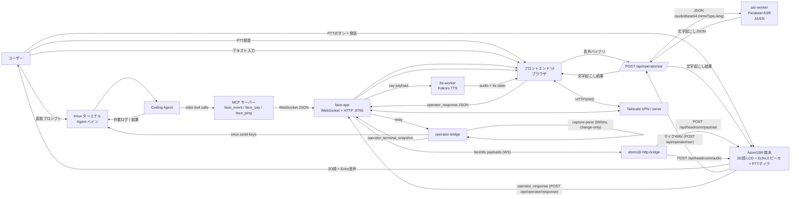
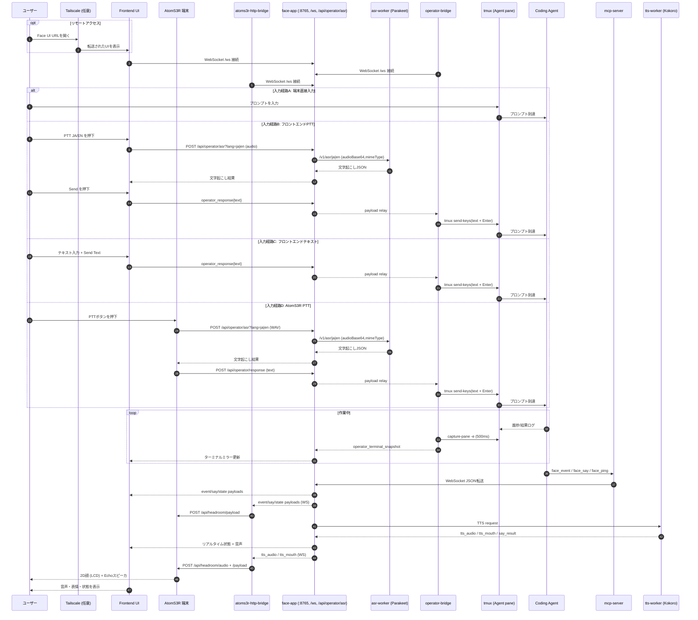

# minimum-headroom

<p>
  
  
</p>
<p>
  
  
</p>

[English](README.md) | [日本語](README.ja.md)

コーディングエージェント向けのフェイス・オペレーター支援アプリです。

## 目次

- [全体像（要点）](#ja-overview)
- [機能](#ja-features)
- [クイックスタート](#ja-quick-start)
- [汎用ブラウザメディア連携](doc/guides/generic-browser-media.md#japanese)
- [エージェント設定](#ja-agent-setup)
- [詳細ガイド](#ja-detailed-guides)
- [ドキュメント索引](doc/README.md#japanese)

<a id="ja-overview"></a>
## 全体像（要点）

- **スマホから PC のコーディングエージェントを操作** — モバイルブラウザで承認・入力・音声コマンドを送信できます。
- **独立した適応型通訳スタック** — モバイル画面の長押し操作から会話の言語ペアを学習し、音声による翻訳先変更にも追従します。4 つの起動プリセットから選んだ ASR／翻訳／TTS プロバイダーだけを起動し、通常のオペレーターとは別画面・別プロセスで動作します。[Interpreter Stack Guide](doc/guides/interpreter-stack.md#japanese) を参照。
- **Claude Code、Codex CLI、Antigravity CLI に対応** — ターミナルで動くエージェントなら何でも使えます。
- **tmux オペレーターブリッジ** がブラウザ画面とエージェントペイン間の入出力を中継します。
- **3D フェイス + TTS + MCP シグナリング** でエージェントに声と表情を与え、状態をリアルタイムに反映します。
- **任意の AtomS3R 卓上デバイス** — 名前のよく似た2種類の M5Stack 基板を追加できます: **AtomS3R**（顔＋音声入出力 — 話しかける物理の卓上フェイス）と **AtomS3R-M12**（カメラ＋音声出力 — 周囲状況の把握、マイク非搭載）。[AtomS3R Devices](doc/guides/atom-devices.md#japanese) を参照。
- **M12 視覚サブシステム** — AtomS3R-M12 カメラ、diffusiongemma（vLLM）による画像説明、階層化された状況メモリ、`GET /situation` によるエージェント文脈への注入、M12 Echo Base への音声アラートを追加します。[M12 Vision Guide](doc/guides/m12-vision.md#japanese) と [vision-worker README](vision-worker/README.md#japanese) を参照。
- **汎用ブラウザメディア** — 信頼済みのローカル MP3 配信元を1件だけ、URL をブラウザへ公開せず、認証済みのデスクトップ／モバイルブラウザへ 128 kbit/s で中継します。[汎用ブラウザメディア連携ガイド](doc/guides/generic-browser-media.md#japanese)を参照。
- **マルチエージェント対応**（実験的） — 分離ワークツリーにヘルパーを生成し、権限プリセットとミッション追跡で管理します。[マルチエージェントガイド](doc/guides/multi-agent.md#japanese)を参照。
- **Tailscale Serve** でスマホ/タブレットから安全にリモートアクセス。

<a id="ja-features"></a>
## 機能

- **オペレーター入力** — 端末直接入力、ブラウザ PTT（JA/EN ASR）、テキスト入力、デスクトップの `Space`/`Shift+Space` 長押し安全装置、キー操作（`Esc`, `↑`, `Select`, `↓`）
- **通訳スタック** — 英語表記の専用モバイル画面、自動言語判定、サーバー側で保持する 2 言語の会話状態、音声による翻訳先指定、Atom VAD による自動ターン、4 つのローカル起動プリセット
- **ターミナルミラー** — tmux 末尾出力の読み取り専用スナップショット（500ms、変更時のみ）。実機の幅そのままで描画され、長い行は横スクロール。タッチ端末では指の位置を中心にピンチズーム、ダブルタップで等倍復帰
- **マルチエージェント**（実験的） — デスクトップのタイルまたはモバイルのリストからヘルパーの生成/フォーカス/削除、権限プリセット、ミッション割当・配信、owner inbox を操作できます。バックグラウンドの停止検出が各ヘルパーの tmux ペインを監視し、既知の CLI モーダル（承認プロンプト、モデルピッカー、利用上限通知、サーベイ）を検出すると owner inbox に自動で `blocked` レポートを投函するので、ポーリング不要で停止に気づけます。[マルチエージェントガイド](doc/guides/multi-agent.md#japanese)を参照。
- **M12 視覚** — AtomS3R-M12 カメラ + diffusiongemma（vLLM）による画像説明、変化判定付き SQLite メモリと段階的な要約、`GET /situation` の要約注入、訂正、キーワード監視、Echo Base 音声アラートを提供します。[M12 Vision Guide](doc/guides/m12-vision.md#japanese) を参照。
- **MCP シグナリング** — `face.event` / `face.say` / `face.ping`、汎用 `media.play` / `media.stop` / `media.status`（[連携ガイド](doc/guides/generic-browser-media.md#japanese)）、エージェントライフサイクルツール（`agent.list`, `agent.spawn`, `agent.focus`, `agent.delete`, `agent.assign`, `agent.assignment.list`, `agent.inject`, `agent.report`, `agent.pane_snapshot`, `agent.pane_send_key`, `owner.inbox.*`）
- **3D フェイス** — 眉・目・口・頭のアニメーション、状態モード（`confused`, `frustration`, `confidence`, `urgency`, `stuckness`, `neutral`）、ドラッグ制御、パネル切替
- **TTS** — Kokoro ONNX + Misaki 既定、任意の多言語Supertonic/Qwen3-TTS、鮮度優先発話ポリシー。[TTS and Speech Guide](doc/guides/tts-and-speech.md#japanese) を参照。
- **ASR** — Parakeet バッチ処理、任意 Voxtral リアルタイム処理。[Operator Stack and ASR Guide](doc/guides/operator-stack.md#japanese) を参照。
- **Looking Glass** WebXR 対応経路

## システムフロー図

静的エクスポート: [High-Level Flow PNG](doc/diagrams/high-level-flow.png), [Sequence Timeline PNG](doc/diagrams/sequence-timeline.png), [High-Level Flow SVG](doc/diagrams/high-level-flow.svg), [Sequence Timeline SVG](doc/diagrams/sequence-timeline.svg)

### ハイレベルフロー



### 時系列シーケンス



## 必要環境

- Node.js 20+（Node 24 推奨）
- `uv`（Python ワーカー依存管理）
- Python 3.10+
- `ffmpeg`（推奨。ASR worker の webm/ogg/mp4 フォールバックデコードに使用）
- Linuxで音声出力する場合（任意）:
  - PortAudio (`libportaudio2`) + `sounddevice`
  - または ALSA `aplay`

### ハードウェア段階（Tiers）

フルセットのハードウェアは必須ではありません。各段階で前の段階に機能を加える構成になっており、コア機能は PC だけでも利用できます:

| 段階 | ハードウェア | できること |
|----|--------------|-----------|
| 段階 0 | Linux PC のみ（**GPU 不要**） | ブラウザの 3D 顔、Kokoro TTS（CPU）、Parakeet バッチ ASR（`MH_ASR_DEVICE=cpu`）、スマホ用オペレーター画面 — コア体験 |
| 段階 1 | + AtomS3R + Atomic Echo Base | 声と PTT・ハンズフリーマイクを備えた物理の卓上フェイス（RMH 体験） |
| 段階 2 | + ミドルレンジ NVIDIA GPU | リアルタイム ASR（Voxtral）とローカル推論の高速化 |
| 段階 3 | + 32GB VRAM GPU + AtomS3R-M12 +（Atomic Echo Base） | diffusiongemma による常時カメラ知覚、階層化された状況メモリ、音声シーンアラート |

32GB という数字は既定構成であってアーキテクチャ上の要件ではありません。視覚ワーカーは OpenAI 互換エンドポイント（`VISION_MODEL_URL`）なら何でも接続できるため、小型のローカル VLM やホスト型モデルを指せば、より軽いハードウェアでも段階 3 を動かせます。

<a id="ja-quick-start"></a>
## クイックスタート

<a id="ja-language-mh-lang"></a>
### 言語: 日本語 / 英語 (MH_LANG)

デプロイ全体の既定言語は `~/.config/minimum-headroom.env` に設定します。

```bash
MH_LANG=en
# または
MH_LANG=ja
```

視覚スタックとオペレータースタックは、次回の起動または再起動時にこのファイルを既定値として読みます。すでに環境変数で個別指定されている値は上書きされません。`MH_LANG` は diffusiongemma の場面説明言語、Kokoro の既定音声（`en` → `af_heart`, `ja` → `jf_alpha`; 明示的な `MH_KOKORO_VOICE` が優先）、ASR のフォールバック言語を切り替えます。

**顔 AtomS3R** は ASR 言語を端末側にも保持します（これは端末があなたの音声を取り込む言語です）。言語を変えるときは一度だけ再プロビジョニングしてください。これは**顔 AtomS3R だけ**に適用されます — AtomS3R-M12 カメラはマイクを持たないので `--asr-lang` は関係ありません。2デバイスの違いは [AtomS3R Devices](doc/guides/atom-devices.md#japanese) を参照。

```bash
node scripts/atoms3r-provision.mjs --asr-lang en
```

Kokoro の音声はアクセントに強く結びついています。`jf_alpha` の英語はかなり日本語訛りに聞こえ、`af_heart` の日本語も同じように不自然です。混在言語セッションでは Kokoro 音声を 1 つ選ぶ必要があります。TTS はチャンクごとにテキスト言語を自動判定し、エージェントは話しかけられた言語で返答します。

目的に合わせて起動パスを選んでください。
開始前に、利用するコーディングエージェントで MCP 設定を行い（[エージェント設定](#ja-agent-setup) を参照）、エージェント向け `AGENTS.md` を設定し、`doc/examples/AGENT_RULES.md` の内容をエージェント指示へ反映してください。すぐ使えるひな形が必要なら、`doc/examples/AGENTS.sample.md` をプロジェクトローカルな `AGENTS.md` のテンプレートとして使ってください。

うまく動かない場合は、まず `./scripts/doctor.sh` を実行して環境を確認してください。

モバイルUIをリモート利用する場合は、先に Tailscale Serve を起動しておくと便利です。

```bash
tailscale serve --bg 8765
```

任意の M12 視覚バックエンド:

```bash
./scripts/run-vision-stack.sh
# または: examples/rmh-voice-mode/start-rmh.sh --agent codex --with-vision
```

### Ubuntu 24.04+ の Codex bubblewrap 警告

Codex 起動時に bubblewrap / user namespace に関する警告が出る場合、多くは Ubuntu 24.04+ のホスト側 AppArmor 制限です。`./scripts/doctor.sh` を実行すると Codex に同梱された `bwrap` 向けの AppArmor プロファイル修正案が表示されます。この修正がないと、Codex のサンドボックスモードはコマンドを実行できません。修正までの間、ヘルパーは `-s danger-full-access` でサンドボックスなしに起動できます。

### Docker / リモートエージェント向けに 0.0.0.0 でバインドする場合

MCP クライアントが Docker など別ネットワーク名前空間で動く構成では、face-app をループバック以外にバインドする必要があります。シェル環境で `FACE_WS_HOST=0.0.0.0` を設定してください。

ループバック外へバインドする場合、`MH_FACE_AUTH_TOKEN` が必須です。長いランダムトークンを設定し、OS ファイアウォール / Tailscale の境界も維持してください。

```bash
export FACE_WS_HOST=0.0.0.0
export MH_FACE_AUTH_TOKEN="$(openssl rand -base64 32)"
```

`MH_FACE_AUTH_TOKEN` がない状態で `0.0.0.0` にすると、face-app は起動を拒否します。このトークンは HTTP API と WebSocket を保護します。静的 UI ファイルは、ブラウザが先に起動してから API/WS にトークンを付けられるよう公開のままです。

`0.0.0.0` にすると、ブロックしない限り LAN からも 8765 に到達可能になります。LAN 端末から触らせたくない場合は、LAN インタフェースだけを OS ファイアウォールで明示的に拒否してください(`lo` / `tailscale0` / `docker0` には触らないので tailscale・コンテナはそのまま動きます):

```bash
sudo ufw deny in on <lan-interface> to any port 8765 proto tcp
```

`<lan-interface>` は実際の有線/Wi-Fi 名(例: `enp129s0`, `eth0`, `wlan0`、`ip -brief addr` で確認)に置き換えてください。

Tailscale Serve 経由では、初回だけトークン付き URL を開いてください。

```text
https://<tailscale-host>:8443/?auth_token=<token>
```

ブラウザは `sessionStorage` にトークンを保存し、face-app も同じオリジンの `mh_face_auth` cookie を設定します。その後、表示 URL からはトークンを取り除くため、モバイルのホーム画面ショートカットにトークン付き URL を残す必要はありません。

PC ブラウザのローカルアクセスも同じ手順です。`http://127.0.0.1:8765/?auth_token=<token>` を初回だけ開き、その状態をブックマークしておけば、次回からはワンクリックで開けます。`?auth_token=...` 無しで開くと、静的 UI は読み込まれても `/api/agents/state` が 401 になり、ダッシュボードに `agent state error` が出ます。

UFW などホストのファイアウォールを `default deny incoming` で運用している場合、Docker ブリッジからホストの `8765` / `8081` への受信も落ちるので、Docker の既定アドレスプールを明示的に許可してください。多くのディストロでは UFW は `sudo ufw enable` を実行するまで無効です(`sudo ufw status` で確認)。リモートマシンで初めて UFW を設定するときは、ロックアウト防止のため `sudo ufw enable` の **前**に `sudo ufw allow OpenSSH` を入れてください。

```bash
sudo ufw allow from 172.16.0.0/12 to any port 8765 proto tcp comment 'docker → face-app'
sudo ufw allow from 172.16.0.0/12 to any port 8081 proto tcp comment 'docker → llm backend'
sudo ufw reload
```

`172.16.0.0/12` は Linux 上の標準 Docker のデフォルトアドレスプールをカバーする範囲です。まず実際の bridge を確認してください:

```bash
docker network ls -q | xargs -I{} docker network inspect {} --format '{{.Name}} {{range .IPAM.Config}}{{.Subnet}}{{end}}'
```

`daemon.json` の `default-address-pools` で別レンジ(例: `10.200.0.0/16`)に変更している場合や、LAN 自体が `172.16/12` を採番している場合(企業 LAN にときどきあります、`ip -brief addr` で確認)は、特定 Docker network の subnet(例: `172.20.0.0/16`)に置き換え、`docker network create` / compose 側で subnet を固定して再作成時のずれを防いでください。家庭 LAN(`192.168/16` か `10/8`)+ 標準 Docker という典型構成なら、`172.16/12` ルールで LAN と Tailnet (`100.64/10`) は引き続き拒否されます。

トークンは、face-app、オペレーターブリッジ、MCP 転送を行うエージェント CLI のすべてに渡す必要があります。通常の `run-operator-once.sh` と `run-interpreter-once.sh` は `~/.config/minimum-headroom.env` を自動的に読み込み、各ペインへ既定値としてエクスポートするため、`set -a` は不要です。GUI や低レベルプロセスを個別に起動する場合だけ、`~/.profile` または専用ランチャーからトークンを継承させてください。

### Path A: Face + MCP（最小構成）

```bash
./scripts/setup.sh
./scripts/run-face-app.sh
```

その後、別ターミナルで:

```bash
./scripts/run-mcp-server.sh
```

これは、シンプルなフェイス画面とシグナリングだけを使いたいとき向けです。`run-face-app.sh` は既定でオペレーターパネルを隠します。

- 利用中のコーディングエージェントが MCP クライアント設定からこのリポジトリの MCP サーバーを自動起動する場合、`./scripts/run-mcp-server.sh` は二重起動しないでください。
- 既定では `face-app` が `tts-worker` を子プロセス起動するため、`FACE_TTS_ENABLED=0` にしていない限り別ターミナルでの起動は不要です。既定バックエンドは Kokoro です。任意導入後にだけ、`TTS_ENGINE=supertonic` または `TTS_ENGINE=qwen3` で別のワーカー経路を選びます。Kokoro の既定音声は `MH_LANG` に従います（英語は `af_heart`、それ以外は `jf_alpha`）。`MH_KOKORO_VOICE` を指定すると上書きできます。

### Path B: フルモバイルオペレータースタック（推奨）

基本セットアップが導入するTTSはKokoroだけです。SupertonicまたはQwen3-TTSは明示的に追加します。

```bash
./scripts/setup.sh
./scripts/setup.sh --with-supertonic
./scripts/setup.sh --with-qwen3-tts
```

その後の推奨 1 発起動:

```bash
./scripts/run-operator-once.sh --profile realtime
```

これは、tmux 連携、ブラウザ PTT、ターミナルミラー、隠し復旧、ブリッジの安全な既定配線まで含む、いちばん実用的な構成です。特にSupertonicまたはQwen3 TTSを使いたい理由がなければ、`--profile default` か `--profile realtime` から始めてください。

- `run-operator-once.sh` / `run-operator-stack.sh` は `face-app` を起動し、その `face-app` が既定で `tts-worker` を子起動します。`FACE_TTS_ENABLED=0` を指定しない限り、別ターミナルでの TTS 起動は不要です。`supertonic*`と`qwen3*`プロファイルは、選択した`TTS_ENGINE`をこの子ワーカーへ渡します。以後、そのOperator宛ての通常の`face_say`は選択したワーカーを使います。TTSエンジンは発話ごとではなく、stackの起動または再起動時に選びます。Kokoro プロファイルでは `MH_LANG=en` または `MH_LANG=ja` でデプロイ既定を選び、英語・日本語で共通利用する音声を明示したい場合だけ `MH_KOKORO_VOICE` を指定します。
- `run-operator-once.sh` はオペレーターペインに `MH_FACE_AGENT_ID=__operator__` / `MH_FACE_AGENT_LABEL=Operator` を export し、統合オペレータースタックの任意起動 MCP サーバーも同じ識別子に束縛します。ヘルパーペインは生成時に割り当てられたヘルパー ID を受け取り、Docker 経由のヘルパーコマンドには `docker exec -e` でコンテナ内へ渡されます。
- MCP のフェイスツールは MCP サーバープロセスに `MH_FACE_AGENT_ID` がある場合、`agent_id` を自動補完し、明示された ID が束縛値と違う場合は対応方法つきで拒否します。MCP クライアントが別の未束縛サーバーを起動する構成では、`MH_FACE_AGENT_ID` を正として `face_ping` / `face_event` / `face_say` の全呼び出しに `agent_id` を明示してください。
- `--agent-cmd` は主オペレーターペインだけを指定します。`MH_AGENT_DEFAULT_CMD` は、あとでヘルパーを追加するときに `face-app` が使うヘルパーエージェント起動テンプレートです。このヘルパーテンプレートが `docker exec` で始まる場合、Minimum Headroom はヘルパーごとの `MH_FACE_AGENT_ID` / `MH_FACE_AGENT_LABEL` を `docker exec -e` で挿入します。Docker でない場合は `env ...` をコマンドの前に付けます。Docker の具体例は[Operator Stack Guide](doc/guides/operator-stack.md#ja-docker-and-helper-agent-commands)を参照してください。
- profile の意味:
  - `--profile default`: Kokoro TTS + batch ASR のみ
  - `--profile realtime`: Kokoro TTS + Voxtral realtime ASR + Parakeet fallback
  - `--profile supertonic`: Supertonic 3 CPU TTS + batch ASR のみ
  - `--profile supertonic-realtime`: Supertonic 3 CPU TTS + Voxtral realtime ASR + Parakeet fallback
  - `--profile qwen3`: Qwen3 TTS + batch ASR のみ
  - `--profile qwen3-realtime`: Qwen3 TTS + Voxtral realtime ASR + Parakeet fallback
- このアプリを使って別の作業リポジトリを扱う場合は、その対象リポジトリ側にもプロジェクトローカルな `AGENTS.md` を置いてください。`doc/examples/AGENTS.sample.md` を出発点にして、そのリポジトリ固有の build/test/run ルールを追記するのが簡単です。
- 別の作業リポジトリで使う起動方法は、次の 2 通りが実用的です。
  - このリポジトリ側から `--repo /path/to/target-repo` を付けて起動する
  - 対象リポジトリ側へ `cd` してから `/path/to/MinimumHeadroom/scripts/run-operator-once.sh ...` を呼ぶ

起動後のマルチエージェント操作については[マルチエージェントガイド](doc/guides/multi-agent.md#japanese)を参照してください。

よく使う派生例:

```bash
# minimum-headroom をオペレーターシェルとして使いながら、別リポジトリを作業対象にする
./scripts/run-operator-once.sh --profile realtime --repo /path/to/target-repo

# 対象リポジトリ側から絶対パスでスクリプトを呼ぶ
cd /path/to/target-repo
/path/to/MinimumHeadroom/scripts/run-operator-once.sh --profile realtime

# まずエージェントペインをシェルだけで開く
./scripts/run-operator-once.sh --profile realtime --agent-shell

# 直前の Codex セッションを再開
./scripts/run-operator-once.sh --agent-cmd 'codex resume --last'

# 起動だけ行い、現在のシェルを維持
./scripts/run-operator-once.sh --profile realtime --no-attach

# 任意環境を導入済みの時だけCPU Supertonicを選ぶ
./scripts/run-operator-once.sh --profile supertonic

# Qwen3 TTS を使いたい時だけ明示的に選ぶ
./scripts/run-operator-once.sh --profile qwen3-realtime

# リモート出力のみ（PC ブラウザ／スマホ／AtomS3R 向けの推奨）
# ワーカーのリモート先読みと、ブラウザ／Atom 側 FIFO キューが有効になり、
# 長文の文間ギャップが短くなります
./scripts/run-operator-once.sh --profile realtime --audio-target browser
```

`browser` / `local` / `both` の選び方は[音声出力先と UI モード](doc/guides/operator-stack.md#音声出力先と-ui-モード)を参照してください。

### Path C: 独立した通訳スタック

通訳機能はオペレーターのプロファイルではなく、独立したランタイムスタックと専用画面として動作します。4 つのローカル構成から 1 つを事前確認し、その構成だけを導入・診断してから、専用の 2 ペイン tmux ウィンドウを起動します。左ペインは Bash、右ペインは通訳バックエンドのログです。

```bash
./scripts/setup-interpreter-stack.sh --preset gemma4-supertonic --dry-run
./scripts/setup-interpreter-stack.sh --preset gemma4-supertonic
./scripts/interpreter-doctor.sh --preset gemma4-supertonic
./scripts/run-interpreter-once.sh --preset gemma4-supertonic
```

ランチャーは `~/.config/minimum-headroom.env`（または `MH_ENV_FILE`）を利用者別の既定設定として自動的に読み込むため、`set -a` は不要です。コマンドラインで明示したオプションと環境変数が優先されます。

いずれかの現行 2 ペインランチャーで起動した後、`Operator` というタイトルまたは Interpreter 画面のプロバイダー名をタップすると、認証済みの `Switch mode` ダイアログが開きます。Operator のプロファイル、Interpreter のプリセットを変更できるほか、同じ右ペインと 8765 番ポートを両アプリ間で引き渡せます。左側のシェル／Codex ペインは動作を続け、切替先の起動に失敗した場合は直前の状態への復元を 1 回だけ試みます。導入条件と復旧範囲はガイドを参照してください。

切替の管理対象は共通の右ペインにあるスタックだけです。左ペイン、別の tmux セッション、サービス、Docker で起動したローカルモデル（M12 用 diffusiongemma を含む）は動作を続けます。空き VRAM の確認や既知の外部プロセスの停止は利用者が行ってください。
切替前に外部モデルを停止した場合も、Operator へ戻るだけでは再起動されません。必要になった時に手動で起動してください。

Gemma 音声認識を使う構成は `gemma4-supertonic` または `gemma4-qwen3` です。Gemma とは異なる認識傾向、対応言語、速度、失敗特性を持つ独立 ASR と比較したい場合は、`nemotron-gemma4-supertonic` または `nemotron-gemma4-qwen3` で Nemotron ASR と Gemma を両方常駐させます。どちらが常に高精度とは断定せず、利用者の声と騒音条件で比較してください。すべての構成で、意図解析と翻訳はローカル Gemma が担当し、通訳に `agy` は不要です。

今回の一文テストでは、`gemma4-supertonic` が最も軽量で、エンコード済み音声の準備まで約 2.1 秒でした。Qwen 構成は約 4.3〜4.5 秒ですが、中国語音声を出力できます。別に合成した中国語音声では Nemotron ASR の結果が良かったため、双方向の中国語通訳では `nemotron-gemma4-qwen3` から試す価値があります。ただし、これは普遍的な精度順位を示すものではありません。

Nemotron が文字起こし不能を示す特定の 422 応答を返した場合に限り、同じ WAV を常駐中の Gemma 音声 ASR へ 1 回渡します。プロバイダー停止など、その他の失敗は黙って再試行しません。旧 `light-cloud` 名は `nemotron-gemma4-supertonic` の非推奨な別名としてのみ受け付けます。モデルのダウンロードやスマホ向けのループバック以外へのバインドを行う前に、[Interpreter Stack Guide](doc/guides/interpreter-stack.md#japanese) を確認してください。同ガイドには、4 構成の実測、顔 Atom／スマホでの操作、第三者モデルのライセンス一覧があります。

スマホ向け TTS には、正常動作している Music Player 経路と同じ FFmpeg／libmp3lame による MP3 128 kbit/s を使用します。エンコーダーがない場合に限り、doctor が容量の大きい PCM へのフォールバックを通知します。

<a id="ja-generic-browser-media"></a>
### 汎用ブラウザメディア連携

Face App は、配信元アプリケーションの実装を知らなくても、信頼済みの MP3 配信元を1件だけ、同じ認証済みブラウザのオリジン経由で中継できます。Minimum Headroom 側でできる操作は再生・停止・状態取得に限られます。カタログ、キュー、配信元の起動は外部アプリケーションが担当します。

第三者アプリの実装に必要な情報は、[汎用ブラウザメディア連携ガイド](doc/guides/generic-browser-media.md#japanese)にまとめています。配信元サービスの準備、任意の検索／ローカルファイルカタログ、推奨するループバック制御プロファイル、構成図とシーケンス図、配信元の応答ヘッダー、HTTP/MCP のスキーマ、認証、iPhone/iPad での挙動、任意の TTS フォーカス連携、セキュリティ、受け入れ確認を扱います。

許可する配信元は、スキーム、ホスト名、実効ポート、パスまで正確に指定します。

```bash
export MH_MEDIA_ALLOWED_ENDPOINTS=http://127.0.0.1:9000/audio.mp3
./scripts/run-operator-once.sh --profile realtime
```

複数指定はカンマで区切ります。要求 URL には、一致したパスへのクエリを追加できます。配信元は `audio/mpeg` と `X-Media-Nominal-Bitrate: 128000` を直接返す必要があります。このヘッダーは信頼済み配信元による宣言です。Minimum Headroom は宣言を確認したうえでバイト列をそのまま中継し、MP3 フレーム解析・再エンコード・PCM フォールバックは行いません。

<a id="ja-agent-setup"></a>
## エージェント設定

個人用ローカル設定ファイルはリポジトリにコミットしないでください。

### Claude Code

CLI で MCP サーバーを追加:

```bash
claude mcp add --transport stdio \
  --env FACE_WS_URL=ws://127.0.0.1:8765/ws \
  minimum-headroom -- /ABS/PATH/minimum-headroom/scripts/run-bound-mcp-server.sh
```

権限プリセットとセキュリティ強化の詳細は [Claude Code setup](doc/examples/claude-code/README.md) を参照。

### Codex CLI

`doc/examples/codex/config.toml` をテンプレートとして使い、`~/.codex/config.toml` またはプロジェクト内 `.codex/config.toml` に配置。絶対パスは各自の環境に合わせてください。

```toml
[mcp_servers.minimum_headroom]
command = "/ABS/PATH/minimum-headroom/scripts/run-bound-mcp-server.sh"
args = []
env = { "FACE_WS_URL" = "ws://127.0.0.1:8765/ws", "MCP_TOOL_NAME_STYLE" = "underscore" }
```

`run-bound-mcp-server.sh` は MCP サーバーを起動し、可能な場合は現在のエージェントプロセスまたは親プロセスから `MH_FACE_AGENT_ID` / `MH_FACE_AGENT_LABEL` を引き継ぎます。Minimum Headroom から起動されたオペレーター/ヘルパーペインでは、これにより `face_ping` / `face_event` / `face_say` の `agent_id` 省略が可能になります。

face-app をループバック以外にバインドして `MH_FACE_AUTH_TOKEN` が必要な場合、同じラッパーは現在の環境、親プロセス、`MH_FACE_ENV_FILE` からトークンを転送します。既定の環境設定ファイルは `~/.config/minimum-headroom.env` です。実際のトークンは Codex の設定ファイルへチェックインしないでください。

### Antigravity (CLI と GUI)

`agy` ターミナル CLI と Antigravity GUI（Electron アプリ）の両方に対応します。両者は `~/.gemini/` を共有しますが **MCP サーバー・スキルの読み取りパスが異なる**ので、導入手順も別です — 詳細マトリクスは [Antigravity setup](doc/examples/antigravity/README.md) を参照。CLI は `agy plugin install` で `~/.gemini/antigravity-cli/plugins/` へ、GUI は `~/.gemini/config/mcp_config.json` を直接読み、スキルは `~/.gemini/config/plugins/` 配下を見ます。hook は `hooks.json` を利用できます。現行ビルドでは共有 `~/.gemini/settings.json` スニペットも使えます。事前に `mcp_config.json`、`hooks.json`、`settings-hooks.snippet.json` の `/ABS/PATH/minimum-headroom` をご自分のチェックアウトの絶対パスへ置換してください。

```bash
# 0. doc/examples/antigravity/{mcp_config.json,hooks.json,settings-hooks.snippet.json} の
#    /ABS/PATH/minimum-headroom を絶対パスへ置換
# coding agentが共有するskill正本を優先し、その構成がないhostでは
# check-in済みの可搬fallbackを使う
MH_OPS_SKILL="${MH_SHARED_SKILLS_DIR:-$HOME/.agents/skills}/minimum-headroom-ops/SKILL.md"
[[ -f "$MH_OPS_SKILL" ]] || MH_OPS_SKILL=doc/examples/skills/minimum-headroom-ops/SKILL.md

# --- CLI (agy) ---
agy plugin install doc/examples/antigravity                   # 冪等
# 任意: スキルも入れて /skills に出るようにする
mkdir -p ~/.gemini/antigravity-cli/plugins/minimum-headroom/skills/minimum-headroom-ops
cp "$MH_OPS_SKILL" \
   ~/.gemini/antigravity-cli/plugins/minimum-headroom/skills/minimum-headroom-ops/SKILL.md

# --- GUI ---
# 1. ~/.gemini/config/mcp_config.json に mcp_config.json をマージ
#    （このファイルが 0 バイトだと全 MCP が無音で落ちるトラップ。要確認）
# 2. plugin.json + skill を ~/.gemini/config/plugins/minimum-headroom/ 配下に配置
mkdir -p ~/.gemini/config/plugins/minimum-headroom/skills/minimum-headroom-ops
cp doc/examples/antigravity/plugin.json \
   ~/.gemini/config/plugins/minimum-headroom/plugin.json
cp "$MH_OPS_SKILL" \
   ~/.gemini/config/plugins/minimum-headroom/skills/minimum-headroom-ops/SKILL.md

# --- 共通: hook ---
# doc/examples/antigravity/hooks.json を使うか、plugin hooks を読まない agy ビルドでは
# settings-hooks.snippet.json を ~/.gemini/settings.json にマージ
```

インストール後 `agy` を再起動、GUI は **完全終了 → 再起動** (タスクトレイに残ったままだと設定を読み直しません)。CLI なら `/mcp`、GUI ならチャットで `List every MCP tool you can call right now` と聞くと `minimum_headroom` の `face_event` / `face_say` / `face_ping` 及びエージェントライフサイクルツールが列挙されます。

詳細パスマトリクス、よくある失敗パターン（特に GUI の 0 バイト `mcp_config.json` トラップ）、権限プリセット、`GEMINI.md` ルール配置は [Antigravity setup](doc/examples/antigravity/README.md) を参照。RMH 音声優先ランチャ `examples/rmh-voice-mode/start-rmh.sh --agent agy` は CLI のプラグインインストールをマシン固有のパス解決込みで自動実行します。

agy 1.1.1 でも、RMH と管理対象ヘルパーは対話型 TUI 経路で動くため、print mode の変更の影響を受けません。
ランチャは `agy models` に表示される名前を `--model '<name>'` で受け取り、利用可能なら
`~/.agents/skills` の正本をプラグインへ同期します。agy を別の自動化に組み込む場合は `agy -p -` を使わず、
標準入力を渡すときは prompt flag 自体を省略してください。詳細は
[agy 1.1.1 互換メモ](doc/examples/antigravity/README.md#print-mode-on-agy-111)を参照してください。

### Hook ブリッジ（face_say の安全網）

エージェントが `face_say` を呼び忘れて承認待ちで沈黙した場合や、最終レポートなしでターンが終わった場合に、ランタイムの hook 機構から自動的にフェイスを喋らせる仕組みです。Claude Code / Codex（新 `hooks` 系）/ Antigravity CLI に対応。

- ドロップインの設定例: `doc/hook-bridge/`
- 各ランタイムのセットアップ README（Claude / Codex / Antigravity）にも同じスニペットを掲載
- 詳細な設定手順: `doc/hook-bridge/README.md`

`MH_FACE_AGENT_ID` がエージェントプロセスに設定されていないとき hook は何もせず exit 0 で終了するため、関係ない別セッションには影響しません。発話テンプレートは `~/.minimum-headroom/face-templates.json` で上書き可能（無い場合は日本語 + 英語の組込みデフォルト）。言語は直近の `face_say` 履歴から自動判定（CJK 文字 → `ja`、それ以外 → `en`）、`MH_FACE_LANG` がフォールバック。

Codex はユーザー定義 hook を起動時に未信頼として静かにスキップするため、`~/.codex/config.toml` に hook 設定を追加した後に **1 回だけ** trust 付与が必要です。trust はユーザー単位の `[hooks.state.*]` に永続化されるので、同じユーザーで起動する以降の全 codex プロセス（オペレーターが生成するヘルパーも含む）が自動的に trust 状態を引き継ぎます。ヘルパーペインに毎回入って trust 操作する必要はありません。

最も簡単なのは同梱の `./scripts/grant-codex-hook-trust.sh` を実行する方法（裏側で短命 codex を 1 つ立てて自動的に trust → 終了）。手動でやる場合は普段使いの codex で 1 回 `/hooks` を開いて trust → 閉じる、で同じ効果。再 trust が必要になるのは hook のコマンドや matcher を編集したときだけです。詳細は `doc/hook-bridge/README.md`。

### エージェント指示の設定

- 対象リポジトリのルートに `AGENTS.md` を配置（`doc/examples/AGENTS.sample.md` をテンプレートとして使用）。
- `doc/examples/AGENT_RULES.md` のシグナリング規約をエージェント指示に含める。
- Claude Code は `CLAUDE.md`、Antigravity CLI (`agy`) は `GEMINI.md`、Codex CLI は `AGENTS.md` を読み込みます。

### Real Minimum Headroom (RMH) 音声優先ランチャ

AtomS3R に `firmware/atoms3r-headroom/` のファームを焼いた物理デバイスがある場合、`examples/rmh-voice-mode/` は Claude Code / Codex / Antigravity CLI のいずれでも AtomS3R で音声会話するためのワークスペース雛形です。

    examples/rmh-voice-mode/start-rmh.sh --agent {claude|codex|agy} [--model <id>]

RMH は LLM とハンズフリーで日常的に会話するための推奨経路です。画面を見ながら作業する場合、ターミナルミラーや承認操作が必要な場合はモバイルオペレータースタック（Path B）を使ってください。`--with-vision` を付けると CLI 起動前に `scripts/run-vision-stack.sh` を開始し、M12 の状況文脈とアラートを利用できます。

スクリプトはリポジトリのルートを自動検出（ハードコーディングなし）し、`MH_FACE_AGENT_ID=__operator__` を export、CLI 別のランタイム設定を生成してから、このフォルダ内で CLI を起動します。Claude は生成 `--mcp-config` と `--settings` を受け取り、Codex は通常の `~/.codex` 認証・状態を保ったまま `codex -c` で MCP + hook を受け取り、agy は MCP・hook・RMH スキルを含むプラグインをインストールまたは同期します。`--with-vision` では Claude と Codex に M12 の状況/相棒会話文脈が受動注入され、agy は MCP の `vision_situation` / `vision_look` で取得できます。これにより `CLAUDE.md` / `AGENTS.md` / `GEMINI.md` の音声優先ルールが読み込まれ、回答は `face_say` で音声化されます。軽量モデル既定（Claude=`haiku`, Codex=`gpt-5.4-mini`）で RMH 会話のレスポンスを軽快に保ちます。詳細は `examples/rmh-voice-mode/README.md` を参照。

### ツール名スタイル

MCP クライアントがドット付きツール名（例: `face.event`、`media.play`）を受け付けない場合は、環境変数 `MCP_TOOL_NAME_STYLE=underscore` を設定。ツールは `face_event`、`face_say`、`face_ping`、`media_play` などの名前で公開されます。

<a id="ja-detailed-guides"></a>
## 詳細ガイド

- [ドキュメント索引](doc/README.md#japanese) — ガイド、設定例、仕様、ファームウェア、vision-worker への入口
- [汎用ブラウザメディア連携](doc/guides/generic-browser-media.md#japanese) — 第三者の MP3 配信元とコントローラーの準備、任意のカタログ機能とローカルファイルの安全な扱い、HTTP/MCP 契約、モバイル再生、セキュリティ、任意の TTS フォーカス連携を解説
- [AtomS3R Devices](doc/guides/atom-devices.md#japanese) — 2つの物理 Atom デバイス（顔 と M12 カメラ）の違い、どの文書がどちらのものか、`--asr-lang` の落とし穴
- [Operator Stack and ASR Guide](doc/guides/operator-stack.md#japanese) — 起動スクリプトの選び方、tmux ブリッジ、オペレーター画面、キーボードショートカット、バッチ / リアルタイム ASR、隠し復旧、Tailscale リモート運用
- [Interpreter Stack Guide](doc/guides/interpreter-stack.md#japanese) — 独立した四つのpreset、実測比較、setup/doctor/start/stop、言語ペア規則、スマホ/Atom操作、第三者license
- [Gemma 4 and llama.cpp Guide](doc/guides/gemma4-llama-cpp.md#japanese) — 公式固定GGUF、変換済みMTP assistant、llama.cpp互換性、再現手順
- [TTS and Speech Guide](doc/guides/tts-and-speech.md#japanese) — Kokoro / Supertonic / Qwen3 のセットアップ、対応言語、発話ゲート、長文発話、発話前の正規化
- [M12 Vision Guide](doc/guides/m12-vision.md#japanese) — M12 の認識の流れ、記憶と忘却、訂正、キーワード監視、音声アラート
- [マルチエージェントガイド](doc/guides/multi-agent.md#japanese) — ヘルパーの生成、権限プリセット、ミッション割当、owner inbox、ワークツリー分離、セキュリティ強化
- [AtomS3R Voice Guide](doc/guides/atoms3r-voice.md#japanese) — **顔 AtomS3R:** ハンズフリー VAD 経路、書き込み＋USB プロビジョニング、RMS と Silero、ADPCM、各チューニング（endSilence / 閾値 / 末尾フレーム / maxUtterance）、PTT、トラブルシュート
- [Tailscale トラベルルーター手順](doc/guides/tailscale-travel-router-setup.md#japanese) — Tailscale 非対応デバイス（AtomS3R 等）を、Tailscale 対応トラベルルーター経由で PC から到達させるサブネットルーティングの手順。**双方向の ACL**（PC→デバイス／デバイス→PC＝顔の WebSocket ポート）を解説。デバイス→PC は ACL の `src` をトラベルルーターの **LAN CIDR** にする必要がある（ルーターはデバイスの元の送信元 IP をそのまま中継するため、ノード/グループ指定だけでは一致しない）。

## オプションスキル

`doc/examples/skills/` に再利用可能なスキルを同梱しています。

- `release-ci-flow`
- `minimum-headroom-ops`
- `looking-glass-webxr-setup`

各フォルダには `SKILL.md` があり、対応エージェントではローカルスキルディレクトリ（例: `$CODEX_HOME/skills/`）へコピーして利用できます。

minimum-headroom のオペレーター/ヘルパー実行環境を使う場合は、`minimum-headroom-ops` の導入を推奨します。`agent.list`, `agent.spawn`, `agent.assign`, `agent.inject`, `agent.assignment.list`, `owner.inbox.*`, `agent.delete` の標準フロー、`agent.pane_snapshot` / `agent.pane_send_key` による停止ヘルパー復旧フロー、ヘルパーレポートの規約をまとめています。

## リリースチェックリスト

- テスト実行:

```bash
npm test
```

- MCP起動確認:

```bash
./scripts/run-mcp-server.sh
```

- face-app 起動とブラウザ表示確認:

```bash
./scripts/run-face-app.sh
```

- TTS ワーカーの簡易確認:

```bash
npm run tts-worker:smoke
```

- ASR ワーカーの簡易確認:

```bash
npm run asr-worker:smoke
```

- オペレータースタック起動確認（tmux 内または `MH_BRIDGE_TMUX_PANE` 指定）:

```bash
./scripts/run-operator-stack.sh
```

## 補足

- 実行時ローカルファイル（モデル、ローカル MCP 設定、キャッシュ、venv など）は `.gitignore` で除外されています。
- three.js は unpkg CDN ではなくローカル配信になりました（PR #65）。Face UI は外部 CDN の可用性に依存しません。
- ノイズ状の TTS 出力は、任意で有効化する録音専用診断で調査できます（PR #66）。既定では無効です。有効時は発話を含むWAVとmetrics JSONを`~/.cache/minimum-headroom/tts-captures`へ保存します。本文とrequest識別子は別のopt-in指定が必要です。captureは機密情報として扱い、診断後に削除してください。

## 謝辞

- 本プロジェクトの AtomS3R ファームウェア（`firmware/atoms3r-headroom/`）は独自に実装したもので、**他のファームウェアからコードを流用していません**。AtomS3R 音声アシスタントの設計にあたり、[**StackChan_Minimal**（A-Uta 氏）](https://github.com/A-Uta/StackChan_Minimal)（Apache-2.0）を参考にさせていただきました。感謝します。
- ファームウェアは [M5Unified](https://github.com/m5stack/M5Unified)（MIT）および ESP32 Arduino コアを基盤としています。
