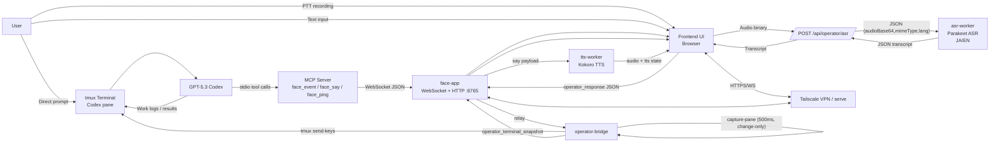
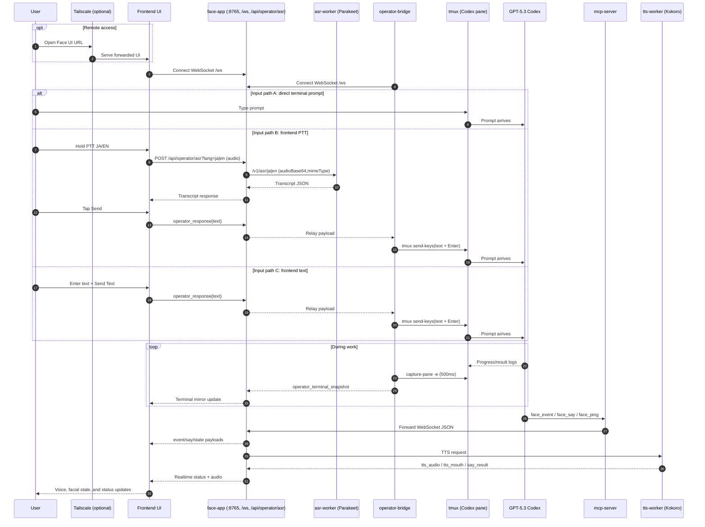
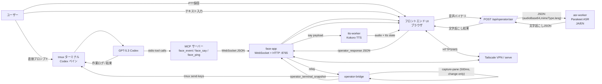
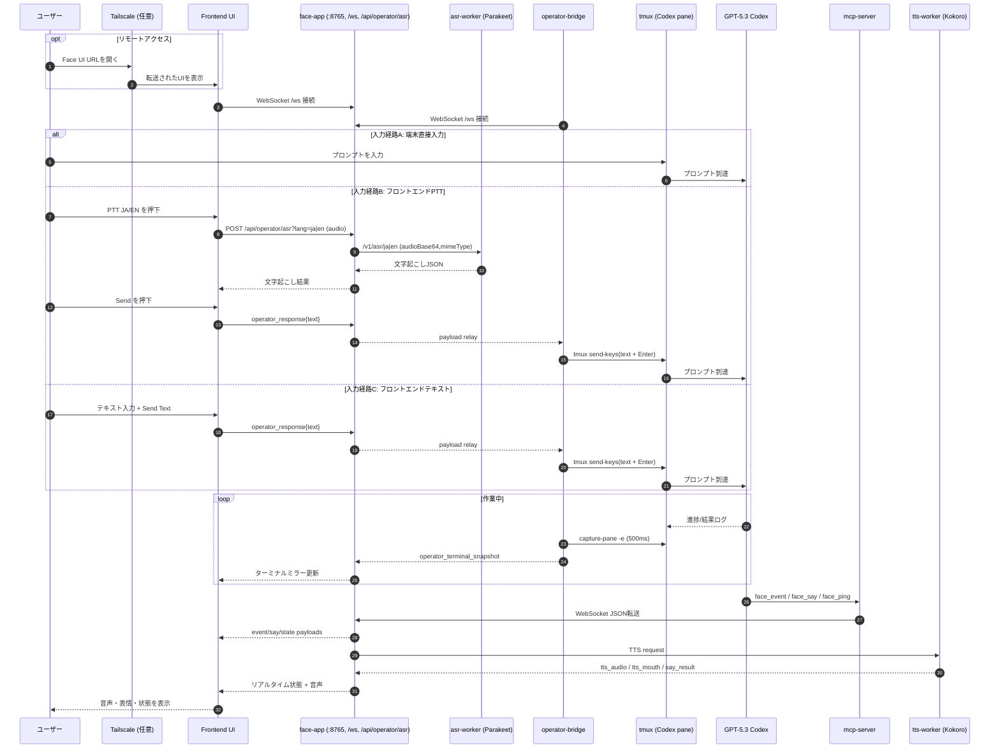

# minimum-headroom

<p>
  
  
</p>
<p>
  
</p>

[English](#english) | [日本語](#japanese)

<a id="english"></a>

## English

---

A face and operator companion app for coding agents.

`minimum-headroom` combines four things into one runtime: a browser face UI, a mobile-friendly operator panel, a tmux bridge for delivering operator input to your agent terminal, and MCP signaling (`face.event` / `face.say` / `face.ping`) for realtime status voice + expression feedback.

## At a Glance

- Run your coding agent in tmux, and control/assist it from terminal or mobile browser.
- Use three input paths: direct terminal text, frontend PTT (JA/EN -> ASR), or frontend text fallback.
- Send approved input to the agent pane via `operator-bridge` (`tmux send-keys`).
- Mirror terminal output back to mobile/desktop UI at 500ms change-only snapshots.
- Broadcast agent state to users through MCP events/speech and browser face animation + audio.
- Access remotely from phone/tablet via Tailscale Serve.

## Features

- Operator input pipeline:
  - terminal direct prompt, frontend PTT (JA/EN), and frontend text fallback
  - browser audio -> ASR proxy -> Parakeet ASR -> transcript confirm -> tmux send
  - key controls (`Esc`, `↑`, `ENTER`, `↓`) and restart/recovery support
- Terminal mirror:
  - read-only tmux tail snapshots
  - 500ms publish interval (change-only)
- MCP tools for signaling:
  - `face.event` / `face.say` / `face.ping`
- Browser 3D face renderer with state-driven animation:
  - eyebrow/eye/mouth/head movement
  - state modes (`confused`, `frustration`, `confidence`, `urgency`, `stuckness`, `neutral`)
  - direct head drag control (mouse/finger) with mode-coupled expression amplification
  - panel toggle shortcuts (`Esc`, double tap, double click)
- Looking Glass WebXR support path
- TTS pipeline:
  - Kokoro ONNX + Misaki (`af_heart`)
  - freshness-first speech policy (`interrupt`, TTL, generation invalidation)
  - speech result feedback (`say_result`)
  - selectable output route (`local`, `browser`, `both`)

## System Flow Diagrams

### High-Level Flow



### Sequence Timeline



## Requirements

- Node.js 20+ (Node 24 recommended)
- `uv` (for Python worker dependencies)
- Python 3.10+
- `ffmpeg` (recommended; used by ASR worker fallback decode for webm/ogg/mp4)
- Optional for audible TTS on Linux:
  - either PortAudio (`libportaudio2`) for `sounddevice`
  - or ALSA `aplay` fallback

## Quick Start

Choose one startup path depending on your goal.
Before starting, configure MCP server settings for your coding agent, set up the agent-specific `AGENTS.md`, and reflect `doc/examples/AGENT_RULES.md` in the agent instructions.

### Path A: Face + MCP (minimal)

From repository root:

```bash
./scripts/setup.sh
./scripts/run-face-app.sh
```

Open the UI shown in logs (default: `http://127.0.0.1:8765/`).

In another terminal:

```bash
./scripts/run-mcp-server.sh
```

### Path B: Full Mobile Operator Stack (recommended for first-time overview)

Recommended one-shot startup:

```bash
./scripts/run-operator-once.sh
```

This script automatically:

- creates or reuses tmux session `agent` (override with `--session`)
- creates a dedicated window `operator` (auto-suffixed if name exists; override with `--window`)
- splits two panes in that window:
  - pane 0: your agent command (default `codex`, override `--agent-cmd`)
  - pane 1: integrated operator stack (default `./scripts/run-operator-stack.sh`, override `--stack-cmd`)
- resolves the real agent pane id and injects it as `MH_BRIDGE_TMUX_PANE` for the stack

Common examples:

```bash
# resume existing Codex conversation
./scripts/run-operator-once.sh --agent-cmd 'codex resume --last'

# custom tmux names + mobile browser audio
./scripts/run-operator-once.sh --session work --window mobile --ui-mode mobile --audio-target browser

# start and keep current shell (no tmux attach/switch)
./scripts/run-operator-once.sh --no-attach
```

Manual startup (equivalent) if you prefer explicit steps:

1) Start tmux and launch your coding agent in one pane:

```bash
tmux new -s agent
codex
```

2) In another terminal, launch the integrated stack:

```bash
MH_BRIDGE_TMUX_PANE=agent:0.0 ./scripts/run-operator-stack.sh
```

This starts `asr-worker`, `face-app`, and `operator-bridge` together with mobile-oriented UI defaults.

You can also use npm scripts for Path A:

```bash
npm run face-app:start
npm run mcp-server:start
```

### Audio Output Target

`./scripts/run-face-app.sh` supports selecting where speech is heard:

```bash
# default (host speaker only)
./scripts/run-face-app.sh --audio-target local

# browser clients only (useful for iOS over tailscale serve)
./scripts/run-face-app.sh --audio-target browser

# both host speaker and browser clients
./scripts/run-face-app.sh --audio-target both
```

`./scripts/run-face-app.sh` also supports UI layout mode:

```bash
# auto detect (default)
./scripts/run-face-app.sh --ui-mode auto

# desktop-oriented debug layout
./scripts/run-face-app.sh --ui-mode pc

# mobile operator layout (full-screen operator panel)
./scripts/run-face-app.sh --ui-mode mobile
```

Tip: when using `--audio-target browser` or `--audio-target both`, you can run:

```bash
tailscale serve --bg 8765
```

Then open the Tailscale Serve URL from your phone/tablet to use the Face App remotely (it forwards to this host's `localhost:8765`).

When using iOS Safari, the first tap/click unlocks browser audio. If autoplay is blocked, use the in-page `Tap to enable audio` button to replay the latest utterance.

### Face Interaction Controls

- Drag on the face/canvas area with mouse or finger to steer head direction.
- While dragging, the active mood is amplified:
  - `confidence` becomes more confident.
  - negative modes (`confused`, `frustration`, `stuckness`) become more pronounced.
- Panel visibility shortcuts remain:
  - `Esc` (desktop keyboard)
  - double tap (mobile)
  - double click (desktop)

## Operator Bridge (Mobile Input)

### tmux Setup (From Zero)

```bash
# 1) start tmux and launch your coding agent in one pane
tmux new -s agent
codex
```

In another terminal (or another tmux pane), confirm target pane id:

```bash
tmux display-message -p '#S:#I.#P'
```

Example output: `agent:0.0`

### One-Command Operator Stack

Run the integrated stack:

```bash
MH_BRIDGE_TMUX_PANE=agent:0.0 ./scripts/run-operator-stack.sh
```

This starts:

- `asr-worker` (Parakeet ASR)
- `face-app`
- `operator-bridge`

Default stack UI mode is mobile (`FACE_UI_MODE=mobile`) so iPhone/iPad operator UI is immediately usable.  
Override if needed:

```bash
FACE_UI_MODE=pc MH_BRIDGE_TMUX_PANE=agent:0.0 ./scripts/run-operator-stack.sh
```

By default this does **not** start `mcp-server` because MCP stdio is usually managed by your agent process (for example Codex CLI).

If you explicitly want stack-managed MCP startup:

```bash
MH_STACK_START_MCP=1 MH_BRIDGE_TMUX_PANE=agent:0.0 ./scripts/run-operator-stack.sh
```

If you run inside tmux, `MH_BRIDGE_TMUX_PANE` can be omitted because `TMUX_PANE` is used automatically.

### ASR Worker (Parakeet) Setup

`./scripts/setup.sh` now syncs both Python workers:

```bash
uv sync --project tts-worker
uv sync --project asr-worker --locked
```

Run ASR worker alone:

```bash
./scripts/run-asr-worker.sh
```

Default device policy:

- Linux: `ASR_DEVICE=cuda` (default)
- macOS / CPU-only hosts: auto-fallback to `ASR_DEVICE=cpu` in `run-asr-worker.sh` when unset
- explicit override is always allowed:

```bash
ASR_DEVICE=cpu ./scripts/run-asr-worker.sh
```

Parakeet model defaults:

- EN: `nvidia/parakeet-tdt-0.6b-v2`
- JA: `nvidia/parakeet-tdt_ctc-0.6b-ja`

The first run downloads models via Hugging Face cache (`~/.cache/huggingface/hub`).  
If you already used `../english-trainer`, the same cache is reused; model file copy is usually unnecessary.

### Operator Bridge Details

`run-operator-bridge.sh` targets one tmux pane.

- If launched inside tmux, it uses `$TMUX_PANE`.
- Or set it explicitly: `MH_BRIDGE_TMUX_PANE=<pane-id-or-target>`.

Default bridge behavior:

- read-only terminal mirror tail: `200` lines
- mirror publish interval: `500ms` (change-only publish)
- restart command: `codex resume --last` (with pre-key `C-u`)

You can override with environment variables:

- `MH_BRIDGE_WS_URL` (default: `ws://127.0.0.1:8765/ws`)
- `MH_BRIDGE_SESSION_ID` (default: `default`)
- `MH_BRIDGE_TMUX_PANE` (required unless running inside tmux)
- `MH_BRIDGE_RESTART_COMMAND` / `MH_BRIDGE_RESTART_PRE_KEYS`
- `MH_BRIDGE_MIRROR_LINES` / `MH_BRIDGE_MIRROR_INTERVAL_MS`
- `MH_BRIDGE_SUBMIT_REINFORCE_DELAY_MS` (default: `90`; manual no-request text/choice send adds a second Enter after this delay)

### Operator UI Controls

- `Esc` button is always visible and sends Escape key semantics to tmux.
- `Restart` is shown only for recovery/offline conditions.
- Arrow key controls are always available as on-screen buttons: `↑`, `ENTER`, `↓`.
- The operator panel is intentionally always open in current mobile-focused behavior.
- `operator-handle` / `close panel` controls are currently hidden in UI.
- UI mode behavior:
  - `pc`: debug panels remain visible and operator panel is available in the same page.
  - `mobile`: near full-screen translucent operator panel, terminal mirror always visible.
- `PTT JA` / `PTT EN` records audio, sends backend ASR, then shows transcript confirm actions:
  - `Send` (submit to tmux)
  - `Retry` (discard transcript and record again)
  - `Cancel` (discard transcript only; awaiting request remains active)
- Text fallback input is always available in operator panel and can be used even when no explicit `operator_prompt` is active.
- Text fallback row actions:
  - `Send Text`: submit current text input to tmux/Codex.
  - `Clear`: clear only the text field contents.
  - `Cancel`: blur the text box (mobile keyboard close) when input focus was opened by mistake.
- `Esc` also blurs text input focus before sending Escape key semantics.
- Terminal mirror is read-only.

### ASR Proxy Endpoint

Browser PTT audio is posted to `face-app` at:

```text
POST /api/operator/asr?lang=ja|en
```

`face-app` converts binary audio to ASR-worker JSON (`audioBase64`, `mimeType`) and forwards it to:

- `ja` -> `${MH_OPERATOR_ASR_BASE_URL}/v1/asr/ja`
- `en` -> `${MH_OPERATOR_ASR_BASE_URL}/v1/asr/en`

ASR-related env vars:

- `MH_OPERATOR_ASR_BASE_URL` (default: `http://127.0.0.1:8091`)
- `MH_OPERATOR_ASR_ENDPOINT_URL` (optional explicit endpoint override)
- `MH_OPERATOR_ASR_TIMEOUT_MS` (default: `20000`)
- `MH_OPERATOR_ASR_MODEL_JA` / `MH_OPERATOR_ASR_MODEL_EN` (optional upstream model override)

### iOS / Tailscale Runbook

```bash
MH_BRIDGE_TMUX_PANE=agent:0.0 ./scripts/run-operator-stack.sh
tailscale serve --bg 8765
```

Then open the Tailscale Serve URL from iPhone/iPad.

Troubleshooting quick checks:

- No PTT transcript:
  - check ASR worker health: `curl -sS http://127.0.0.1:8091/health`
  - check `run-operator-stack.sh` logs for `asr_upstream_not_configured` / timeout
- Bridge input not reaching agent:
  - verify pane id: `tmux display-message -p '#S:#I.#P'`
  - ensure `MH_BRIDGE_TMUX_PANE` matches the pane running `codex`
- Need to abort current agent action:
  - use always-visible `Esc` in operator UI
- Panel seems missing after custom CSS/UI edits:
  - confirm `FACE_UI_MODE=mobile|pc` and reload the page

## TTS Model Files

Place model files in `assets/kokoro/`:

- `kokoro-v1.0.onnx`
- `voices-v1.0.bin`

Reference download instructions are in `assets/kokoro/README.md`.

These large model files are intentionally ignored by git.

## Speech Gate Config (`config.yaml`)

`face-app` now reads `config.yaml` from repository root at startup (or `FACE_CONFIG_PATH` if set) and applies `speech_gate` values to voice throttling.

Checked-in defaults are intentionally relaxed so the assistant can speak more often:

```yaml
speech_gate:
  min_interval_priority1_ms: 1500
  global_window_ms: 60000
  global_limit_low_priority: 24
  session_window_ms: 60000
  session_limit_low_priority: 12
  dedupe_ms_low_priority: 800
```

Fields map to runtime gate options:

- `min_interval_priority1_ms` -> minimum interval for `priority=1`
- `global_limit_low_priority` within `global_window_ms` for `priority<=2`
- `session_limit_low_priority` within `session_window_ms` for `priority<=2`
- `dedupe_ms_low_priority` for repeated `dedupe_key` on `priority<=2`

## Long Speech Behavior

- `face.say` default `ttl_ms` is now `60000` (60s) when omitted.
- You can override default with env var `FACE_SAY_DEFAULT_TTL_MS` on `mcp-server`.
- `face-app` also supports `tts.default_ttl_ms` in `config.yaml`.
- `face-app` supports `tts.auto_interrupt_after_ms`: when `policy=replace` input arrives after this threshold while another speech is active, it is promoted to interrupt.

When a new `face.say` arrives during playback:

- `policy=replace` keeps current playback and queues only the latest pending utterance.
- `policy=interrupt` (or `priority=3`) stops current playback and starts the new utterance immediately.

## Speech Language Routing

- ASCII text is spoken as English (`en-us`, speed `1.0`)
- Non-ASCII text is spoken as Japanese (`j`, speed `1.2`)

### English Normalization Spec

Applied to all `face.say` text before speech synthesis.

- `‘` / `’` -> `'`
- `“` / `”` -> `"`
- `…` / `...` -> regular space
- `。` / `、` / `・` -> regular space
- NBSP (`U+00A0`) / NNBSP (`U+202F`) -> regular space
- Latin letters with combining marks are ASCII-normalized
  - `café -> cafe`, `naïve -> naive`, `rôle -> role`
- Existing inline dash normalization is preserved for English
  - `9-to-5 -> 9 to 5`
- Full-width symbols/letters and Japanese characters are preserved
- If normalization results in empty text, speech is skipped

This is implemented in the face-app TTS controller (normalization) plus tts-worker chunking/synthesis path (language routing).

## MCP Client Config

Do not commit your personal local config files.

### Codex CLI example

Use `doc/examples/codex/config.toml` as a template. Update absolute paths for your machine.

If your MCP client rejects tool names with dots (for example `face.event`), set:

```toml
env = { FACE_WS_URL = "ws://127.0.0.1:8765/ws", MCP_TOOL_NAME_STYLE = "underscore" }
```

Then tools are published as:

- `face_event`
- `face_say`
- `face_ping`

### Antigravity example

Use `doc/examples/antigravity/mcp_config.json` as a template with your own absolute path.

For agent-side signaling conventions, see `doc/examples/AGENT_RULES.md`.

## Optional Agent Skills

This repository includes reusable skill packages under `doc/examples/skills/`:

- `release-ci-flow`
- `minimum-headroom-ops`
- `looking-glass-webxr-setup`

Each folder contains a `SKILL.md` and can be copied into your local skills directory (for example `$CODEX_HOME/skills/`) if your agent supports local skill loading.

## Release Checklist

- Run tests:

```bash
npm test
```

- Verify MCP startup:

```bash
./scripts/run-mcp-server.sh
```

- Verify face app startup and browser rendering:

```bash
./scripts/run-face-app.sh
```

- Verify TTS worker smoke:

```bash
npm run tts-worker:smoke
```

- Verify ASR worker smoke:

```bash
npm run asr-worker:smoke
```

- Verify operator stack startup (inside tmux or with `MH_BRIDGE_TMUX_PANE` set):

```bash
./scripts/run-operator-stack.sh
```

## Repository Notes

- Runtime/local files (models, local MCP config, caches, venv) are excluded via `.gitignore`.

<a id="japanese"></a>

## 日本語

コーディングエージェント向けのフェイス・オペレーター支援アプリです。

`minimum-headroom` は次の4つを1つの実行環境としてまとめたアプリです。

- ブラウザで動作するフェイスUI
- モバイル向けオペレーターパネル
- オペレーター入力をエージェント用tmuxペインへ届ける `operator-bridge`
- MCPシグナリング (`face.event` / `face.say` / `face.ping`) によるリアルタイム状態通知（音声・表情）

## 全体像（要点）

- エージェントを tmux で動かし、端末またはモバイルブラウザから補助操作できます。
- 入力経路は3つです: 端末の直接入力、フロントエンドPTT（JA/EN -> ASR）、フロントエンドのテキスト入力。
- 承認・送信された入力は `operator-bridge` が `tmux send-keys` でエージェントペインへ投入します。
- 端末出力は 500ms 間隔（差分があるときのみ）でミラー配信されます。
- エージェント状態は MCP イベント/発話とフェイスUI（表情・音声）でユーザーへ通知されます。
- Tailscale Serve を使うとスマホ/タブレットからリモートアクセスできます。

## 機能

- オペレーター入力パイプライン:
  - 端末直接入力 / フロントエンドPTT（JA/EN）/ フロントエンドテキスト入力
  - ブラウザ音声 -> ASRプロキシ -> Parakeet ASR -> 文字起こし確認 -> tmux送信
  - キー操作（`Esc`, `↑`, `ENTER`, `↓`）と復旧用 `Restart`
- ターミナルミラー:
  - tmux末尾出力の読み取り専用スナップショット
  - 500ms 発行（変更があった場合のみ）
- MCPシグナリングツール:
  - `face.event` / `face.say` / `face.ping`
- ブラウザ3Dフェイス描画:
  - 眉・目・口・頭の状態駆動アニメーション
  - 状態モード（`confused`, `frustration`, `confidence`, `urgency`, `stuckness`, `neutral`）
  - ドラッグ操作（マウス/タッチ）による頭部制御とモード連動バイアス
  - パネル表示切替ショートカット（`Esc`, ダブルタップ, ダブルクリック）
- Looking Glass WebXR 対応経路
- TTSパイプライン:
  - Kokoro ONNX + Misaki (`af_heart`)
  - 発話鮮度優先ポリシー（`interrupt`, TTL, generation）
  - `say_result` フィードバック
  - 出力先切替（`local`, `browser`, `both`）

## システムフロー図

### ハイレベルフロー



### 時系列シーケンス



## 必要環境

- Node.js 20+（Node 24 推奨）
- `uv`（Python worker依存管理）
- Python 3.10+
- `ffmpeg`（推奨。ASR worker の webm/ogg/mp4 フォールバックデコードに使用）
- Linuxで音声出力する場合（任意）:
  - PortAudio (`libportaudio2`) + `sounddevice`
  - または ALSA `aplay`

## クイックスタート

目的に合わせて起動パスを選んでください。
開始前に、利用するコーディングエージェントで MCP サーバー設定を行い、エージェント向け `AGENTS.md` を設定し、`doc/examples/AGENT_RULES.md` の内容をエージェント指示へ反映してください。

### Path A: Face + MCP（最小構成）

リポジトリルートで実行:

```bash
./scripts/setup.sh
./scripts/run-face-app.sh
```

ログに表示されるURL（既定: `http://127.0.0.1:8765/`）を開きます。

別ターミナルで:

```bash
./scripts/run-mcp-server.sh
```

### Path B: フルモバイル Operator Stack（初見ユーザー推奨）

推奨: 1発起動スクリプト

```bash
./scripts/run-operator-once.sh
```

このスクリプトは自動で次を行います:

- tmux セッション `agent` を作成または再利用（`--session` で変更可）
- 専用ウィンドウ `operator` を作成（同名があれば `operator-1` のように自動採番、`--window` で変更可）
- 2ペインへ分割:
  - 0番ペイン: エージェント起動コマンド（既定 `codex`、`--agent-cmd` で変更）
  - 1番ペイン: 統合スタック起動（既定 `./scripts/run-operator-stack.sh`、`--stack-cmd` で変更）
- 実際のエージェントペインIDを解決し、`MH_BRIDGE_TMUX_PANE` として統合スタックへ自動注入

よく使う例:

```bash
# 直前セッションを再開
./scripts/run-operator-once.sh --agent-cmd 'codex resume --last'

# tmux名を変更 + モバイル向けブラウザ音声
./scripts/run-operator-once.sh --session work --window mobile --ui-mode mobile --audio-target browser

# 起動のみ行い、現在のシェルを維持（attach/switchしない）
./scripts/run-operator-once.sh --no-attach
```

手動で分けて起動したい場合（同等手順）:

1) tmuxを起動し、1ペインでエージェントを起動:

```bash
tmux new -s agent
codex
```

2) 別ターミナルで統合スタックを起動:

```bash
MH_BRIDGE_TMUX_PANE=agent:0.0 ./scripts/run-operator-stack.sh
```

このコマンドで `asr-worker` / `face-app` / `operator-bridge` がまとめて起動します（モバイル向けUI前提）。

Path A は npm scripts でも起動できます:

```bash
npm run face-app:start
npm run mcp-server:start
```

### 音声出力先（Audio Output Target）

`./scripts/run-face-app.sh` で音声出力先を選択できます。

```bash
# 既定（ホストスピーカーのみ）
./scripts/run-face-app.sh --audio-target local

# ブラウザのみ（iOS + tailscale serve運用向け）
./scripts/run-face-app.sh --audio-target browser

# ホスト + ブラウザ両方
./scripts/run-face-app.sh --audio-target both
```

`./scripts/run-face-app.sh` はUIモードも選択できます。

```bash
# 自動判定（既定）
./scripts/run-face-app.sh --ui-mode auto

# デスクトップ向け
./scripts/run-face-app.sh --ui-mode pc

# モバイル向け（ほぼ全画面のoperator panel）
./scripts/run-face-app.sh --ui-mode mobile
```

`--audio-target browser` または `both` の場合、次の設定が便利です。

```bash
tailscale serve --bg 8765
```

スマホ/タブレットから Tailscale Serve URL を開くと、このホストの `localhost:8765` に転送されます。

iOS Safari では初回タップで音声アンロックが必要です。自動再生がブロックされた場合、UI内 `Tap to enable audio` を使って直近発話を再生できます。

### フェイス操作

- 顔/キャンバス領域をドラッグ（マウス・タッチ）すると頭部向きを操作できます。
- ドラッグ中は現在の感情モードが強調されます。
  - `confidence` はより自信寄りに
  - `confused`, `frustration`, `stuckness` はより強く
- パネル表示切替ショートカット:
  - `Esc`（デスクトップ）
  - ダブルタップ（モバイル）
  - ダブルクリック（デスクトップ）

## Operator Bridge（モバイル入力）

### tmux セットアップ（ゼロから）

```bash
# 1) tmuxを起動し、1ペインでエージェントを起動
tmux new -s agent
codex
```

別ターミナル（または別tmuxペイン）で対象ペインIDを確認:

```bash
tmux display-message -p '#S:#I.#P'
```

例: `agent:0.0`

### 1コマンド統合起動

```bash
MH_BRIDGE_TMUX_PANE=agent:0.0 ./scripts/run-operator-stack.sh
```

起動されるサービス:

- `asr-worker`（Parakeet ASR）
- `face-app`
- `operator-bridge`

既定では `FACE_UI_MODE=mobile` で起動するため、iPhone/iPadでそのまま使いやすい設定です。必要に応じて上書きできます。

```bash
FACE_UI_MODE=pc MH_BRIDGE_TMUX_PANE=agent:0.0 ./scripts/run-operator-stack.sh
```

既定では `mcp-server` は起動しません（通常はエージェント側がstdio管理するため）。

`mcp-server` も統合起動したい場合:

```bash
MH_STACK_START_MCP=1 MH_BRIDGE_TMUX_PANE=agent:0.0 ./scripts/run-operator-stack.sh
```

tmux内で実行している場合は `MH_BRIDGE_TMUX_PANE` を省略できます（`TMUX_PANE` を自動使用）。

### ASR Worker（Parakeet）

`./scripts/setup.sh` は2つのPython workerを同期します。

```bash
uv sync --project tts-worker
uv sync --project asr-worker --locked
```

ASR worker 単体起動:

```bash
./scripts/run-asr-worker.sh
```

既定デバイス方針:

- Linux: `ASR_DEVICE=cuda`（既定）
- macOS / CPUのみ: `run-asr-worker.sh` が未指定時に `ASR_DEVICE=cpu` へ自動フォールバック
- 明示上書きも可能:

```bash
ASR_DEVICE=cpu ./scripts/run-asr-worker.sh
```

Parakeet既定モデル:

- EN: `nvidia/parakeet-tdt-0.6b-v2`
- JA: `nvidia/parakeet-tdt_ctc-0.6b-ja`

初回実行時は Hugging Face キャッシュ（`~/.cache/huggingface/hub`）へモデルを取得します。

### Operator Bridge 詳細

`run-operator-bridge.sh` は1つの tmux ペインを対象にします。

- tmux内起動時: `$TMUX_PANE` を使用
- 明示指定: `MH_BRIDGE_TMUX_PANE=<pane-id-or-target>`

既定挙動:

- ターミナルミラー末尾: `200` 行
- ミラー発行間隔: `500ms`（変更時のみ）
- 再開コマンド: `codex resume --last`（事前キー `C-u`）

上書き可能な環境変数:

- `MH_BRIDGE_WS_URL`（既定: `ws://127.0.0.1:8765/ws`）
- `MH_BRIDGE_SESSION_ID`（既定: `default`）
- `MH_BRIDGE_TMUX_PANE`（tmux外では必須）
- `MH_BRIDGE_RESTART_COMMAND` / `MH_BRIDGE_RESTART_PRE_KEYS`
- `MH_BRIDGE_MIRROR_LINES` / `MH_BRIDGE_MIRROR_INTERVAL_MS`
- `MH_BRIDGE_SUBMIT_REINFORCE_DELAY_MS`（既定: `90`）

### Operator UI 操作

- `Esc` ボタンは常時表示で、tmuxへ Escape キーを送信します。
- `Restart` は復旧/オフライン時のみ表示されます。
- カーソルキーは常時表示（`↑`, `ENTER`, `↓`）。
- 現在のモバイル重視挙動では、operator panel は常時オープンを前提にしています。
- `operator-handle` / `close panel` は現在UIで非表示です。
- UIモード:
  - `pc`: デバッグパネルを表示したまま operator panel を利用
  - `mobile`: 半透明のほぼ全画面 operator panel + 常時 terminal mirror
- `PTT JA` / `PTT EN` は録音 -> ASR -> 文字起こし確認へ進みます:
  - `Send`（tmuxへ送信）
  - `Retry`（文字起こし破棄して再録音）
  - `Cancel`（文字起こしのみ破棄）
- テキストフォールバック入力は、`operator_prompt` が無い状態でも常時利用可能です。
- テキスト行の操作:
  - `Send Text`（現在文字列を tmux/Codex へ送信）
  - `Clear`（入力欄クリア）
  - `Cancel`（入力欄を blur してキーボードを閉じる）
- `Esc` は送信前に入力フォーカスを外します。
- terminal mirror は読み取り専用です。

### ASR プロキシエンドポイント

ブラウザPTT音声は `face-app` の以下へPOSTされます。

```text
POST /api/operator/asr?lang=ja|en
```

`face-app` はバイナリ音声を ASR worker 用 JSON（`audioBase64`, `mimeType`）へ変換して転送します。

- `ja` -> `${MH_OPERATOR_ASR_BASE_URL}/v1/asr/ja`
- `en` -> `${MH_OPERATOR_ASR_BASE_URL}/v1/asr/en`

ASR関連環境変数:

- `MH_OPERATOR_ASR_BASE_URL`（既定: `http://127.0.0.1:8091`）
- `MH_OPERATOR_ASR_ENDPOINT_URL`（任意。明示エンドポイント上書き）
- `MH_OPERATOR_ASR_TIMEOUT_MS`（既定: `20000`）
- `MH_OPERATOR_ASR_MODEL_JA` / `MH_OPERATOR_ASR_MODEL_EN`（任意。上流モデル上書き）

### iOS / Tailscale 運用手順

```bash
MH_BRIDGE_TMUX_PANE=agent:0.0 ./scripts/run-operator-stack.sh
tailscale serve --bg 8765
```

iPhone/iPad で Tailscale Serve URL を開いて利用します。

トラブルシュート（クイックチェック）:

- PTT文字起こしが返らない:
  - `curl -sS http://127.0.0.1:8091/health`
  - `run-operator-stack.sh` のログで `asr_upstream_not_configured` / timeout を確認
- 入力がエージェントに届かない:
  - `tmux display-message -p '#S:#I.#P'`
  - `MH_BRIDGE_TMUX_PANE` が `codex` 実行ペインと一致しているか確認
- 現在の作業を中断したい:
  - operator UI の常時表示 `Esc` を利用
- パネルが見えない（カスタムCSS等の影響）:
  - `FACE_UI_MODE=mobile|pc` を確認してページ再読み込み

## TTS モデルファイル

モデルを `assets/kokoro/` に配置してください。

- `kokoro-v1.0.onnx`
- `voices-v1.0.bin`

ダウンロード手順は `assets/kokoro/README.md` を参照してください。

## Speech Gate 設定（`config.yaml`）

`face-app` は起動時にリポジトリルートの `config.yaml`（または `FACE_CONFIG_PATH`）を読み、発話ゲート設定を適用します。

既定値（発話しやすめ設定）:

```yaml
speech_gate:
  min_interval_priority1_ms: 1500
  global_window_ms: 60000
  global_limit_low_priority: 24
  session_window_ms: 60000
  session_limit_low_priority: 12
  dedupe_ms_low_priority: 800
```

各フィールドの対応:

- `min_interval_priority1_ms` -> `priority=1` の最小間隔
- `global_limit_low_priority` in `global_window_ms` -> `priority<=2` の全体上限
- `session_limit_low_priority` in `session_window_ms` -> `priority<=2` のセッション上限
- `dedupe_ms_low_priority` -> `priority<=2` で同一 `dedupe_key` の抑制時間

## 長文発話の挙動

- `face.say` の `ttl_ms` 未指定時既定は `60000`（60秒）
- `FACE_SAY_DEFAULT_TTL_MS` で上書き可能（`mcp-server`）
- `face-app` は `config.yaml` の `tts.default_ttl_ms` に対応
- `face-app` は `tts.auto_interrupt_after_ms` に対応（一定時間後の `replace` を `interrupt` 扱いへ昇格）

発話中に新しい `face.say` が来た場合:

- `policy=replace`: 現在発話を継続し、最新1件のみ保留
- `policy=interrupt`（または `priority=3`）: 現在発話を停止し新規発話を即時開始

## 発話言語ルーティング

- ASCIIのみの文字列 -> 英語音声（`en-us`, speed `1.0`）
- 非ASCIIを含む文字列 -> 日本語音声（`j`, speed `1.2`）

### 英語正規化仕様

`face.say` テキストに対して発話前に適用されます。

- `‘` / `’` -> `'`
- `“` / `”` -> `"`
- `…` / `...` -> 半角スペース
- `。` / `、` / `・` -> 半角スペース
- NBSP (`U+00A0`) / NNBSP (`U+202F`) -> 半角スペース
- 結合文字を含むラテン文字はASCII正規化
  - `café -> cafe`, `naïve -> naive`, `rôle -> role`
- 英語向けインラインダッシュ正規化は維持
  - `9-to-5 -> 9 to 5`
- 全角記号/日本語文字は保持
- 正規化結果が空なら発話スキップ

## MCPクライアント設定

個人用ローカル設定ファイルはリポジトリにコミットしないでください。

### Codex CLI 例

`doc/examples/codex/config.toml` をテンプレートとして使い、各自の絶対パスへ置き換えてください。

MCPクライアントがドット付きツール名（例: `face.event`）を受け付けない場合:

```toml
env = { FACE_WS_URL = "ws://127.0.0.1:8765/ws", MCP_TOOL_NAME_STYLE = "underscore" }
```

公開ツール名は次の形になります。

- `face_event`
- `face_say`
- `face_ping`

### Antigravity 例

`doc/examples/antigravity/mcp_config.json` をテンプレートとして使い、各自の絶対パスへ置き換えてください。

エージェント側シグナリング規約は `doc/examples/AGENT_RULES.md` を参照してください。

## オプションスキル

`doc/examples/skills/` に再利用可能なスキルを同梱しています。

- `release-ci-flow`
- `minimum-headroom-ops`
- `looking-glass-webxr-setup`

各フォルダには `SKILL.md` があり、対応エージェントではローカルスキルディレクトリ（例: `$CODEX_HOME/skills/`）へコピーして利用できます。

## リリースチェックリスト

- テスト実行:

```bash
npm test
```

- MCP起動確認:

```bash
./scripts/run-mcp-server.sh
```

- face-app起動とブラウザ表示確認:

```bash
./scripts/run-face-app.sh
```

- TTS worker smoke確認:

```bash
npm run tts-worker:smoke
```

- ASR worker smoke確認:

```bash
npm run asr-worker:smoke
```

- operator stack起動確認（tmux内 or `MH_BRIDGE_TMUX_PANE` 指定）:

```bash
./scripts/run-operator-stack.sh
```

## 補足

- 実行時ローカルファイル（モデル、ローカルMCP設定、キャッシュ、venv など）は `.gitignore` で除外されています。
