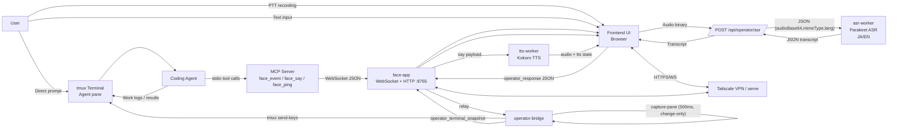
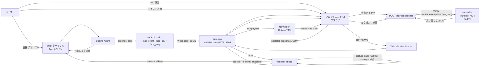
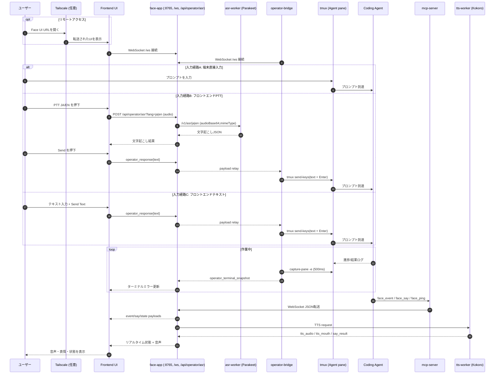

# minimum-headroom

<p>
  
  
</p>
<p>
  
  
</p>

[English](#english) | [日本語](#japanese)

<a id="english"></a>

## English

---

A face and operator companion app for coding agents.

## Contents

- [At a Glance](#en-at-a-glance)
- [Features](#en-features)
- [Quick Start](#en-quick-start)
- [Agent Setup](#en-agent-setup)
- [Detailed Guides](#en-detailed-guides)
- [Japanese](#japanese)

<a id="en-at-a-glance"></a>
## At a Glance

- **Control your PC coding agent from your phone** — approve, type, or speak commands via mobile browser.
- **Works with Claude Code, Codex CLI, and Gemini CLI** — any agent that runs in a terminal.
- **tmux operator bridge** relays input/output between the browser UI and the agent pane.
- **3D face + TTS + MCP signaling** give your agent a voice and expressions that reflect its state.
- **Multi-agent support** (experimental) — spawn helper agents in isolated worktrees with permission presets and durable mission tracking. See [Multi-Agent Guide](doc/guides/multi-agent.md).
- **Tailscale Serve** for secure remote access from phone or tablet.

<a id="en-features"></a>
## Features

- **Operator input** — terminal direct prompt, browser PTT (JA/EN ASR), text fallback, desktop `Space`/`Shift+Space` hold-to-talk safety, key controls (`Esc`, `↑`, `Select`, `↓`)
- **Terminal mirror** — read-only tmux tail snapshots at 500ms change-only intervals
- **Multi-agent** (experimental) — spawn/focus/delete helpers from desktop tiles or mobile list, permission presets, mission assignment and delivery, owner inbox. See [Multi-Agent Guide](doc/guides/multi-agent.md).
- **MCP signaling** — `face.event` / `face.say` / `face.ping` plus agent lifecycle tools (`agent.list`, `agent.spawn`, `agent.focus`, `agent.delete`, `agent.assign`, `agent.assignment.list`, `agent.inject`, `agent.report`, `owner.inbox.*`)
- **3D face** — eyebrow/eye/mouth/head animation, state modes (`confused`, `frustration`, `confidence`, `urgency`, `stuckness`, `neutral`), drag control, panel toggles
- **TTS** — Kokoro ONNX + Misaki default, optional Qwen3-TTS Japanese backend, freshness-first speech policy. See [TTS and Speech Guide](doc/guides/tts-and-speech.md).
- **ASR** — Parakeet batch, optional Voxtral realtime. See [Operator Stack and ASR Guide](doc/guides/operator-stack.md).
- **Looking Glass** WebXR support path

## System Flow Diagrams

Static exports: [High-Level Flow PNG](doc/diagrams/high-level-flow.png), [Sequence Timeline PNG](doc/diagrams/sequence-timeline.png), [High-Level Flow SVG](doc/diagrams/high-level-flow.svg), [Sequence Timeline SVG](doc/diagrams/sequence-timeline.svg)

### High-Level Flow


```mermaid
flowchart LR
  U[User]
  TMUX[tmux Terminal<br/>Agent pane]
  C[Coding Agent]
  MCP[MCP Server<br/>face_event / face_say / face_ping]
  WS[face-app<br/>WebSocket + HTTP :8765]
  FE[Frontend UI<br/>Browser]
  BR[operator-bridge]
  ASRP[/POST /api/operator/asr/]
  ASR[asr-worker<br/>Parakeet ASR<br/>JA/EN]
  TTS[tts-worker<br/>Kokoro TTS]
  TS[Tailscale VPN / serve]

  U -- Direct prompt --> TMUX
  U -- PTT recording --> FE
  U -- Text input --> FE

  FE -- Audio binary --> ASRP
  ASRP -- JSON (audioBase64,mimeType,lang) --> ASR
  ASR -- JSON transcript --> ASRP
  ASRP -- Transcript --> FE

  FE -- operator_response JSON --> WS
  WS -- relay --> BR
  BR -- tmux send-keys --> TMUX
  TMUX --> C
  C -- Work logs / results --> TMUX

  BR -- capture-pane (500ms, change-only) --> BR
  BR -- operator_terminal_snapshot --> WS
  WS --> FE

  C -- stdio tool calls --> MCP
  MCP -- WebSocket JSON --> WS
  WS --> FE

  WS -- say payload --> TTS
  TTS -- audio + tts state --> FE

  FE <-- HTTPS/WS --> TS
  TS <---> WS
```

### Sequence Timeline


```mermaid
sequenceDiagram
  autonumber
  participant U as User
  participant TS as Tailscale (optional)
  participant FE as Frontend UI
  participant FA as face-app (:8765, /ws, /api/operator/asr)
  participant ASR as asr-worker (Parakeet)
  participant BR as operator-bridge
  participant TM as tmux (Agent pane)
  participant CX as Coding Agent
  participant MCP as mcp-server
  participant TTS as tts-worker (Kokoro)

  opt Remote access
    U->>TS: Open Face UI URL
    TS->>FE: Serve forwarded UI
  end

  FE->>FA: Connect WebSocket /ws
  BR->>FA: Connect WebSocket /ws

  alt Input path A: direct terminal prompt
    U->>TM: Type prompt
    TM->>CX: Prompt arrives
  else Input path B: frontend PTT
    U->>FE: Hold PTT JA/EN
    FE->>FA: POST /api/operator/asr?lang=ja|en (audio)
    FA->>ASR: /v1/asr/ja|en (audioBase64,mimeType)
    ASR-->>FA: Transcript JSON
    FA-->>FE: Transcript response
    U->>FE: Tap Send
    FE->>FA: operator_response{text}
    FA-->>BR: Relay payload
    BR->>TM: tmux send-keys(text + Enter)
    TM->>CX: Prompt arrives
  else Input path C: frontend text
    U->>FE: Enter text + Send Text
    FE->>FA: operator_response{text}
    FA-->>BR: Relay payload
    BR->>TM: tmux send-keys(text + Enter)
    TM->>CX: Prompt arrives
  end

  loop During work
    CX-->>TM: Progress/result logs
    BR->>TM: capture-pane -e (500ms)
    BR-->>FA: operator_terminal_snapshot
    FA-->>FE: Terminal mirror update
  end

  CX->>MCP: face_event / face_say / face_ping
  MCP->>FA: Forward WebSocket JSON
  FA-->>FE: event/say/state payloads

  FA->>TTS: TTS request
  TTS-->>FA: tts_audio / tts_mouth / say_result
  FA-->>FE: Realtime status + audio
  FE-->>U: Voice, facial state, and status updates
```

## Requirements

- Node.js 20+ (Node 24 recommended)
- `uv` (for Python worker dependencies)
- Python 3.10+
- `ffmpeg` (recommended; used by ASR worker fallback decode for webm/ogg/mp4)
- Optional for audible TTS on Linux:
  - either PortAudio (`libportaudio2`) for `sounddevice`
  - or ALSA `aplay` fallback

<a id="en-quick-start"></a>
## Quick Start

Choose one startup path depending on your goal.
Before starting, configure your coding agent for MCP (see [Agent Setup](#en-agent-setup)), set up the agent-specific `AGENTS.md`, and reflect `doc/examples/AGENT_RULES.md` in the agent instructions. If you want a ready-to-paste starting point, use `doc/examples/AGENTS.sample.md` as the template for your project-local `AGENTS.md`.

If you plan to use the mobile UI remotely, it is convenient to start Tailscale Serve in advance:

```bash
tailscale serve --bg 8765
```

### Path A: Face + MCP (minimal)

From repository root:

```bash
./scripts/setup.sh
./scripts/run-face-app.sh
```

Then, in another terminal:

```bash
./scripts/run-mcp-server.sh
```

Use this path when you want the simple face UI and signaling, without the full operator panel workflow. `run-face-app.sh` hides the operator panel by default.

- If your coding agent already starts this repository's MCP server from its own MCP client config, do not also run `./scripts/run-mcp-server.sh`.
- By default, `face-app` starts `tts-worker` for you unless `FACE_TTS_ENABLED=0` is set. The default backend is Kokoro; if the `face-app` process is launched with `TTS_ENGINE=qwen3`, the spawned worker uses the optional Qwen3 path instead.

### Path B: Full Mobile Operator Stack (recommended)

After `./scripts/setup.sh`, recommended one-shot startup:

```bash
./scripts/run-operator-once.sh --profile realtime
```

Use this when you want the full tmux-backed operator workflow, browser PTT, terminal mirror, hidden mobile recovery, and the safest default bridge wiring. Start with `--profile default` or `--profile realtime` unless you specifically want Qwen3 TTS.

- `run-operator-once.sh` / `run-operator-stack.sh` launch `face-app`, and `face-app` starts `tts-worker` by default unless `FACE_TTS_ENABLED=0` is set. `qwen3` / `qwen3-realtime` profiles work by passing `TTS_ENGINE=qwen3` into that spawned worker path.
- Profile shorthand:
  - `--profile default`: Kokoro TTS + batch ASR only
  - `--profile realtime`: Kokoro TTS + Voxtral realtime ASR + Parakeet fallback
  - `--profile qwen3`: Qwen3 TTS + batch ASR only
  - `--profile qwen3-realtime`: Qwen3 TTS + Voxtral realtime ASR + Parakeet fallback
- When you use this app to work on another repository, put a project-local `AGENTS.md` in that target repository too. Start from `doc/examples/AGENTS.sample.md`, then customize the repo-specific build/test/run rules there.
- For another repository, you can start the operator in either of these equivalent styles:
  - run from this repository and pass `--repo /path/to/target-repo`
  - or `cd` into the target repository and launch `/path/to/MinimumHeadroom/scripts/run-operator-once.sh ...`

After startup, multi-agent helpers can be spawned and managed from the browser UI or MCP tools. See the [Multi-Agent Guide](doc/guides/multi-agent.md) for the full workflow.

Useful variants:

```bash
# work on another repository while keeping minimum-headroom as the operator shell
./scripts/run-operator-once.sh --profile realtime --repo /path/to/target-repo

# work from the target repository itself and call the script by absolute path
cd /path/to/target-repo
/path/to/MinimumHeadroom/scripts/run-operator-once.sh --profile realtime

# start with a shell in the agent pane first
./scripts/run-operator-once.sh --profile realtime --agent-shell

# resume an existing Codex conversation
./scripts/run-operator-once.sh --agent-cmd 'codex resume --last'

# keep the current shell instead of attaching to tmux
./scripts/run-operator-once.sh --profile realtime --no-attach

# choose Qwen3 TTS only when you want that path explicitly
./scripts/run-operator-once.sh --profile qwen3-realtime
```

<a id="en-agent-setup"></a>
## Agent Setup

Do not commit your personal local config files.

### Claude Code

Add the MCP server via CLI:

```bash
claude mcp add --transport stdio \
  --env FACE_WS_URL=ws://127.0.0.1:8765/ws \
  minimum-headroom -- node /ABS/PATH/minimum-headroom/mcp-server/dist/index.js
```

See [Claude Code setup details](doc/examples/claude-code/README.md) for permission presets and security hardening.

### Codex CLI

Use `doc/examples/codex/config.toml` as a template. Place at `~/.codex/config.toml` or `.codex/config.toml` within a trusted project. Update absolute paths for your machine.

```toml
[mcp_servers.minimum_headroom]
command = "node"
args = ["/ABS/PATH/minimum-headroom/mcp-server/dist/index.js"]
env = { "FACE_WS_URL" = "ws://127.0.0.1:8765/ws" }
```

### Gemini CLI

Use `doc/examples/antigravity/mcp_config.json` as a template. Place in `~/.gemini/` or a project-local `.gemini/` folder. Gemini requires `MCP_TOOL_NAME_STYLE=underscore`.

```json
{
  "mcpServers": {
    "minimum-headroom": {
      "command": "node",
      "args": ["/ABS/PATH/minimum-headroom/mcp-server/dist/index.js"],
      "env": {
        "FACE_WS_URL": "ws://127.0.0.1:8765/ws",
        "MCP_TOOL_NAME_STYLE": "underscore"
      }
    }
  }
}
```

See [Gemini setup details](doc/examples/antigravity/README.md) for permission presets and AGENTS.md guidance.

### Agent Instructions

- Place an `AGENTS.md` in your target repository root (use `doc/examples/AGENTS.sample.md` as the starting template).
- Include signaling rules from `doc/examples/AGENT_RULES.md` in the agent instructions.
- For Claude Code, you can also use `CLAUDE.md` for Claude-specific project instructions.

### Tool name style

If your MCP client rejects tool names with dots (for example `face.event`), set env `MCP_TOOL_NAME_STYLE=underscore`. Tools are then published as `face_event`, `face_say`, `face_ping`.

<a id="en-detailed-guides"></a>
## Detailed Guides

- [Operator Stack and ASR Guide](doc/guides/operator-stack.md#english) — launcher choice, tmux bridge, operator UI, keyboard shortcuts, hidden mobile recovery, batch/realtime ASR, Tailscale remote operation
- [TTS and Speech Guide](doc/guides/tts-and-speech.md#english) — Kokoro and Qwen3 setup, speech gate, long-speech behavior, pre-synthesis text normalization
- [Multi-Agent Guide](doc/guides/multi-agent.md#english) — spawning helpers, permission presets, mission assignment, owner inbox, worktree isolation, security hardening

## Optional Agent Skills

This repository includes reusable skill packages under `doc/examples/skills/`:

- `release-ci-flow`
- `minimum-headroom-ops`
- `looking-glass-webxr-setup`

Each folder contains a `SKILL.md` and can be copied into your local skills directory (for example `$CODEX_HOME/skills/`) if your agent supports local skill loading.

If you are using the minimum-headroom operator/helper runtime, install `minimum-headroom-ops`. It covers the expected MCP lifecycle flow (`agent.list`, `agent.spawn`, `agent.assign`, `agent.inject`, `agent.assignment.list`, `owner.inbox.*`, `agent.delete`) and the helper reporting contract.

## Release Checklist

- Run tests:

```bash
npm test
```

- Verify MCP startup:

```bash
./scripts/run-mcp-server.sh
```

- Verify face app startup and browser rendering:

```bash
./scripts/run-face-app.sh
```

- Verify TTS worker smoke:

```bash
npm run tts-worker:smoke
```

- Verify ASR worker smoke:

```bash
npm run asr-worker:smoke
```

- Verify operator stack startup (inside tmux or with `MH_BRIDGE_TMUX_PANE` set):

```bash
./scripts/run-operator-stack.sh
```

## Repository Notes

- Runtime/local files (models, local MCP config, caches, venv) are excluded via `.gitignore`.

<a id="japanese"></a>

## 日本語

コーディングエージェント向けのフェイス・オペレーター支援アプリです。

## 目次

- [全体像（要点）](#ja-overview)
- [機能](#ja-features)
- [クイックスタート](#ja-quick-start)
- [エージェント設定](#ja-agent-setup)
- [詳細ガイド](#ja-detailed-guides)
- [English](#english)

<a id="ja-overview"></a>
## 全体像（要点）

- **スマホから PC のコーディングエージェントを操作** — モバイルブラウザで承認・入力・音声コマンドを送信できます。
- **Claude Code、Codex CLI、Gemini CLI に対応** — ターミナルで動くエージェントなら何でも使えます。
- **tmux operator bridge** がブラウザ UI とエージェントペイン間の入出力を中継します。
- **3D フェイス + TTS + MCP シグナリング** でエージェントに声と表情を与え、状態をリアルタイムに反映します。
- **マルチエージェント対応**（実験的） — 分離 worktree に helper を生成し、権限プリセットとミッション追跡で管理します。[マルチエージェントガイド](doc/guides/multi-agent.md#japanese)を参照。
- **Tailscale Serve** でスマホ/タブレットから安全にリモートアクセス。

<a id="ja-features"></a>
## 機能

- **オペレーター入力** — 端末直接入力、ブラウザ PTT（JA/EN ASR）、テキスト入力、Desktop `Space`/`Shift+Space` 長押し安全装置、キー操作（`Esc`, `↑`, `Select`, `↓`）
- **ターミナルミラー** — tmux 末尾出力の読み取り専用スナップショット（500ms、変更時のみ）
- **マルチエージェント**（実験的） — Desktop タイルまたは Mobile リストから helper の生成/フォーカス/削除、権限プリセット、ミッション割当・配信、owner inbox。[マルチエージェントガイド](doc/guides/multi-agent.md#japanese)を参照。
- **MCP シグナリング** — `face.event` / `face.say` / `face.ping` およびエージェントライフサイクルツール（`agent.list`, `agent.spawn`, `agent.focus`, `agent.delete`, `agent.assign`, `agent.assignment.list`, `agent.inject`, `agent.report`, `owner.inbox.*`）
- **3D フェイス** — 眉・目・口・頭のアニメーション、状態モード（`confused`, `frustration`, `confidence`, `urgency`, `stuckness`, `neutral`）、ドラッグ制御、パネル切替
- **TTS** — Kokoro ONNX + Misaki 既定、任意 Qwen3-TTS 日本語 backend、鮮度優先発話ポリシー。[TTS and Speech Guide](doc/guides/tts-and-speech.md#japanese) を参照。
- **ASR** — Parakeet batch、任意 Voxtral realtime。[Operator Stack and ASR Guide](doc/guides/operator-stack.md#japanese) を参照。
- **Looking Glass** WebXR 対応経路

## システムフロー図

静的エクスポート: [High-Level Flow PNG](doc/diagrams/high-level-flow.png), [Sequence Timeline PNG](doc/diagrams/sequence-timeline.png), [High-Level Flow SVG](doc/diagrams/high-level-flow.svg), [Sequence Timeline SVG](doc/diagrams/sequence-timeline.svg)

### ハイレベルフロー


```mermaid
flowchart LR
  U[ユーザー]
  TMUX[tmux ターミナル<br/>Agent ペイン]
  C[Coding Agent]
  MCP[MCP サーバー<br/>face_event / face_say / face_ping]
  WS[face-app<br/>WebSocket + HTTP :8765]
  FE[フロントエンド UI<br/>ブラウザ]
  BR[operator-bridge]
  ASRP[/POST /api/operator/asr/]
  ASR[asr-worker<br/>Parakeet ASR<br/>JA/EN]
  TTS[tts-worker<br/>Kokoro TTS]
  TS[Tailscale VPN / serve]

  U -- 直接プロンプト --> TMUX
  U -- PTT録音 --> FE
  U -- テキスト入力 --> FE

  FE -- 音声バイナリ --> ASRP
  ASRP -- JSON (audioBase64,mimeType,lang) --> ASR
  ASR -- 文字起こしJSON --> ASRP
  ASRP -- 文字起こし結果 --> FE

  FE -- operator_response JSON --> WS
  WS -- relay --> BR
  BR -- tmux send-keys --> TMUX
  TMUX --> C
  C -- 作業ログ / 結果 --> TMUX

  BR -- capture-pane (500ms, change-only) --> BR
  BR -- operator_terminal_snapshot --> WS
  WS --> FE

  C -- stdio tool calls --> MCP
  MCP -- WebSocket JSON --> WS
  WS --> FE

  WS -- say payload --> TTS
  TTS -- audio + tts state --> FE

  FE <-- HTTPS/WS --> TS
  TS <---> WS
```

### 時系列シーケンス


```mermaid
sequenceDiagram
  autonumber
  participant U as ユーザー
  participant TS as Tailscale (任意)
  participant FE as Frontend UI
  participant FA as face-app (:8765, /ws, /api/operator/asr)
  participant ASR as asr-worker (Parakeet)
  participant BR as operator-bridge
  participant TM as tmux (Agent pane)
  participant CX as Coding Agent
  participant MCP as mcp-server
  participant TTS as tts-worker (Kokoro)

  opt リモートアクセス
    U->>TS: Face UI URLを開く
    TS->>FE: 転送されたUIを表示
  end

  FE->>FA: WebSocket /ws 接続
  BR->>FA: WebSocket /ws 接続

  alt 入力経路A: 端末直接入力
    U->>TM: プロンプトを入力
    TM->>CX: プロンプト到達
  else 入力経路B: フロントエンドPTT
    U->>FE: PTT JA/EN を押下
    FE->>FA: POST /api/operator/asr?lang=ja|en (audio)
    FA->>ASR: /v1/asr/ja|en (audioBase64,mimeType)
    ASR-->>FA: 文字起こしJSON
    FA-->>FE: 文字起こし結果
    U->>FE: Send を押下
    FE->>FA: operator_response{text}
    FA-->>BR: payload relay
    BR->>TM: tmux send-keys(text + Enter)
    TM->>CX: プロンプト到達
  else 入力経路C: フロントエンドテキスト
    U->>FE: テキスト入力 + Send Text
    FE->>FA: operator_response{text}
    FA-->>BR: payload relay
    BR->>TM: tmux send-keys(text + Enter)
    TM->>CX: プロンプト到達
  end

  loop 作業中
    CX-->>TM: 進捗/結果ログ
    BR->>TM: capture-pane -e (500ms)
    BR-->>FA: operator_terminal_snapshot
    FA-->>FE: ターミナルミラー更新
  end

  CX->>MCP: face_event / face_say / face_ping
  MCP->>FA: WebSocket JSON転送
  FA-->>FE: event/say/state payloads

  FA->>TTS: TTS request
  TTS-->>FA: tts_audio / tts_mouth / say_result
  FA-->>FE: リアルタイム状態 + 音声
  FE-->>U: 音声・表情・状態を表示
```

## 必要環境

- Node.js 20+（Node 24 推奨）
- `uv`（Python worker依存管理）
- Python 3.10+
- `ffmpeg`（推奨。ASR worker の webm/ogg/mp4 フォールバックデコードに使用）
- Linuxで音声出力する場合（任意）:
  - PortAudio (`libportaudio2`) + `sounddevice`
  - または ALSA `aplay`

<a id="ja-quick-start"></a>
## クイックスタート

目的に合わせて起動パスを選んでください。
開始前に、利用するコーディングエージェントで MCP 設定を行い（[エージェント設定](#ja-agent-setup) を参照）、エージェント向け `AGENTS.md` を設定し、`doc/examples/AGENT_RULES.md` の内容をエージェント指示へ反映してください。すぐ使えるひな形が必要なら、`doc/examples/AGENTS.sample.md` を project-local `AGENTS.md` のテンプレートとして使ってください。

モバイルUIをリモート利用する場合は、先に Tailscale Serve を起動しておくと便利です。

```bash
tailscale serve --bg 8765
```

### Path A: Face + MCP（最小構成）

```bash
./scripts/setup.sh
./scripts/run-face-app.sh
```

その後、別ターミナルで:

```bash
./scripts/run-mcp-server.sh
```

これは、シンプルな face UI とシグナリングだけを使いたいとき向けです。`run-face-app.sh` は既定で operator panel を隠します。

- 利用中のコーディングエージェントが MCP クライアント設定からこのリポジトリの MCP サーバーを自動起動する場合、`./scripts/run-mcp-server.sh` は二重起動しないでください。
- 既定では `face-app` が `tts-worker` を子プロセス起動するため、`FACE_TTS_ENABLED=0` にしていない限り別ターミナルでの起動は不要です。既定 backend は Kokoro で、`face-app` 側を `TTS_ENGINE=qwen3` 付きで起動すると任意の Qwen3 worker 経路を使います。

### Path B: フルモバイル Operator Stack（推奨）

`./scripts/setup.sh` 実行後の推奨 1 発起動:

```bash
./scripts/run-operator-once.sh --profile realtime
```

これは、tmux 連携、browser PTT、terminal mirror、隠し復旧、bridge の安全な既定配線まで含む、いちばん実用的な構成です。特に Qwen3 TTS を使いたい理由がなければ、`--profile default` か `--profile realtime` から始めてください。

- `run-operator-once.sh` / `run-operator-stack.sh` は `face-app` を起動し、その `face-app` が既定で `tts-worker` を子起動します。`FACE_TTS_ENABLED=0` を指定しない限り、別ターミナルでの TTS 起動は不要です。`qwen3` / `qwen3-realtime` profile は、この子起動 worker に `TTS_ENGINE=qwen3` を渡して切り替えます。
- profile の意味:
  - `--profile default`: Kokoro TTS + batch ASR のみ
  - `--profile realtime`: Kokoro TTS + Voxtral realtime ASR + Parakeet fallback
  - `--profile qwen3`: Qwen3 TTS + batch ASR のみ
  - `--profile qwen3-realtime`: Qwen3 TTS + Voxtral realtime ASR + Parakeet fallback
- このアプリを使って別の作業リポジトリを扱う場合は、その target repository 側にも project-local な `AGENTS.md` を置いてください。`doc/examples/AGENTS.sample.md` を出発点にして、その repo 固有の build/test/run ルールを追記するのが簡単です。
- 別の作業リポジトリで使う起動方法は、次の 2 通りが実用的です。
  - このリポジトリ側から `--repo /path/to/target-repo` を付けて起動する
  - target repository 側へ `cd` してから `/path/to/MinimumHeadroom/scripts/run-operator-once.sh ...` を呼ぶ

起動後のマルチエージェント操作については[マルチエージェントガイド](doc/guides/multi-agent.md#japanese)を参照してください。

よく使う派生例:

```bash
# minimum-headroom を operator shell として使いながら、別 repo を作業対象にする
./scripts/run-operator-once.sh --profile realtime --repo /path/to/target-repo

# target repository 側から absolute path で script を呼ぶ
cd /path/to/target-repo
/path/to/MinimumHeadroom/scripts/run-operator-once.sh --profile realtime

# まず agent ペインをシェルだけで開く
./scripts/run-operator-once.sh --profile realtime --agent-shell

# 直前の Codex セッションを再開
./scripts/run-operator-once.sh --agent-cmd 'codex resume --last'

# 起動だけ行い、現在のシェルを維持
./scripts/run-operator-once.sh --profile realtime --no-attach

# Qwen3 TTS を使いたい時だけ明示的に選ぶ
./scripts/run-operator-once.sh --profile qwen3-realtime
```

<a id="ja-agent-setup"></a>
## エージェント設定

個人用ローカル設定ファイルはリポジトリにコミットしないでください。

### Claude Code

CLI で MCP サーバーを追加:

```bash
claude mcp add --transport stdio \
  --env FACE_WS_URL=ws://127.0.0.1:8765/ws \
  minimum-headroom -- node /ABS/PATH/minimum-headroom/mcp-server/dist/index.js
```

権限プリセットとセキュリティ強化の詳細は [Claude Code setup](doc/examples/claude-code/README.md) を参照。

### Codex CLI

`doc/examples/codex/config.toml` をテンプレートとして使い、`~/.codex/config.toml` またはプロジェクト内 `.codex/config.toml` に配置。絶対パスは各自の環境に合わせてください。

```toml
[mcp_servers.minimum_headroom]
command = "node"
args = ["/ABS/PATH/minimum-headroom/mcp-server/dist/index.js"]
env = { "FACE_WS_URL" = "ws://127.0.0.1:8765/ws" }
```

### Gemini CLI

`doc/examples/antigravity/mcp_config.json` をテンプレートとして使い、`~/.gemini/` またはプロジェクト内 `.gemini/` に配置。Gemini は `MCP_TOOL_NAME_STYLE=underscore` が必要です。

```json
{
  "mcpServers": {
    "minimum-headroom": {
      "command": "node",
      "args": ["/ABS/PATH/minimum-headroom/mcp-server/dist/index.js"],
      "env": {
        "FACE_WS_URL": "ws://127.0.0.1:8765/ws",
        "MCP_TOOL_NAME_STYLE": "underscore"
      }
    }
  }
}
```

権限プリセットと AGENTS.md の詳細は [Gemini setup](doc/examples/antigravity/README.md) を参照。

### エージェント指示の設定

- target repository のルートに `AGENTS.md` を配置（`doc/examples/AGENTS.sample.md` をテンプレートとして使用）。
- `doc/examples/AGENT_RULES.md` のシグナリング規約をエージェント指示に含める。
- Claude Code の場合は `CLAUDE.md` で Claude 固有のプロジェクト指示も利用可能。

### ツール名スタイル

MCP クライアントがドット付きツール名（例: `face.event`）を受け付けない場合は、環境変数 `MCP_TOOL_NAME_STYLE=underscore` を設定。ツールは `face_event`, `face_say`, `face_ping` として公開されます。

<a id="ja-detailed-guides"></a>
## 詳細ガイド

- [Operator Stack and ASR Guide](doc/guides/operator-stack.md#japanese) — 起動スクリプトの選び方、tmux bridge、operator UI、キーボードショートカット、batch / realtime ASR、隠し復旧、Tailscale リモート運用
- [TTS and Speech Guide](doc/guides/tts-and-speech.md#japanese) — Kokoro / Qwen3 のセットアップ、発話ゲート、長文発話、発話前の正規化
- [マルチエージェントガイド](doc/guides/multi-agent.md#japanese) — helper の生成、権限プリセット、ミッション割当、owner inbox、worktree 分離、セキュリティ強化

## オプションスキル

`doc/examples/skills/` に再利用可能なスキルを同梱しています。

- `release-ci-flow`
- `minimum-headroom-ops`
- `looking-glass-webxr-setup`

各フォルダには `SKILL.md` があり、対応エージェントではローカルスキルディレクトリ（例: `$CODEX_HOME/skills/`）へコピーして利用できます。

minimum-headroom の operator/helper runtime を使う場合は、`minimum-headroom-ops` の導入を推奨します。`agent.list`, `agent.spawn`, `agent.assign`, `agent.inject`, `agent.assignment.list`, `owner.inbox.*`, `agent.delete` を使う標準フローと、helper report の規約をまとめています。

## リリースチェックリスト

- テスト実行:

```bash
npm test
```

- MCP起動確認:

```bash
./scripts/run-mcp-server.sh
```

- face-app起動とブラウザ表示確認:

```bash
./scripts/run-face-app.sh
```

- TTS worker smoke確認:

```bash
npm run tts-worker:smoke
```

- ASR worker smoke確認:

```bash
npm run asr-worker:smoke
```

- operator stack起動確認（tmux内 or `MH_BRIDGE_TMUX_PANE` 指定）:

```bash
./scripts/run-operator-stack.sh
```

## 補足

- 実行時ローカルファイル（モデル、ローカルMCP設定、キャッシュ、venv など）は `.gitignore` で除外されています。
