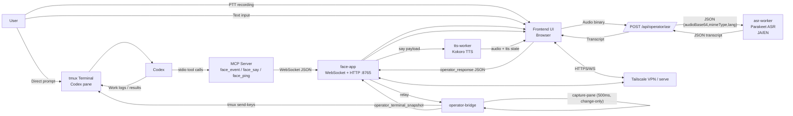
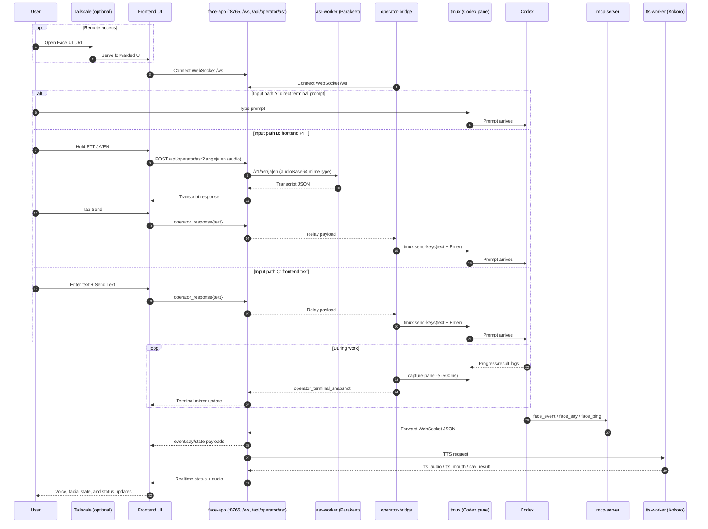
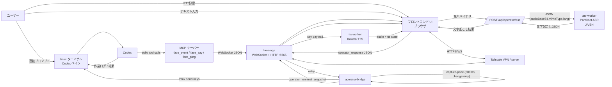
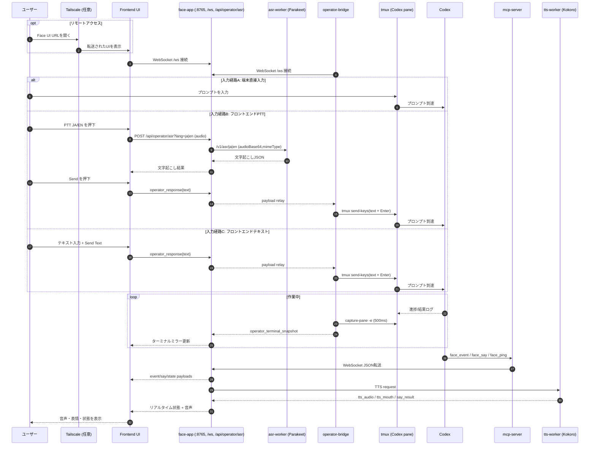

# minimum-headroom

<p>
  
  
</p>
<p>
  
  
</p>

[English](#english) | [日本語](#japanese)

<a id="english"></a>

## English

---

A face and operator companion app for coding agents.

`minimum-headroom` combines four things into one runtime: a browser face UI, a mobile-friendly operator panel, a tmux bridge for delivering operator input to your agent terminal, and MCP signaling (`face.event` / `face.say` / `face.ping`) for realtime status voice + expression feedback.

## Contents

- [At a Glance](#en-at-a-glance)
- [Quick Start](#en-quick-start)
- [Detailed Guides](#en-detailed-guides)
- [MCP Client Config](#en-mcp-client-config)
- [Japanese](#japanese)

<a id="en-at-a-glance"></a>
## At a Glance

- Run your coding agent in tmux, and control/assist it from terminal or mobile browser.
- Use three input paths: direct terminal text, frontend PTT (JA/EN -> ASR), or frontend text fallback.
- Send approved input to the agent pane via `operator-bridge` (`tmux send-keys`).
- Mirror terminal output back to mobile/desktop UI at 500ms change-only snapshots.
- Broadcast agent state to users through MCP events/speech and browser face animation + audio.
- Access remotely from phone/tablet via Tailscale Serve.

## Features

- Operator input pipeline:
  - terminal direct prompt, frontend PTT (JA/EN), and frontend text fallback
  - browser audio -> ASR proxy -> Parakeet ASR -> append to text fallback -> tmux send
  - desktop keyboard safety: `Space` / `Shift+Space` PTT starts only after a 1 second hold
  - key controls (`Esc`, `↑`, `Select`, `↓`) and restart/recovery support
- Terminal mirror:
  - read-only tmux tail snapshots
  - 500ms publish interval (change-only)
- Multi-agent operator control:
  - desktop current-agent bar opens the Agents surface from the normal one-agent view
  - mobile current-agent bar opens the agent list without displacing `Esc`
  - desktop currently renders `operator + up to 7 helper agents` at once (`8` tiles total)
  - each desktop face tile keeps its own identity, speech bubble, idle/attention tone, and direct mouse-drag head steering
  - `+Agent` uses safe auto-generated id/branch/worktree defaults, inherits the active target repository when the operator was started with `--repo`, and restores only helpers from that active repository stream on the next launch
  - selecting a tile or list row changes the real operator focus target
  - `Delete` removes the helper agent pane, worktree, and runtime record together
  - helper reports now land in an app-owned durable owner inbox; unresolved items survive reloads and keep helper/owner attention visible until resolved
  - helper missions can now be stored in an app-owned assignment store, injected into helper panes through controlled tmux paste-buffer delivery, and tracked as `pending` / `sent_to_tmux` / `acked` / `failed` / `timeout`
  - `agent.spawn` accepts `permission_preset` (`reviewer`, `implementer`, `full`) to auto-configure helper tool permissions at spawn time, eliminating manual approval prompts for Claude, Gemini, and Codex agents
  - after full tmux shutdown, helper agents are recreated from saved worktrees on the next startup when possible; helpers from other repositories stay hidden, and helpers whose worktrees are gone appear as `missing`
- MCP tools for signaling:
  - `face.event` / `face.say` / `face.ping`
  - `agent.list` / `agent.spawn` / `agent.focus` / `agent.delete`
  - `agent.assign` / `agent.inject` / `agent.assignment.list`
  - `agent.report` / `owner.inbox.list` / `owner.inbox.resolve`
- Browser 3D face renderer with state-driven animation:
  - eyebrow/eye/mouth/head movement
  - state modes (`confused`, `frustration`, `confidence`, `urgency`, `stuckness`, `neutral`)
  - direct head drag control (mouse/finger) with mode-coupled expression amplification
  - panel toggle shortcuts (`Esc`, double tap, double click)
- Looking Glass WebXR support path
- TTS pipeline:
  - Kokoro ONNX + Misaki (`af_heart`) by default
  - optional experimental Qwen3-TTS Japanese backend
  - freshness-first speech policy (`interrupt`, TTL, generation invalidation)
  - speech result feedback (`say_result`)
  - selectable output route (`local`, `browser`, `both`)

## System Flow Diagrams

Static exports: [High-Level Flow PNG](doc/diagrams/high-level-flow.png), [Sequence Timeline PNG](doc/diagrams/sequence-timeline.png), [High-Level Flow SVG](doc/diagrams/high-level-flow.svg), [Sequence Timeline SVG](doc/diagrams/sequence-timeline.svg)

### High-Level Flow


```mermaid
flowchart LR
  U[User]
  TMUX[tmux Terminal<br/>Codex pane]
  C[Codex]
  MCP[MCP Server<br/>face_event / face_say / face_ping]
  WS[face-app<br/>WebSocket + HTTP :8765]
  FE[Frontend UI<br/>Browser]
  BR[operator-bridge]
  ASRP[/POST /api/operator/asr/]
  ASR[asr-worker<br/>Parakeet ASR<br/>JA/EN]
  TTS[tts-worker<br/>Kokoro TTS]
  TS[Tailscale VPN / serve]

  U -- Direct prompt --> TMUX
  U -- PTT recording --> FE
  U -- Text input --> FE

  FE -- Audio binary --> ASRP
  ASRP -- JSON (audioBase64,mimeType,lang) --> ASR
  ASR -- JSON transcript --> ASRP
  ASRP -- Transcript --> FE

  FE -- operator_response JSON --> WS
  WS -- relay --> BR
  BR -- tmux send-keys --> TMUX
  TMUX --> C
  C -- Work logs / results --> TMUX

  BR -- capture-pane (500ms, change-only) --> BR
  BR -- operator_terminal_snapshot --> WS
  WS --> FE

  C -- stdio tool calls --> MCP
  MCP -- WebSocket JSON --> WS
  WS --> FE

  WS -- say payload --> TTS
  TTS -- audio + tts state --> FE

  FE <-- HTTPS/WS --> TS
  TS <---> WS
```

### Sequence Timeline


```mermaid
sequenceDiagram
  autonumber
  participant U as User
  participant TS as Tailscale (optional)
  participant FE as Frontend UI
  participant FA as face-app (:8765, /ws, /api/operator/asr)
  participant ASR as asr-worker (Parakeet)
  participant BR as operator-bridge
  participant TM as tmux (Codex pane)
  participant CX as Codex
  participant MCP as mcp-server
  participant TTS as tts-worker (Kokoro)

  opt Remote access
    U->>TS: Open Face UI URL
    TS->>FE: Serve forwarded UI
  end

  FE->>FA: Connect WebSocket /ws
  BR->>FA: Connect WebSocket /ws

  alt Input path A: direct terminal prompt
    U->>TM: Type prompt
    TM->>CX: Prompt arrives
  else Input path B: frontend PTT
    U->>FE: Hold PTT JA/EN
    FE->>FA: POST /api/operator/asr?lang=ja|en (audio)
    FA->>ASR: /v1/asr/ja|en (audioBase64,mimeType)
    ASR-->>FA: Transcript JSON
    FA-->>FE: Transcript response
    U->>FE: Tap Send
    FE->>FA: operator_response{text}
    FA-->>BR: Relay payload
    BR->>TM: tmux send-keys(text + Enter)
    TM->>CX: Prompt arrives
  else Input path C: frontend text
    U->>FE: Enter text + Send Text
    FE->>FA: operator_response{text}
    FA-->>BR: Relay payload
    BR->>TM: tmux send-keys(text + Enter)
    TM->>CX: Prompt arrives
  end

  loop During work
    CX-->>TM: Progress/result logs
    BR->>TM: capture-pane -e (500ms)
    BR-->>FA: operator_terminal_snapshot
    FA-->>FE: Terminal mirror update
  end

  CX->>MCP: face_event / face_say / face_ping
  MCP->>FA: Forward WebSocket JSON
  FA-->>FE: event/say/state payloads

  FA->>TTS: TTS request
  TTS-->>FA: tts_audio / tts_mouth / say_result
  FA-->>FE: Realtime status + audio
  FE-->>U: Voice, facial state, and status updates
```

## Requirements

- Node.js 20+ (Node 24 recommended)
- `uv` (for Python worker dependencies)
- Python 3.10+
- `ffmpeg` (recommended; used by ASR worker fallback decode for webm/ogg/mp4)
- Optional for audible TTS on Linux:
  - either PortAudio (`libportaudio2`) for `sounddevice`
  - or ALSA `aplay` fallback

<a id="en-quick-start"></a>
## Quick Start

Choose one startup path depending on your goal.
Before starting, configure MCP server settings for your coding agent (see [MCP Client Config](#en-mcp-client-config)), set up the agent-specific `AGENTS.md`, and reflect `doc/examples/AGENT_RULES.md` in the agent instructions. If you want a ready-to-paste starting point, use `doc/examples/AGENTS.sample.md` as the template for your project-local `AGENTS.md`.

If you plan to use the mobile UI remotely, it is convenient to start Tailscale Serve in advance:

```bash
tailscale serve --bg 8765
```

### Path A: Face + MCP (minimal)

From repository root:

```bash
./scripts/setup.sh
./scripts/run-face-app.sh
```

Then, in another terminal:

```bash
./scripts/run-mcp-server.sh
```

Use this path when you want the simple face UI and signaling, without the full operator panel workflow. `run-face-app.sh` hides the operator panel by default.

- If your coding agent already starts this repository's MCP server from its own MCP client config, do not also run `./scripts/run-mcp-server.sh`.
- By default, `face-app` starts `tts-worker` for you unless `FACE_TTS_ENABLED=0` is set. The default backend is Kokoro; if the `face-app` process is launched with `TTS_ENGINE=qwen3`, the spawned worker uses the optional Qwen3 path instead.

### Path B: Full Mobile Operator Stack (recommended)

After `./scripts/setup.sh`, recommended one-shot startup:

```bash
./scripts/run-operator-once.sh --profile realtime
```

Use this when you want the full tmux-backed operator workflow, browser PTT, terminal mirror, hidden mobile recovery, and the safest default bridge wiring. Start with `--profile default` or `--profile realtime` unless you specifically want Qwen3 TTS.

- `run-operator-once.sh` / `run-operator-stack.sh` launch `face-app`, and `face-app` starts `tts-worker` by default unless `FACE_TTS_ENABLED=0` is set. `qwen3` / `qwen3-realtime` profiles work by passing `TTS_ENGINE=qwen3` into that spawned worker path.
- Profile shorthand:
  - `--profile default`: Kokoro TTS + batch ASR only
  - `--profile realtime`: Kokoro TTS + Voxtral realtime ASR + Parakeet fallback
  - `--profile qwen3`: Qwen3 TTS + batch ASR only
  - `--profile qwen3-realtime`: Qwen3 TTS + Voxtral realtime ASR + Parakeet fallback
- When you use this app to work on another repository, put a project-local `AGENTS.md` in that target repository too. Start from `doc/examples/AGENTS.sample.md`, then customize the repo-specific build/test/run rules there.
- For another repository, you can start the operator in either of these equivalent styles:
  - run from this repository and pass `--repo /path/to/target-repo`
  - or `cd` into the target repository and launch `/path/to/MinimumHeadroom/scripts/run-operator-once.sh ...`

After startup, multi-agent use is centered in the operator pane:

- Desktop: click the current-agent bar to open `Agents`, use `+Agent` to spawn a helper, click a tile to retarget the operator pane, and use `Delete` to remove a finished helper agent.
- Mobile: tap the current-agent bar below the title row to open the agent list, then `+Agent`, tap an agent row to retarget, or `Delete` a helper agent.
- When the operator was started with `--repo /path/to/target`, new helpers inherit that target repository by default rather than falling back to this app repository, and helper worktrees default under that target repository's `.agent/worktrees`.
- Helper reports are stored in an app-owned durable owner inbox, so unresolved `blocked` / `question` / `done` / `review_findings` items continue to drive attention after browser reloads.
- Helper missions can be stored in an app-owned assignment store, then delivered into helper panes through controlled tmux injection. Delivery is tracked as `pending`, `sent_to_tmux`, `acked`, `failed`, or `timeout`, and matching helper `agent.report` calls acknowledge the mission.
- For review or investigation helpers, keep assignments concrete: prefer `target_paths`, `completion_criteria`, `timebox_minutes`, and `max_findings` so the first helper pass returns one narrow result or a clear blocking question instead of wandering. `target_paths` are interpreted relative to the active stream/source repository root, so they may intentionally point outside the helper worktree itself.
- If you later shut the whole tmux session down and start fresh with `./scripts/run-operator-once.sh`, saved helper agents are recreated from their existing worktrees for the active target repository stream only; helpers whose worktrees are gone come back as `missing`.

Useful variants:

```bash
# work on another repository while keeping minimum-headroom as the operator shell
./scripts/run-operator-once.sh --profile realtime --repo /path/to/target-repo

# work from the target repository itself and call the script by absolute path
cd /path/to/target-repo
/path/to/MinimumHeadroom/scripts/run-operator-once.sh --profile realtime

# start with a shell in the agent pane first
./scripts/run-operator-once.sh --profile realtime --agent-shell

# resume an existing Codex conversation
./scripts/run-operator-once.sh --agent-cmd 'codex resume --last'

# keep the current shell instead of attaching to tmux
./scripts/run-operator-once.sh --profile realtime --no-attach

# choose Qwen3 TTS only when you want that path explicitly
./scripts/run-operator-once.sh --profile qwen3-realtime
```

<a id="en-detailed-guides"></a>
## Detailed Guides

The top-level README intentionally stays shorter now. Use these files for the full operational playbook:

- [Operator Stack and ASR Guide](doc/guides/operator-stack.md#english)
  - launcher choice, tmux bridge wiring, operator UI behavior, multi-agent add/focus/delete flow, keyboard shortcuts, hidden mobile recovery, supported shutdown guidance, batch/realtime ASR, and Tailscale remote operation
- [TTS and Speech Guide](doc/guides/tts-and-speech.md#english)
  - Kokoro and Qwen3 setup, speech gate, long-speech behavior, and pre-synthesis text normalization

<a id="en-mcp-client-config"></a>
## MCP Client Config

Do not commit your personal local config files.

### Codex CLI example

Use `doc/examples/codex/config.toml` as a template. Update absolute paths for your machine.

If your MCP client rejects tool names with dots (for example `face.event`), set:

```toml
env = { FACE_WS_URL = "ws://127.0.0.1:8765/ws", MCP_TOOL_NAME_STYLE = "underscore" }
```

Then tools are published as:

- `face_event`
- `face_say`
- `face_ping`

### Antigravity example

Use `doc/examples/antigravity/mcp_config.json` as a template with your own absolute path.

For agent-side signaling conventions, see `doc/examples/AGENT_RULES.md`.

## Optional Agent Skills

This repository includes reusable skill packages under `doc/examples/skills/`:

- `release-ci-flow`
- `minimum-headroom-ops`
- `looking-glass-webxr-setup`

Each folder contains a `SKILL.md` and can be copied into your local skills directory (for example `$CODEX_HOME/skills/`) if your agent supports local skill loading.

If you are using the minimum-headroom operator/helper runtime, install `minimum-headroom-ops`. It covers the expected MCP lifecycle flow (`agent.list`, `agent.spawn`, `agent.assign`, `agent.inject`, `agent.assignment.list`, `owner.inbox.*`, `agent.delete`) and the helper reporting contract.

## Release Checklist

- Run tests:

```bash
npm test
```

- Verify MCP startup:

```bash
./scripts/run-mcp-server.sh
```

- Verify face app startup and browser rendering:

```bash
./scripts/run-face-app.sh
```

- Verify TTS worker smoke:

```bash
npm run tts-worker:smoke
```

- Verify ASR worker smoke:

```bash
npm run asr-worker:smoke
```

- Verify operator stack startup (inside tmux or with `MH_BRIDGE_TMUX_PANE` set):

```bash
./scripts/run-operator-stack.sh
```

## Repository Notes

- Runtime/local files (models, local MCP config, caches, venv) are excluded via `.gitignore`.

<a id="japanese"></a>

## 日本語

コーディングエージェント向けのフェイス・オペレーター支援アプリです。

`minimum-headroom` は次の4つを1つの実行環境としてまとめたアプリです。

- ブラウザで動作するフェイスUI
- モバイル向けオペレーターパネル
- オペレーター入力をエージェント用tmuxペインへ届ける `operator-bridge`
- MCPシグナリング (`face.event` / `face.say` / `face.ping`) によるリアルタイム状態通知（音声・表情）

## 目次

- [全体像（要点）](#ja-overview)
- [クイックスタート](#ja-quick-start)
- [詳細ガイド](#ja-detailed-guides)
- [MCPクライアント設定](#ja-mcp-client-config)
- [English](#english)

<a id="ja-overview"></a>
## 全体像（要点）

- エージェントを tmux で動かし、端末またはモバイルブラウザから補助操作できます。
- 入力経路は3つです: 端末の直接入力、フロントエンドPTT（JA/EN -> ASR）、フロントエンドのテキスト入力。
- 承認・送信された入力は `operator-bridge` が `tmux send-keys` でエージェントペインへ投入します。
- 端末出力は 500ms 間隔（差分があるときのみ）でミラー配信されます。
- `./scripts/run-operator-once.sh --ui-mode pc` はデスクトップ向けUI、`--ui-mode mobile` はモバイル向けUI、`--ui-mode auto` は自動選択です。
- エージェント状態は MCP イベント/発話とフェイスUI（表情・音声）でユーザーへ通知されます。
- Tailscale Serve を使うとスマホ/タブレットからリモートアクセスできます。

## 機能

- オペレーター入力パイプライン:
  - 端末直接入力 / フロントエンドPTT（JA/EN）/ フロントエンドテキスト入力
  - ブラウザ音声 -> ASRプロキシ -> Parakeet ASR -> テキスト入力へ追記 -> tmux送信
  - デスクトップの誤作動対策として `Space` / `Shift+Space` の PTT は 1 秒長押しで開始
  - キー操作（`Esc`, `↑`, `Select`, `↓`）と復旧用 `Restart`
- ターミナルミラー:
  - tmux末尾出力の読み取り専用スナップショット
  - 500ms 発行（変更があった場合のみ）
- マルチエージェントオペレーター制御:
  - Desktop の現在エージェントバーから `Agents` サーフェスを開く
  - Mobile の現在エージェントバーから agent list を開く
  - Desktop は現在 `operator + helper 最大 7 体` を同時表示します（合計 `8` タイル）
  - 各 Desktop 顔タイルは固有の見た目、speech bubble、idle/attention 色、個別のマウスドラッグ頭部操作を持ちます
  - `+Agent` は安全な自動 id / branch / worktree を使い、operator を `--repo` 付きで起動している場合はその target repository を helper の既定 source repo / worktree 基点として継承し、次回起動時もその active repository stream の helper だけを復元表示します
  - タイルや行の選択で operator pane の接続先を切り替えます
  - `Delete` は helper agent の pane / worktree / runtime record をまとめて削除します
  - helper report は app 側の durable な owner inbox に保存され、未解決項目は reload 後も helper / owner の attention 表示を維持します
  - helper mission は app 側の assignment store に保存され、制御された tmux paste-buffer 注入で helper pane へ渡せます。delivery 状態は `pending` / `sent_to_tmux` / `acked` / `failed` / `timeout` として追跡されます
  - `agent.spawn` で `permission_preset`（`reviewer` / `implementer` / `full`）を指定すると、Claude / Gemini / Codex 各エージェントのツール承認を spawn 時に自動設定し、手動承認プロンプトを排除できます
  - review や investigation 用 helper の mission は、`target_paths`、`completion_criteria`、`timebox_minutes`、`max_findings` を使って具体化するのが有効です。そうすると helper は最初の pass で狭い結果 1 件か、明確な `question` / `blocked` を返しやすくなります。`target_paths` は active stream / source repository root 基準で解釈されるので、helper worktree の外にある source-repo 側パスを意図的に指定できます
  - `tmux` session 全体を落として再起動した場合も、active repository stream の helper は worktree が残っていれば再生成され、無ければ `missing` として戻ります。他 repository の helper は hidden のままです
- MCPシグナリングツール:
  - `face.event` / `face.say` / `face.ping`
  - `agent.list` / `agent.spawn` / `agent.focus` / `agent.delete`
  - `agent.assign` / `agent.inject` / `agent.assignment.list`
  - `agent.report` / `owner.inbox.list` / `owner.inbox.resolve`
- ブラウザ3Dフェイス描画:
  - 眉・目・口・頭の状態駆動アニメーション
  - 状態モード（`confused`, `frustration`, `confidence`, `urgency`, `stuckness`, `neutral`）
  - ドラッグ操作（マウス/タッチ）による頭部制御とモード連動バイアス
  - パネル表示切替ショートカット（`Esc`, ダブルタップ, ダブルクリック）
- Looking Glass WebXR 対応経路
- TTSパイプライン:
  - 既定は Kokoro ONNX + Misaki (`af_heart`)
  - 任意で実験的な Qwen3-TTS 日本語 backend
  - 発話鮮度優先ポリシー（`interrupt`, TTL, generation）
  - `say_result` フィードバック
  - 出力先切替（`local`, `browser`, `both`）

## システムフロー図

静的エクスポート: [High-Level Flow PNG](doc/diagrams/high-level-flow.png), [Sequence Timeline PNG](doc/diagrams/sequence-timeline.png), [High-Level Flow SVG](doc/diagrams/high-level-flow.svg), [Sequence Timeline SVG](doc/diagrams/sequence-timeline.svg)

### ハイレベルフロー


```mermaid
flowchart LR
  U[ユーザー]
  TMUX[tmux ターミナル<br/>Codex ペイン]
  C[Codex]
  MCP[MCP サーバー<br/>face_event / face_say / face_ping]
  WS[face-app<br/>WebSocket + HTTP :8765]
  FE[フロントエンド UI<br/>ブラウザ]
  BR[operator-bridge]
  ASRP[/POST /api/operator/asr/]
  ASR[asr-worker<br/>Parakeet ASR<br/>JA/EN]
  TTS[tts-worker<br/>Kokoro TTS]
  TS[Tailscale VPN / serve]

  U -- 直接プロンプト --> TMUX
  U -- PTT録音 --> FE
  U -- テキスト入力 --> FE

  FE -- 音声バイナリ --> ASRP
  ASRP -- JSON (audioBase64,mimeType,lang) --> ASR
  ASR -- 文字起こしJSON --> ASRP
  ASRP -- 文字起こし結果 --> FE

  FE -- operator_response JSON --> WS
  WS -- relay --> BR
  BR -- tmux send-keys --> TMUX
  TMUX --> C
  C -- 作業ログ / 結果 --> TMUX

  BR -- capture-pane (500ms, change-only) --> BR
  BR -- operator_terminal_snapshot --> WS
  WS --> FE

  C -- stdio tool calls --> MCP
  MCP -- WebSocket JSON --> WS
  WS --> FE

  WS -- say payload --> TTS
  TTS -- audio + tts state --> FE

  FE <-- HTTPS/WS --> TS
  TS <---> WS
```

### 時系列シーケンス


```mermaid
sequenceDiagram
  autonumber
  participant U as ユーザー
  participant TS as Tailscale (任意)
  participant FE as Frontend UI
  participant FA as face-app (:8765, /ws, /api/operator/asr)
  participant ASR as asr-worker (Parakeet)
  participant BR as operator-bridge
  participant TM as tmux (Codex pane)
  participant CX as Codex
  participant MCP as mcp-server
  participant TTS as tts-worker (Kokoro)

  opt リモートアクセス
    U->>TS: Face UI URLを開く
    TS->>FE: 転送されたUIを表示
  end

  FE->>FA: WebSocket /ws 接続
  BR->>FA: WebSocket /ws 接続

  alt 入力経路A: 端末直接入力
    U->>TM: プロンプトを入力
    TM->>CX: プロンプト到達
  else 入力経路B: フロントエンドPTT
    U->>FE: PTT JA/EN を押下
    FE->>FA: POST /api/operator/asr?lang=ja|en (audio)
    FA->>ASR: /v1/asr/ja|en (audioBase64,mimeType)
    ASR-->>FA: 文字起こしJSON
    FA-->>FE: 文字起こし結果
    U->>FE: Send を押下
    FE->>FA: operator_response{text}
    FA-->>BR: payload relay
    BR->>TM: tmux send-keys(text + Enter)
    TM->>CX: プロンプト到達
  else 入力経路C: フロントエンドテキスト
    U->>FE: テキスト入力 + Send Text
    FE->>FA: operator_response{text}
    FA-->>BR: payload relay
    BR->>TM: tmux send-keys(text + Enter)
    TM->>CX: プロンプト到達
  end

  loop 作業中
    CX-->>TM: 進捗/結果ログ
    BR->>TM: capture-pane -e (500ms)
    BR-->>FA: operator_terminal_snapshot
    FA-->>FE: ターミナルミラー更新
  end

  CX->>MCP: face_event / face_say / face_ping
  MCP->>FA: WebSocket JSON転送
  FA-->>FE: event/say/state payloads

  FA->>TTS: TTS request
  TTS-->>FA: tts_audio / tts_mouth / say_result
  FA-->>FE: リアルタイム状態 + 音声
  FE-->>U: 音声・表情・状態を表示
```

## 必要環境

- Node.js 20+（Node 24 推奨）
- `uv`（Python worker依存管理）
- Python 3.10+
- `ffmpeg`（推奨。ASR worker の webm/ogg/mp4 フォールバックデコードに使用）
- Linuxで音声出力する場合（任意）:
  - PortAudio (`libportaudio2`) + `sounddevice`
  - または ALSA `aplay`

<a id="ja-quick-start"></a>
## クイックスタート

目的に合わせて起動パスを選んでください。
開始前に、利用するコーディングエージェントで MCP サーバー設定を行い（[MCPクライアント設定](#ja-mcp-client-config) を参照）、エージェント向け `AGENTS.md` を設定し、`doc/examples/AGENT_RULES.md` の内容をエージェント指示へ反映してください。すぐ使えるひな形が必要なら、`doc/examples/AGENTS.sample.md` を project-local `AGENTS.md` のテンプレートとして使ってください。

モバイルUIをリモート利用する場合は、先に Tailscale Serve を起動しておくと便利です。

```bash
tailscale serve --bg 8765
```

### Path A: Face + MCP（最小構成）

```bash
./scripts/setup.sh
./scripts/run-face-app.sh
```

その後、別ターミナルで:

```bash
./scripts/run-mcp-server.sh
```

これは、シンプルな face UI とシグナリングだけを使いたいとき向けです。`run-face-app.sh` は既定で operator panel を隠します。

- 利用中のコーディングエージェントが MCP クライアント設定からこのリポジトリの MCP サーバーを自動起動する場合、`./scripts/run-mcp-server.sh` は二重起動しないでください。
- 既定では `face-app` が `tts-worker` を子プロセス起動するため、`FACE_TTS_ENABLED=0` にしていない限り別ターミナルでの起動は不要です。既定 backend は Kokoro で、`face-app` 側を `TTS_ENGINE=qwen3` 付きで起動すると任意の Qwen3 worker 経路を使います。

### Path B: フルモバイル Operator Stack（推奨）

`./scripts/setup.sh` 実行後の推奨 1 発起動:

```bash
./scripts/run-operator-once.sh --profile realtime
```

これは、tmux 連携、browser PTT、terminal mirror、隠し復旧、bridge の安全な既定配線まで含む、いちばん実用的な構成です。特に Qwen3 TTS を使いたい理由がなければ、`--profile default` か `--profile realtime` から始めてください。

- `run-operator-once.sh` / `run-operator-stack.sh` は `face-app` を起動し、その `face-app` が既定で `tts-worker` を子起動します。`FACE_TTS_ENABLED=0` を指定しない限り、別ターミナルでの TTS 起動は不要です。`qwen3` / `qwen3-realtime` profile は、この子起動 worker に `TTS_ENGINE=qwen3` を渡して切り替えます。
- profile の意味:
  - `--profile default`: Kokoro TTS + batch ASR のみ
  - `--profile realtime`: Kokoro TTS + Voxtral realtime ASR + Parakeet fallback
  - `--profile qwen3`: Qwen3 TTS + batch ASR のみ
  - `--profile qwen3-realtime`: Qwen3 TTS + Voxtral realtime ASR + Parakeet fallback
- このアプリを使って別の作業リポジトリを扱う場合は、その target repository 側にも project-local な `AGENTS.md` を置いてください。`doc/examples/AGENTS.sample.md` を出発点にして、その repo 固有の build/test/run ルールを追記するのが簡単です。
- 別の作業リポジトリで使う起動方法は、次の 2 通りが実用的です。
  - このリポジトリ側から `--repo /path/to/target-repo` を付けて起動する
  - target repository 側へ `cd` してから `/path/to/MinimumHeadroom/scripts/run-operator-once.sh ...` を呼ぶ

起動後のマルチエージェント操作は、operator pane を中心に次の流れで行います。

- Desktop: 現在エージェントバーを押して `Agents` を開き、`+Agent` で helper を追加し、タイルを押して operator pane の接続先を切り替え、完了した helper は `Delete` で削除します。
- Mobile: タイトル行の下にある現在エージェントバーを押して agent list を開き、`+Agent`、行タップでの切り替え、`Delete` による helper 削除を行います。
- Desktop は現在 `operator + helper 最大 7 体` を同時表示します（合計 `8` タイル）。
- operator を `--repo /path/to/target` 付きで起動した場合、新しい helper は既定でその target repository を継承します。
- helper report は app 側の durable な owner inbox に保持されるため、未解決の `blocked` / `question` / `done` / `review_findings` は browser reload 後も attention を維持します。
- helper mission は app 側の assignment store に保存され、制御された tmux paste-buffer 注入で helper pane に渡せます。delivery は `pending` / `sent_to_tmux` / `acked` / `failed` / `timeout` として追跡され、matching `agent.report` が ack を返します。
- `agent.spawn` で `permission_preset` を指定すると、helper のツール承認をエージェント種別（Claude / Gemini / Codex）に応じて自動設定できます。
- `tmux` session 全体を落としてから `./scripts/run-operator-once.sh` で再起動した場合も、helper の worktree が残っていれば再生成され、worktree が無ければ `missing` として戻ります。

よく使う派生例:

```bash
# minimum-headroom を operator shell として使いながら、別 repo を作業対象にする
./scripts/run-operator-once.sh --profile realtime --repo /path/to/target-repo

# target repository 側から absolute path で script を呼ぶ
cd /path/to/target-repo
/path/to/MinimumHeadroom/scripts/run-operator-once.sh --profile realtime

# まず agent ペインをシェルだけで開く
./scripts/run-operator-once.sh --profile realtime --agent-shell

# 直前の Codex セッションを再開
./scripts/run-operator-once.sh --agent-cmd 'codex resume --last'

# 起動だけ行い、現在のシェルを維持
./scripts/run-operator-once.sh --profile realtime --no-attach

# Qwen3 TTS を使いたい時だけ明示的に選ぶ
./scripts/run-operator-once.sh --profile qwen3-realtime
```

<a id="ja-detailed-guides"></a>
## 詳細ガイド

トップレベル README は入口に絞っています。詳しい運用手順は次のガイドを見てください。

- [Operator Stack and ASR Guide](doc/guides/operator-stack.md#japanese)
  - 起動スクリプトの選び方、tmux bridge、operator UI、キーボードショートカット、batch / realtime ASR、隠し復旧、Tailscale リモート運用
- [TTS and Speech Guide](doc/guides/tts-and-speech.md#japanese)
  - Kokoro / Qwen3 のセットアップ、発話ゲート、長文発話、発話前の正規化

<a id="ja-mcp-client-config"></a>
## MCPクライアント設定

個人用ローカル設定ファイルはリポジトリにコミットしないでください。

### Codex CLI 例

`doc/examples/codex/config.toml` をテンプレートとして使い、各自の絶対パスへ置き換えてください。

MCPクライアントがドット付きツール名（例: `face.event`）を受け付けない場合:

```toml
env = { FACE_WS_URL = "ws://127.0.0.1:8765/ws", MCP_TOOL_NAME_STYLE = "underscore" }
```

公開ツール名は次の形になります。

- `face_event`
- `face_say`
- `face_ping`

### Antigravity 例

`doc/examples/antigravity/mcp_config.json` をテンプレートとして使い、各自の絶対パスへ置き換えてください。

エージェント側シグナリング規約は `doc/examples/AGENT_RULES.md` を参照してください。

## オプションスキル

`doc/examples/skills/` に再利用可能なスキルを同梱しています。

- `release-ci-flow`
- `minimum-headroom-ops`
- `looking-glass-webxr-setup`

各フォルダには `SKILL.md` があり、対応エージェントではローカルスキルディレクトリ（例: `$CODEX_HOME/skills/`）へコピーして利用できます。

minimum-headroom の operator/helper runtime を使う場合は、`minimum-headroom-ops` の導入を推奨します。`agent.list`, `agent.spawn`, `agent.assign`, `agent.inject`, `agent.assignment.list`, `owner.inbox.*`, `agent.delete` を使う標準フローと、helper report の規約をまとめています。

## リリースチェックリスト

- テスト実行:

```bash
npm test
```

- MCP起動確認:

```bash
./scripts/run-mcp-server.sh
```

- face-app起動とブラウザ表示確認:

```bash
./scripts/run-face-app.sh
```

- TTS worker smoke確認:

```bash
npm run tts-worker:smoke
```

- ASR worker smoke確認:

```bash
npm run asr-worker:smoke
```

- operator stack起動確認（tmux内 or `MH_BRIDGE_TMUX_PANE` 指定）:

```bash
./scripts/run-operator-stack.sh
```

## 補足

- 実行時ローカルファイル（モデル、ローカルMCP設定、キャッシュ、venv など）は `.gitignore` で除外されています。
