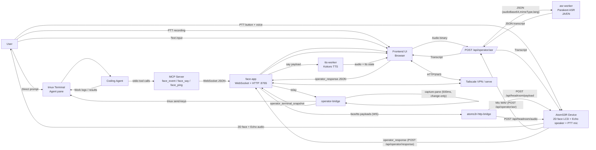
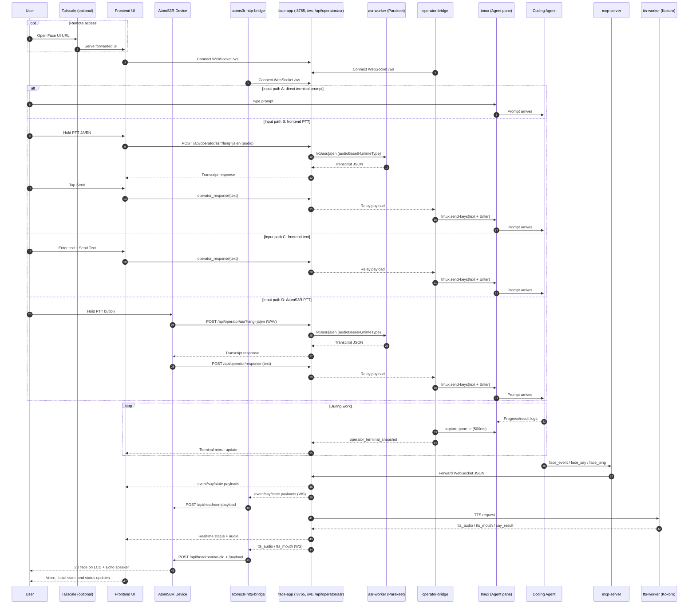

# minimum-headroom

<p>
  
  
</p>
<p>
  
  
</p>

[English](README.md) | [日本語](README.ja.md)

A face and operator companion app for coding agents.

## Contents

- [At a Glance](#en-at-a-glance)
- [Features](#en-features)
- [Quick Start](#en-quick-start)
- [Agent Setup](#en-agent-setup)
- [Detailed Guides](#en-detailed-guides)
- [Documentation Index](doc/README.md)

<a id="en-at-a-glance"></a>
## At a Glance

- **Control your PC coding agent from your phone** — approve, type, or speak commands via mobile browser.
- **Works with Claude Code, Codex CLI, and Antigravity CLI** — any agent that runs in a terminal.
- **tmux operator bridge** relays input/output between the browser UI and the agent pane.
- **3D face + TTS + MCP signaling** give your agent a voice and expressions that reflect its state.
- **M12 vision subsystem** adds AtomS3R-M12 camera awareness: diffusiongemma (vLLM) captions, hierarchical situation memory, `GET /situation` agent-context injection, and spoken alerts through the M12 Echo Base. See [M12 Vision Guide](doc/guides/m12-vision.md#english) and [vision-worker README](vision-worker/README.md).
- **Multi-agent support** (experimental) — spawn helper agents in isolated worktrees with permission presets and durable mission tracking. See [Multi-Agent Guide](doc/guides/multi-agent.md).
- **Tailscale Serve** for secure remote access from phone or tablet.

<a id="en-features"></a>
## Features

- **Operator input** — terminal direct prompt, browser PTT (JA/EN ASR), text fallback, desktop `Space`/`Shift+Space` hold-to-talk safety, key controls (`Esc`, `↑`, `Select`, `↓`)
- **Terminal mirror** — read-only tmux tail snapshots at 500ms change-only intervals; lines render at native width with horizontal scroll, and on touch devices you can pinch-to-zoom (anchored under your fingers) and double-tap to reset
- **Multi-agent** (experimental) — spawn/focus/delete helpers from desktop tiles or mobile list, permission presets, mission assignment and delivery, owner inbox. A background stuck-detector scans each helper's tmux pane and posts auto `blocked` reports to the owner inbox when a known CLI modal (approval prompt, model picker, usage-limit notice, survey) is visible, so the operator notices stalled helpers without polling. See [Multi-Agent Guide](doc/guides/multi-agent.md).
- **M12 vision** — AtomS3R-M12 camera + diffusiongemma (vLLM) captioner, change-gated SQLite memory with tiered summaries, `GET /situation` digest injection, corrections, keyword watches, and Echo Base spoken alerts. See [M12 Vision Guide](doc/guides/m12-vision.md#english).
- **MCP signaling** — `face.event` / `face.say` / `face.ping` plus agent lifecycle tools (`agent.list`, `agent.spawn`, `agent.focus`, `agent.delete`, `agent.assign`, `agent.assignment.list`, `agent.inject`, `agent.report`, `agent.pane_snapshot`, `agent.pane_send_key`, `owner.inbox.*`)
- **3D face** — eyebrow/eye/mouth/head animation, state modes (`confused`, `frustration`, `confidence`, `urgency`, `stuckness`, `neutral`), drag control, panel toggles
- **TTS** — Kokoro ONNX + Misaki default, optional Qwen3-TTS Japanese backend, freshness-first speech policy. See [TTS and Speech Guide](doc/guides/tts-and-speech.md).
- **ASR** — Parakeet batch, optional Voxtral realtime. See [Operator Stack and ASR Guide](doc/guides/operator-stack.md).
- **Looking Glass** WebXR support path

## System Flow Diagrams

Static exports: [High-Level Flow PNG](doc/diagrams/high-level-flow.png), [Sequence Timeline PNG](doc/diagrams/sequence-timeline.png), [High-Level Flow SVG](doc/diagrams/high-level-flow.svg), [Sequence Timeline SVG](doc/diagrams/sequence-timeline.svg)

### High-Level Flow


```mermaid
flowchart LR
  U[User]
  TMUX[tmux Terminal<br/>Agent pane]
  C[Coding Agent]
  MCP[MCP Server<br/>face_event / face_say / face_ping]
  WS[face-app<br/>WebSocket + HTTP :8765]
  FE[Frontend UI<br/>Browser]
  ATOM[AtomS3R Device<br/>2D face LCD + Echo speaker + PTT mic]
  ATOMBR[atoms3r-http-bridge]
  BR[operator-bridge]
  ASRP[/POST /api/operator/asr/]
  ASR[asr-worker<br/>Parakeet ASR<br/>JA/EN]
  TTS[tts-worker<br/>Kokoro TTS]
  TS[Tailscale VPN / serve]

  U -- Direct prompt --> TMUX
  U -- PTT recording --> FE
  U -- Text input --> FE
  U -- PTT button + voice --> ATOM
  ATOM -- 2D face + Echo audio --> U

  FE -- Audio binary --> ASRP
  ATOM -- Mic WAV (POST /api/operator/asr) --> ASRP
  ASRP -- JSON (audioBase64,mimeType,lang) --> ASR
  ASR -- JSON transcript --> ASRP
  ASRP -- Transcript --> FE
  ASRP -- Transcript --> ATOM

  FE -- operator_response JSON --> WS
  ATOM -- operator_response (POST /api/operator/response) --> WS
  WS -- relay --> BR
  BR -- tmux send-keys --> TMUX
  TMUX --> C
  C -- Work logs / results --> TMUX

  BR -- capture-pane (500ms, change-only) --> BR
  BR -- operator_terminal_snapshot --> WS
  WS --> FE

  C -- stdio tool calls --> MCP
  MCP -- WebSocket JSON --> WS
  WS --> FE

  WS -- say payload --> TTS
  TTS -- audio + tts state --> FE

  WS -- face/tts payloads (WS) --> ATOMBR
  ATOMBR -- POST /api/headroom/payload --> ATOM
  ATOMBR -- POST /api/headroom/audio --> ATOM

  FE <-- HTTPS/WS --> TS
  TS <---> WS
```

### Sequence Timeline


```mermaid
sequenceDiagram
  autonumber
  participant U as User
  participant TS as Tailscale (optional)
  participant FE as Frontend UI
  participant ATOM as AtomS3R Device
  participant ATOMBR as atoms3r-http-bridge
  participant FA as face-app (:8765, /ws, /api/operator/asr)
  participant ASR as asr-worker (Parakeet)
  participant BR as operator-bridge
  participant TM as tmux (Agent pane)
  participant CX as Coding Agent
  participant MCP as mcp-server
  participant TTS as tts-worker (Kokoro)

  opt Remote access
    U->>TS: Open Face UI URL
    TS->>FE: Serve forwarded UI
  end

  FE->>FA: Connect WebSocket /ws
  BR->>FA: Connect WebSocket /ws
  ATOMBR->>FA: Connect WebSocket /ws

  alt Input path A: direct terminal prompt
    U->>TM: Type prompt
    TM->>CX: Prompt arrives
  else Input path B: frontend PTT
    U->>FE: Hold PTT JA/EN
    FE->>FA: POST /api/operator/asr?lang=ja|en (audio)
    FA->>ASR: /v1/asr/ja|en (audioBase64,mimeType)
    ASR-->>FA: Transcript JSON
    FA-->>FE: Transcript response
    U->>FE: Tap Send
    FE->>FA: operator_response{text}
    FA-->>BR: Relay payload
    BR->>TM: tmux send-keys(text + Enter)
    TM->>CX: Prompt arrives
  else Input path C: frontend text
    U->>FE: Enter text + Send Text
    FE->>FA: operator_response{text}
    FA-->>BR: Relay payload
    BR->>TM: tmux send-keys(text + Enter)
    TM->>CX: Prompt arrives
  else Input path D: AtomS3R PTT
    U->>ATOM: Hold PTT button
    ATOM->>FA: POST /api/operator/asr?lang=ja|en (WAV)
    FA->>ASR: /v1/asr/ja|en (audioBase64,mimeType)
    ASR-->>FA: Transcript JSON
    FA-->>ATOM: Transcript response
    ATOM->>FA: POST /api/operator/response (text)
    FA-->>BR: Relay payload
    BR->>TM: tmux send-keys(text + Enter)
    TM->>CX: Prompt arrives
  end

  loop During work
    CX-->>TM: Progress/result logs
    BR->>TM: capture-pane -e (500ms)
    BR-->>FA: operator_terminal_snapshot
    FA-->>FE: Terminal mirror update
  end

  CX->>MCP: face_event / face_say / face_ping
  MCP->>FA: Forward WebSocket JSON
  FA-->>FE: event/say/state payloads
  FA-->>ATOMBR: event/say/state payloads (WS)
  ATOMBR->>ATOM: POST /api/headroom/payload

  FA->>TTS: TTS request
  TTS-->>FA: tts_audio / tts_mouth / say_result
  FA-->>FE: Realtime status + audio
  FA-->>ATOMBR: tts_audio / tts_mouth (WS)
  ATOMBR->>ATOM: POST /api/headroom/audio + /payload
  ATOM-->>U: 2D face on LCD + Echo speaker
  FE-->>U: Voice, facial state, and status updates
```

## Requirements

- Node.js 20+ (Node 24 recommended)
- `uv` (for Python worker dependencies)
- Python 3.10+
- `ffmpeg` (recommended; used by ASR worker fallback decode for webm/ogg/mp4)
- Optional for audible TTS on Linux:
  - either PortAudio (`libportaudio2`) for `sounddevice`
  - or ALSA `aplay` fallback

### Hardware Tiers

You do not need the full hardware set. Each tier adds capability on top of the previous one — the core experience works on a plain PC:

| Tier | Hardware | What you get |
|------|----------|--------------|
| 0 | A Linux PC, **no GPU** | Browser 3D face, Kokoro TTS (CPU), Parakeet batch ASR (`MH_ASR_DEVICE=cpu`), mobile operator UI — the core experience |
| 1 | + AtomS3R + Atomic Echo Base | A physical desk face with voice, push-to-talk, and hands-free mic (the RMH experience) |
| 2 | + a mid-range NVIDIA GPU | Realtime ASR (Voxtral) and faster local inference |
| 3 | + 32 GB VRAM GPU + AtomS3R-M12 (+ its own Echo Base) | Always-on camera perception with diffusiongemma, hierarchical situation memory, and spoken scene alerts |

The 32 GB figure is the default configuration, not an architectural requirement: the vision worker talks to any OpenAI-compatible endpoint (`VISION_MODEL_URL`), so a smaller local VLM or a hosted model can serve tier 3 on lighter hardware.

<a id="en-quick-start"></a>
## Quick Start

### Language: Japanese / English (MH_LANG)

Set the deployment language in `~/.config/minimum-headroom.env`:

```bash
MH_LANG=en
# or
MH_LANG=ja
```

The vision stack and operator stack read this file as defaults on the next start or restart; an already exported specific variable still wins. `MH_LANG` switches the diffusiongemma scene-description language, the default Kokoro voice (`en` → `af_heart`, `ja` → `jf_alpha`; explicit `MH_KOKORO_VOICE` wins), and the ASR fallback language.

The Atom device keeps its own ASR language setting. Provision it once when changing languages:

```bash
node scripts/atoms3r-provision.mjs --asr-lang en
```

Kokoro voices are accent-bound: `jf_alpha` speaking English sounds heavily Japanese-accented, and `af_heart` speaking Japanese is similarly unnatural. Mixed-language sessions must pick one Kokoro voice. TTS auto-detects the text language per chunk, and the agent replies in the language you speak.

Choose one startup path depending on your goal.
Before starting, configure your coding agent for MCP (see [Agent Setup](#en-agent-setup)), set up the agent-specific `AGENTS.md`, and reflect `doc/examples/AGENT_RULES.md` in the agent instructions. If you want a ready-to-paste starting point, use `doc/examples/AGENTS.sample.md` as the template for your project-local `AGENTS.md`.

If anything misbehaves, run `./scripts/doctor.sh` to check your environment before digging deeper.

If you plan to use the mobile UI remotely, it is convenient to start Tailscale Serve in advance:

```bash
tailscale serve --bg 8765
```

Optional M12 vision backend:

```bash
./scripts/run-vision-stack.sh
# or: examples/rmh-voice-mode/start-rmh.sh --agent codex --with-vision
```

### Codex bubblewrap warning on Ubuntu 24.04+

If Codex prints a startup warning about bubblewrap or user namespaces, it is usually a host AppArmor restriction on Ubuntu 24.04+. Run `./scripts/doctor.sh` to get a tailored AppArmor profile for Codex's bundled `bwrap`; without that fix, Codex sandboxed modes cannot execute commands. Helpers can still be launched unsandboxed with `-s danger-full-access` while you apply the fix.

### Binding to 0.0.0.0 for docker / remote agents

If an MCP client runs in docker or another network namespace, face-app must bind to a non-loopback address. Set `FACE_WS_HOST=0.0.0.0` in your shell environment.

When binding outside loopback, `MH_FACE_AUTH_TOKEN` is required. Use a long random token and keep the OS firewall/Tailscale boundary in place:

```bash
export FACE_WS_HOST=0.0.0.0
export MH_FACE_AUTH_TOKEN="$(openssl rand -base64 32)"
```

Without `MH_FACE_AUTH_TOKEN`, face-app refuses to start on `0.0.0.0`. The token protects the HTTP API and WebSocket endpoint; static UI files remain public so the browser can bootstrap and then attach the token to API/WS calls.

When bound to `0.0.0.0`, port 8765 is reachable from the LAN unless blocked. If you do not want LAN devices to reach it, deny the LAN interface explicitly at the OS firewall (leave `lo`, `tailscale0`, and `docker0` untouched so tailscale and containers still work):

```bash
sudo ufw deny in on <lan-interface> to any port 8765 proto tcp
```

Replace `<lan-interface>` with your actual Ethernet/Wi-Fi name (for example `enp129s0`, `eth0`, `wlan0`; check with `ip -brief addr`).

For Tailscale Serve, open the UI with the token once:

```text
https://<tailscale-host>:8443/?auth_token=<token>
```

The browser stores it in `sessionStorage`, and face-app also sets an `mh_face_auth` cookie for the same origin. The visible URL is then cleaned so mobile home-screen shortcuts do not need to keep the token in the URL.

Local browser access works the same way: open `http://127.0.0.1:8765/?auth_token=<token>` once and bookmark the resulting page. Without `?auth_token=...`, the static UI loads but `/api/agents/state` returns 401 and the dashboard shows `agent state error`.

If UFW (or another host firewall) is set to default deny incoming, Docker bridges from non-loopback containers to host ports `8765` / `8081` are also blocked. Allow the Docker default address pool explicitly. UFW is disabled on most distros until `sudo ufw enable`; check with `sudo ufw status`. If you are configuring UFW for the first time on a remote machine, run `sudo ufw allow OpenSSH` **before** `sudo ufw enable` to avoid locking yourself out.

```bash
sudo ufw allow from 172.16.0.0/12 to any port 8765 proto tcp comment 'docker → face-app'
sudo ufw allow from 172.16.0.0/12 to any port 8081 proto tcp comment 'docker → llm backend'
sudo ufw reload
```

`172.16.0.0/12` covers the stock Docker default address pool on Linux. Verify your actual bridges first:

```bash
docker network ls -q | xargs -I{} docker network inspect {} --format '{{.Name}} {{range .IPAM.Config}}{{.Subnet}}{{end}}'
```

If Docker has been reconfigured to a different pool (for example `10.200.0.0/16` via `daemon.json`), or if your LAN itself sits in `172.16/12` (some corporate networks do — check `ip -brief addr`), narrow the rule to the specific Docker network subnet (for example `172.20.0.0/16`) and pin that subnet in the compose / `docker network create` so it does not drift on recreation. With a typical home LAN (`192.168/16` or `10/8`) and stock Docker, the `172.16/12` rule keeps LAN and Tailnet (`100.64/10`) blocked.

The token must be present in the shell that starts face-app, the operator bridge, and any agent CLI whose MCP server forwards to face-app. If you keep it in `~/.config/minimum-headroom.env` sourced from `.bashrc`, also source it from `~/.profile` (or a launcher wrapper) so non-interactive and GUI-launched agents inherit it. Recovery from a 401 MCP WebSocket: `set -a; . ~/.config/minimum-headroom.env; set +a` in the launching shell, then restart the agent.

### Path A: Face + MCP (minimal)

From repository root:

```bash
./scripts/setup.sh
./scripts/run-face-app.sh
```

Then, in another terminal:

```bash
./scripts/run-mcp-server.sh
```

Use this path when you want the simple face UI and signaling, without the full operator panel workflow. `run-face-app.sh` hides the operator panel by default.

- If your coding agent already starts this repository's MCP server from its own MCP client config, do not also run `./scripts/run-mcp-server.sh`.
- By default, `face-app` starts `tts-worker` for you unless `FACE_TTS_ENABLED=0` is set. The default backend is Kokoro; if the `face-app` process is launched with `TTS_ENGINE=qwen3`, the spawned worker uses the optional Qwen3 path instead. For Kokoro, the default voice follows `MH_LANG` (`af_heart` for English, `jf_alpha` otherwise); set `MH_KOKORO_VOICE` to override it.

### Path B: Full Mobile Operator Stack (recommended)

After `./scripts/setup.sh`, recommended one-shot startup:

```bash
./scripts/run-operator-once.sh --profile realtime
```

Use this when you want the full tmux-backed operator workflow, browser PTT, terminal mirror, hidden mobile recovery, and the safest default bridge wiring. Start with `--profile default` or `--profile realtime` unless you specifically want Qwen3 TTS.

- `run-operator-once.sh` / `run-operator-stack.sh` launch `face-app`, and `face-app` starts `tts-worker` by default unless `FACE_TTS_ENABLED=0` is set. `qwen3` / `qwen3-realtime` profiles work by passing `TTS_ENGINE=qwen3` into that spawned worker path. For Kokoro profiles, set `MH_LANG=en` or `MH_LANG=ja` for the deployment default, or set `MH_KOKORO_VOICE` when you need an explicit shared voice for English and Japanese.
- `run-operator-once.sh` exports `MH_FACE_AGENT_ID=__operator__` / `MH_FACE_AGENT_LABEL=Operator` for the operator pane, and the integrated operator stack binds its optional MCP server to the same identity. Helper panes get their assigned helper id at spawn time; Docker-based helper commands receive it through `docker exec -e`.
- The MCP face tools auto-fill `agent_id` from `MH_FACE_AGENT_ID` when their MCP server process has that binding, and reject mismatched explicit ids with remediation guidance. If your MCP client runs a separate unbound server, pass `agent_id` explicitly on every `face_ping`, `face_event`, and `face_say` call, using `MH_FACE_AGENT_ID` as the source of truth.
- `--agent-cmd` controls only the primary operator pane. `MH_AGENT_DEFAULT_CMD` is the helper-agent launch template used by `face-app` when you add helpers later. If that helper template starts with `docker exec`, Minimum Headroom inserts the per-helper `MH_FACE_AGENT_ID` / `MH_FACE_AGENT_LABEL` with `docker exec -e`; otherwise it prefixes the helper command with `env ...`. See [Operator Stack Guide](doc/guides/operator-stack.md#docker-and-helper-agent-commands) for Docker examples.
- Profile shorthand:
  - `--profile default`: Kokoro TTS + batch ASR only
  - `--profile realtime`: Kokoro TTS + Voxtral realtime ASR + Parakeet fallback
  - `--profile qwen3`: Qwen3 TTS + batch ASR only
  - `--profile qwen3-realtime`: Qwen3 TTS + Voxtral realtime ASR + Parakeet fallback
- When you use this app to work on another repository, put a project-local `AGENTS.md` in that target repository too. Start from `doc/examples/AGENTS.sample.md`, then customize the repo-specific build/test/run rules there.
- For another repository, you can start the operator in either of these equivalent styles:
  - run from this repository and pass `--repo /path/to/target-repo`
  - or `cd` into the target repository and launch `/path/to/MinimumHeadroom/scripts/run-operator-once.sh ...`

After startup, multi-agent helpers can be spawned and managed from the browser UI or MCP tools. See the [Multi-Agent Guide](doc/guides/multi-agent.md) for the full workflow.

Useful variants:

```bash
# work on another repository while keeping minimum-headroom as the operator shell
./scripts/run-operator-once.sh --profile realtime --repo /path/to/target-repo

# work from the target repository itself and call the script by absolute path
cd /path/to/target-repo
/path/to/MinimumHeadroom/scripts/run-operator-once.sh --profile realtime

# start with a shell in the agent pane first
./scripts/run-operator-once.sh --profile realtime --agent-shell

# resume an existing Codex conversation
./scripts/run-operator-once.sh --agent-cmd 'codex resume --last'

# keep the current shell instead of attaching to tmux
./scripts/run-operator-once.sh --profile realtime --no-attach

# choose Qwen3 TTS only when you want that path explicitly
./scripts/run-operator-once.sh --profile qwen3-realtime

# remote-only audio (recommended for PC browser tab, mobile, and AtomS3R)
# turns on the TTS worker's remote prefetch and the browser/Atom FIFO queues,
# which shorten the inter-chunk gaps on long multi-sentence answers
./scripts/run-operator-once.sh --profile realtime --audio-target browser
```

See [Audio target and UI mode](doc/guides/operator-stack.md#audio-target-and-ui-mode) for when to pick `browser`, `local`, or `both`.

<a id="en-agent-setup"></a>
## Agent Setup

Do not commit your personal local config files.

### Claude Code

Add the MCP server via CLI:

```bash
claude mcp add --transport stdio \
  --env FACE_WS_URL=ws://127.0.0.1:8765/ws \
  minimum-headroom -- /ABS/PATH/minimum-headroom/scripts/run-bound-mcp-server.sh
```

See [Claude Code setup details](doc/examples/claude-code/README.md) for permission presets and security hardening.

### Codex CLI

Use `doc/examples/codex/config.toml` as a template. Place at `~/.codex/config.toml` or `.codex/config.toml` within a trusted project. Update absolute paths for your machine.

```toml
[mcp_servers.minimum_headroom]
command = "/ABS/PATH/minimum-headroom/scripts/run-bound-mcp-server.sh"
args = []
env = { "FACE_WS_URL" = "ws://127.0.0.1:8765/ws", "MCP_TOOL_NAME_STYLE" = "underscore" }
```

`run-bound-mcp-server.sh` starts the MCP server and preserves `MH_FACE_AGENT_ID` / `MH_FACE_AGENT_LABEL` from the current agent process or its parent process when available. This lets `face_ping`, `face_event`, and `face_say` omit `agent_id` in operator/helper panes that were launched by Minimum Headroom.

When face-app is bound outside loopback and requires `MH_FACE_AUTH_TOKEN`, the
same wrapper forwards `MH_FACE_AUTH_TOKEN` from the current environment, from a
parent process, or from `MH_FACE_ENV_FILE`. The default env file is
`~/.config/minimum-headroom.env`. Keep real tokens out of checked-in Codex
config files.

### Antigravity (CLI and GUI)

Both the `agy` terminal CLI and the Antigravity GUI (Electron desktop app) are supported. They share `~/.gemini/` but read MCP servers and skills from **different paths**, so the install steps differ — see [Antigravity setup details](doc/examples/antigravity/README.md) for the full matrix. The CLI uses `agy plugin install` into `~/.gemini/antigravity-cli/plugins/`; the GUI reads `~/.gemini/config/mcp_config.json` and looks for skills under `~/.gemini/config/plugins/`. Hooks can use `hooks.json`; current builds can also use the shared `~/.gemini/settings.json` snippet. Replace `/ABS/PATH/minimum-headroom` in `mcp_config.json`, `hooks.json`, and `settings-hooks.snippet.json` with the absolute path to your checkout first.

```bash
# 0. Edit doc/examples/antigravity/{mcp_config.json,hooks.json,settings-hooks.snippet.json}:
#    replace /ABS/PATH/minimum-headroom with the absolute path of your checkout.

# --- CLI (agy) -----------------------------------------------------------------
agy plugin install doc/examples/antigravity                   # idempotent
# optional: also drop the skill so /skills shows it
mkdir -p ~/.gemini/antigravity-cli/plugins/minimum-headroom/skills/minimum-headroom-ops
cp doc/examples/skills/minimum-headroom-ops/SKILL.md \
   ~/.gemini/antigravity-cli/plugins/minimum-headroom/skills/minimum-headroom-ops/SKILL.md

# --- GUI -----------------------------------------------------------------------
# 1. Merge mcp_config.json into ~/.gemini/config/mcp_config.json
#    (this file is often a 0-byte stub that silently breaks every MCP server until valid).
# 2. Drop plugin.json + the skill under ~/.gemini/config/plugins/minimum-headroom/
mkdir -p ~/.gemini/config/plugins/minimum-headroom/skills/minimum-headroom-ops
cp doc/examples/antigravity/plugin.json \
   ~/.gemini/config/plugins/minimum-headroom/plugin.json
cp doc/examples/skills/minimum-headroom-ops/SKILL.md \
   ~/.gemini/config/plugins/minimum-headroom/skills/minimum-headroom-ops/SKILL.md

# --- shared: hooks --------------------------------------------------------------
# Use doc/examples/antigravity/hooks.json, or merge settings-hooks.snippet.json into
# ~/.gemini/settings.json if your installed agy build does not load plugin hooks.
```

After installing, restart `agy` (CLI) and **fully quit + relaunch** the GUI (close-to-tray does not re-read configs). In `agy` type `/mcp`; in the GUI ask the chat `List every MCP tool you can call right now`. Both should list `minimum_headroom` with `face_event` / `face_say` / `face_ping` and the agent lifecycle tools.

See [Antigravity setup details](doc/examples/antigravity/README.md) for the path matrix, common failure modes (especially the 0-byte `mcp_config.json` trap on GUI), permission presets, and the `GEMINI.md` rule placement. The RMH voice-first launcher at `examples/rmh-voice-mode/start-rmh.sh --agent agy` handles the CLI plugin install automatically with the machine's path resolved.

### Agent Instructions

- Place an `AGENTS.md` in your target repository root (use `doc/examples/AGENTS.sample.md` as the starting template).
- Include signaling rules from `doc/examples/AGENT_RULES.md` in the agent instructions.
- For Claude Code, use `CLAUDE.md`; for Antigravity CLI (`agy`), use `GEMINI.md`; Codex CLI reads `AGENTS.md`.

### Real Minimum Headroom (RMH) voice-first launcher

If you have an AtomS3R running the firmware in `firmware/atoms3r-headroom/`, `examples/rmh-voice-mode/` is a turnkey workspace that makes any of Claude Code, Codex, or Antigravity CLI talk to you through the device. From there:

    examples/rmh-voice-mode/start-rmh.sh --agent {claude|codex|agy} [--model <id>]

RMH is the recommended everyday way to converse with the LLM hands-free; use the mobile operator stack (Path B) when you need screen-based work, terminal mirror, or approval controls. Add `--with-vision` to start `scripts/run-vision-stack.sh` before the CLI so M12 situation context and alerts are available.

The script auto-detects the repo root (no hard-coded paths), exports `MH_FACE_AGENT_ID=__operator__`, renders the per-CLI MCP config into a runtime directory, and launches the chosen CLI in this folder so it reads the voice-first rules in `CLAUDE.md` / `AGENTS.md` / `GEMINI.md`. For Codex, that generated config also includes hooks; for agy, the script installs the MCP plugin and leaves hook setup as the one-time Antigravity step documented above. Conservative light-model defaults (`haiku` for Claude, `gpt-5-mini` for Codex) keep RMH conversations responsive. See `examples/rmh-voice-mode/README.md` for details.

### Tool name style

If your MCP client rejects tool names with dots (for example `face.event`), set env `MCP_TOOL_NAME_STYLE=underscore`. Tools are then published as `face_event`, `face_say`, `face_ping`.

<a id="en-detailed-guides"></a>
## Detailed Guides

- [Documentation Index](doc/README.md) — full map of repository docs, guides, examples, specs, firmware, and vision-worker references
- [Operator Stack and ASR Guide](doc/guides/operator-stack.md#english) — launcher choice, tmux bridge, operator UI, keyboard shortcuts, hidden mobile recovery, batch/realtime ASR, Tailscale remote operation
- [TTS and Speech Guide](doc/guides/tts-and-speech.md#english) — Kokoro and Qwen3 setup, speech gate, long-speech behavior, pre-synthesis text normalization
- [M12 Vision Guide](doc/guides/m12-vision.md#english) — M12 perception flow, hierarchical memory and forgetting, corrections, keyword watches, and spoken alerts
- [Multi-Agent Guide](doc/guides/multi-agent.md#english) — spawning helpers, permission presets, mission assignment, owner inbox, worktree isolation, security hardening
- [AtomS3R Voice Guide](doc/guides/atoms3r-voice.md#english) — hands-free VAD pipeline, flashing + USB provisioning, RMS vs Silero backends, ADPCM, every tuning knob (endSilence / threshold / tail / maxUtterance), PTT, troubleshooting
- [Tailscale Travel-Router Guide](doc/guides/tailscale-travel-router-setup.md#english) — reach a Tailscale-incapable device (e.g. AtomS3R) from the PC over a Tailscale-capable travel router via subnet routing. Covers the **bidirectional ACL**: PC→device, and device→PC (the face WebSocket port). For the device→PC direction the ACL `src` must be the travel router's **LAN CIDR** — the router relays the device's original source IP, so a node/group grant alone will not match.

## Hook Bridge (safety net for forgotten face_say)

`scripts/mh-hook.mjs` is a small wrapper that maps each agent runtime's hook
events to a `face_say` + `face_event` (and an owner-inbox entry for helpers),
so the face speaks even when the agent forgets to call `face_say` voluntarily.
Currently supports Claude Code, Codex (new `hooks` system + legacy `notify`
fallback), and Antigravity CLI.

Configuration:

- Per-runtime examples (drop-in JSON/TOML): `doc/hook-bridge/`
- Embedded in the per-runtime setup READMEs: `doc/examples/claude-code/README.md`, `doc/examples/codex/config.toml`, `doc/examples/antigravity/README.md`

The hook only fires when `MH_FACE_AGENT_ID` is set in the agent process
environment, so unrelated Claude/Codex/Antigravity sessions on the same machine are
unaffected. Templates (the lines spoken on each event) live at
`~/.minimum-headroom/face-templates.json`; if absent, the built-in
Japanese + English defaults are used. Language is auto-detected from the
agent's recent `face_say` history (CJK → `ja`, otherwise → `en`), with
`MH_FACE_LANG` as fallback.

Codex silently filters untrusted hooks at startup, so a one-time trust grant
is required after editing `~/.codex/config.toml`. The trust is persisted in
`[hooks.state.*]` at the user level — once granted, every subsequent Codex
session for that user (including helpers spawned by `agent.spawn`) inherits
it automatically. You do not need to enter individual helper panes. The
easiest way is `./scripts/grant-codex-hook-trust.sh` (spawns a transient
Codex inside a private tmux server, walks the trust UI, exits). Manually:
run any Codex once, type `/hooks`, walk the browser, and quit. Re-grant only
when you change a hook command or matcher. See `doc/hook-bridge/README.md`
for the full procedure.

## Optional Agent Skills

This repository includes reusable skill packages under `doc/examples/skills/`:

- `release-ci-flow`
- `minimum-headroom-ops`
- `looking-glass-webxr-setup`

Each folder contains a `SKILL.md` and can be copied into your local skills directory (for example `$CODEX_HOME/skills/`) if your agent supports local skill loading.

If you are using the minimum-headroom operator/helper runtime, install `minimum-headroom-ops`. It covers the expected MCP lifecycle flow (`agent.list`, `agent.spawn`, `agent.assign`, `agent.inject`, `agent.assignment.list`, `owner.inbox.*`, `agent.delete`), the stuck-helper recovery flow (`agent.pane_snapshot`, `agent.pane_send_key`), and the helper reporting contract.

## Release Checklist

- Run tests:

```bash
npm test
```

- Verify MCP startup:

```bash
./scripts/run-mcp-server.sh
```

- Verify face app startup and browser rendering:

```bash
./scripts/run-face-app.sh
```

- Verify TTS worker smoke:

```bash
npm run tts-worker:smoke
```

- Verify ASR worker smoke:

```bash
npm run asr-worker:smoke
```

- Verify operator stack startup (inside tmux or with `MH_BRIDGE_TMUX_PANE` set):

```bash
./scripts/run-operator-stack.sh
```

## Repository Notes

- Runtime/local files (models, local MCP config, caches, venv) are excluded via `.gitignore`.
- Three.js assets are served locally instead of from the unpkg CDN (PR #65), so the face UI does not depend on third-party CDN availability.
- Noise-like TTS output can be diagnosed with opt-in capture-only logging (PR #66): enable the env-gated path to capture WAV + JSON under `~/.cache/minimum-headroom/tts-captures`.

## Acknowledgements

- The AtomS3R firmware (`firmware/atoms3r-headroom/`) was implemented independently for this project; **no code is derived from other firmware**. We thank [**StackChan_Minimal** by A-Uta](https://github.com/A-Uta/StackChan_Minimal) (Apache-2.0) for serving as a helpful reference on AtomS3R voice-assistant design.
- The firmware builds on [M5Unified](https://github.com/m5stack/M5Unified) (MIT) and the ESP32 Arduino core.
