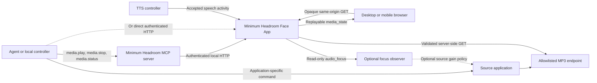
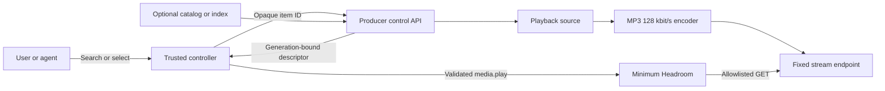
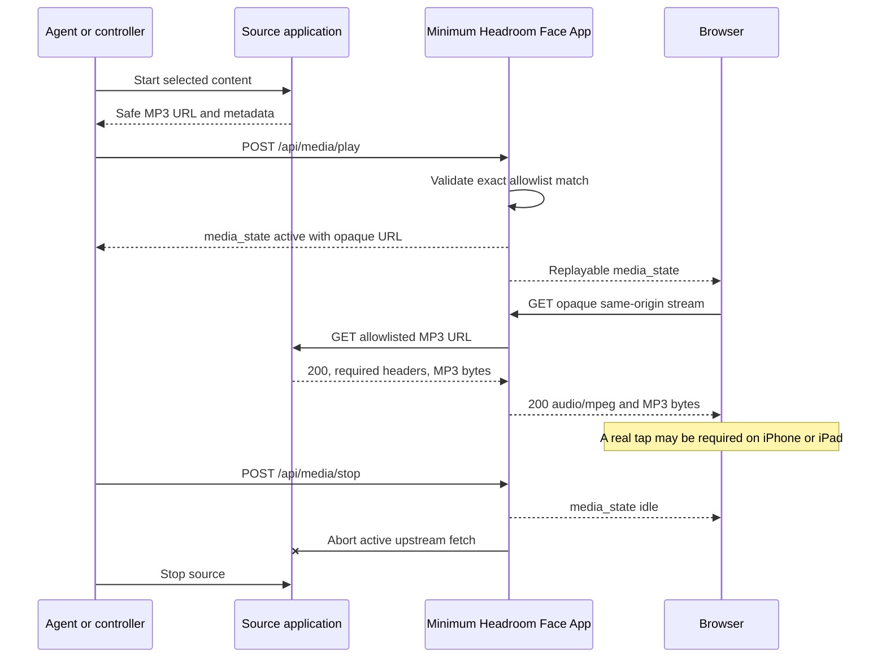
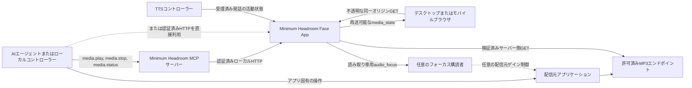
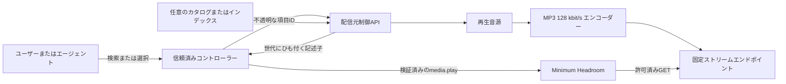
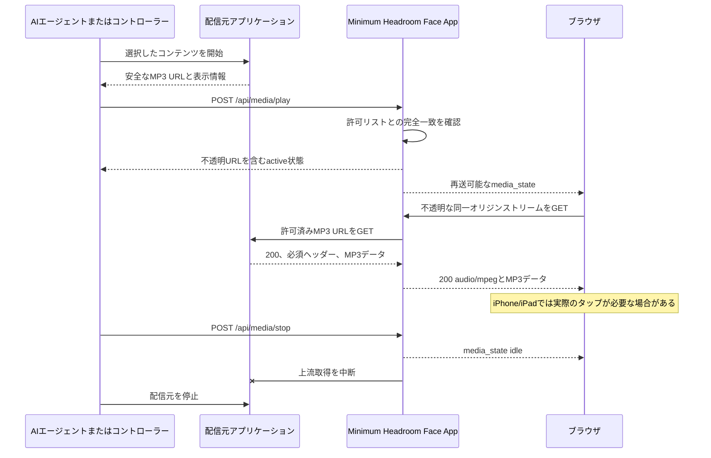

# Generic Browser Media Integration / 汎用ブラウザメディア連携

[English](#english) | [日本語](#japanese)

<a id="english"></a>

## English

This guide explains how an independent audio application can use Minimum Headroom as its authenticated browser playback surface. The source application owns its catalog, playback engine, queue, and MP3 encoder. Minimum Headroom owns one shared media registration, endpoint validation, a same-origin streaming proxy, browser state delivery, and mobile playback recovery.

The integration is source-agnostic. A source can be a music server, radio receiver, ambient sound generator, monitoring feed, or another application that can expose a trusted MP3 response. Minimum Headroom does not need to know the source application's product name or control model.

### What the channel does

The channel accepts one HTTP or HTTPS MP3 source at a time. A local controller registers that source through authenticated HTTP or the generic `media.play` MCP tool. Minimum Headroom keeps the upstream URL on the host, gives browsers an opaque same-origin URL, and forwards the MP3 bytes without transcoding them.

This first version intentionally has only play, stop, and status:

- A valid play replaces the previous registered media item.
- Stop is idempotent and revokes the active opaque stream handle.
- Status reports server intent as `idle`, `active`, or `error`. `active` means registered, not confirmed audible.
- Pause, seek, playlists, catalogs, next/previous, and loop behavior belong to the source application.
- TTS and media use separate native browser audio elements. Minimum Headroom does not mix them or change media volume.

At a declared 128 kbit/s, the encoded payload is approximately 57.6 MB per hour before transport overhead.

### Component and trust boundaries



| Component | Responsibility |
|---|---|
| Source application | Starts and stops its own audio engine, exposes real MP3 bytes, validates its query parameters, and cleans up disconnected clients. |
| Application-specific controller or agent skill | Selects content, starts the source, derives a safe upstream URL, calls Minimum Headroom, and rolls back the source when registration fails. |
| Minimum Headroom | Validates the exact configured endpoint, registers one item, hides the upstream URL, proxies bytes, broadcasts state, and hosts the browser player. |
| Browser | Receives `media_state`, loads the opaque same-origin stream, and handles device autoplay/output behavior. |
| Optional focus observer | Receives only `speech`/`normal` hints and may apply a source-side gain policy. It is not required for playback. |

The source application does not need to implement MCP. A controller can call the source application's own API and then use Minimum Headroom's HTTP API or MCP tools. This separation lets an agent skill expose a friendly catalog while Minimum Headroom remains unaware of that catalog.

Minimum Headroom does not call back into the source application's control API and does not start that application. Its generic `media.play` tool expects an MP3 endpoint that the application-specific controller has already made available. The controller may also start and stop an application service when needed.

### Preparing a producer service

This section describes the observable behavior a producer and its trusted controller should provide. It does not require a particular language, database, service manager, or encoder. A producer may use FFmpeg, a media framework, a hardware input, or an already encoded source. The requirement is that another component can select content safely, obtain a policy-compliant stream, recover from failure, and release every resource it started.

The producer service and controller may run in one process, but keep their authority separate:

- The producer owns content discovery, playback state, generation or session identifiers, encoding, and stream cleanup.
- The controller owns user- or agent-facing commands, service readiness, safe descriptor validation, Minimum Headroom registration, and cross-system rollback.
- The language model receives bounded content IDs and display metadata. It does not receive filesystem paths, executable arguments, encoder settings, credentials, or a free-form upstream URL.



#### Required producer behavior

| Capability | Observable guarantee |
|---|---|
| Readiness and status | Provide a bounded local status operation that distinguishes at least `idle`, `starting`, `playing`, and `error`. Return success only after the control and MP3 routes are ready. Do not expose credentials, stack traces, or private paths. |
| Selection and control | Start content from an application-owned opaque ID or another bounded domain command. Make stop idempotent. Reject unknown fields rather than passing them to a shell, encoder, filesystem, or playback engine. |
| Generation ownership | Give every accepted playback session a generation or session identifier. A new accepted play replaces the prior session or rejects atomically; it must not leave two sessions accidentally active. Reject stale stream queries after replacement or stop. |
| Safe media descriptor | Return a fixed producer-owned stream path, the matching generation, display metadata, `audio/mpeg`, and bitrate `128000`. Prefer a relative path so the trusted controller, not the model, combines it with a configured loopback base URL. |
| MP3 delivery | Satisfy the [source MP3 endpoint contract](#en-source-mp3-endpoint-contract), begin the response at a decodable MP3 frame boundary, and continuously deliver enough data for a native browser audio element. |
| Connection lifecycle | Support a fresh GET after browser reload or network recovery. Bound queued bytes for every listener; pause production or close a slow listener instead of buffering without limit. On disconnect, detach the listener and terminate any per-client encoder. |
| Playback and process cleanup | Stop readers, decoders, encoders, subprocesses, temporary files, and device subscriptions on stop and service shutdown. A failed encoder must end the response and become visible as an error; it must not silently switch to PCM or another bitrate. |

For a finite file, end the HTTP body normally at end of file and update producer state. Minimum Headroom may still report the item as registered until the controller issues media stop or registers another item; the browser's local `ended` state is not an authoritative backend callback. The producer or application-specific controller therefore owns next-item, loop, replay, and final-stop policy. For a live source, keep the body open until stop, replacement, disconnect, or source failure.

#### Recommended loopback control profile

Minimum Headroom does not call these routes and does not require these exact names. They are a small interoperable profile for a deterministic controller or agent skill:

| Operation | Example route | Purpose |
|---|---|---|
| Status/readiness | `GET /api/player/status` | Report service readiness, source state, current generation, and safe now-playing metadata. |
| Start | `POST /api/player/play` | Accept one opaque application ID, start or replace playback, and return a safe media descriptor. |
| Stop | `POST /api/player/stop` | Stop playback and encoders. Repeating it while idle succeeds. |
| Search (optional) | `GET /api/library/search?q=...&limit=...` | Return a bounded candidate list for sources with a catalog. |
| Item detail (optional) | `GET /api/library/items/<opaque-id>` | Resolve one returned ID to display metadata and available sub-items without exposing storage paths. |

A successful start response can use this shape:

```json
{
  "ok": true,
  "state": "starting",
  "generation": 42,
  "now_playing": {
    "item_id": "library:item-7f3a",
    "title": "Selected program",
    "subtitle": "Local library"
  },
  "media": {
    "path": "/live.mp3?generation=42",
    "mime_type": "audio/mpeg",
    "bitrate": 128000
  }
}
```

Do not trust this response merely because it came from the producer process. Treat it as a claim that the trusted controller must verify. Before calling Minimum Headroom, the controller should require all of the following:

1. `generation` has the expected bounded type and exactly matches the stream query.
2. `media.path` resolves against the configured producer base URL, remains on that exact origin, uses the one configured stream pathname, and contains only the documented generation or session query.
3. `mime_type` is exactly `audio/mpeg` and `bitrate` is exactly `128000`.
4. The descriptor contains no credentials or fragment, and no redirect or caller-selected alternate endpoint is accepted.
5. Display metadata is bounded and safe to publish to every connected browser.

The controller then constructs the absolute upstream URL itself and follows the [end-to-end lifecycle](#en-end-to-end-lifecycle). Do not accept a model-produced URL merely because it points at the configured producer origin.

#### Searchable catalog profile

Catalog search is optional because a radio receiver, microphone, or ambient generator may have no library. When a producer has searchable content:

- Issue stable opaque item IDs and resolve them through a controlled index. Do not use an absolute path, shell command, URL, or array position as an agent-facing ID.
- Bound query length, result count, metadata size, and parsing work. Define normalization and rescan behavior so the same unchanged item keeps the same ID across service restarts.
- Return only entries the producer can actually attempt to play. Keep ambiguous matches as multiple candidates so the controller can request clarification rather than selecting the first result.
- Let the controller map a selected item ID to a producer start request. Never let the language model supply codec, bitrate, headers, process arguments, or a stream pathname.

For a local-file library, configure allowed library roots outside the request path and apply these additional controls:

- Canonicalize each configured root and candidate with the operating system's real-path operation, then require the resolved candidate to remain inside one configured root. Reject `..`, absolute-path injection, encoded traversal, and symbolic-link targets outside those roots. If symlinks intentionally join another disk, configure the resolved target as another explicit root.
- If an untrusted account can modify the library tree while the service runs, avoid a check-then-open race: reject symlinks and use the operating system's no-follow or root-relative open facility, or verify the opened file handle before streaming it. A real-path string check alone is not enough against concurrent replacement.
- Serve only regular files of explicitly supported audio types. Reject devices, FIFOs, sockets, directories, and unexpected hidden or metadata files. Do not trust a filename extension alone when selecting a decoder.
- Do not return raw filesystem paths in search, status, errors, media IDs, or browser metadata. Keep metadata parsing bounded and stream large files instead of reading them completely into memory.
- Define whether rescans are startup-only, periodic, or explicit. Build a replacement index first and swap it atomically so search and play never observe a partially rebuilt catalog.

#### Operational and failure behavior

Bind a same-host producer to loopback unless another deployment explicitly requires a different trust boundary. Loopback limits network exposure but does not authenticate every same-host process; on a multi-user host, or when binding beyond loopback, protect the producer control API separately and keep its credentials in ignored configuration. If the controller starts the service on demand, it should use a bounded readiness timeout and stop only the service instance it owns. A port conflict is an error to report; it is not permission to kill the process using that port.

Treat play as a cross-system transaction: start the producer, validate its descriptor, register it with Minimum Headroom, and stop the newly started producer session if registration fails. Stop should attempt both Minimum Headroom and producer cleanup even when one side is already unavailable. Service shutdown should wait for owned children and release its listening port. These operations must be safe to retry after a partial failure.

<a id="en-end-to-end-lifecycle"></a>

### End-to-end lifecycle

A robust controller follows this order:

1. Start or select content in the source application.
2. Obtain an absolute MP3 URL that the Minimum Headroom host can fetch.
3. Validate that the URL came from the source application; do not accept an arbitrary model-supplied URL.
4. Call `POST /api/media/play` or `media.play` with the URL and display metadata.
5. If registration fails, stop the newly started source so it does not run unheard.
6. Treat an `active` response as accepted intent only. Browser autoplay, decoding, and output selection still determine audibility.
7. On shutdown, call `POST /api/media/stop` and stop the source. Make both operations safe to repeat.

If a source uses a generation or session query parameter, issue a new play registration whenever that generation changes. Minimum Headroom permits a query on an allowed endpoint but does not interpret or constrain its fields; the source application must validate them.

<a id="en-source-mp3-endpoint-contract"></a>

### Source MP3 endpoint contract

Configure and control only endpoints you own. For a requested URL such as:

```text
http://127.0.0.1:9000/live.mp3?session=17
```

the source must satisfy this contract:

- Use `http:` or `https:` and return a direct 2xx response. Redirects are rejected.
- Return `Content-Type: audio/mpeg`. Media type parameters are tolerated, but another audio type is not.
- Return exactly `X-Media-Nominal-Bitrate: 128000` after whitespace trimming.
- Send actual MP3 bytes compatible with the browser. Minimum Headroom forwards them unchanged and does not transcode or provide a fallback.
- Treat the nominal-bitrate header as a trusted producer declaration. Minimum Headroom checks the header but does not inspect MP3 frames or rate-limit the connection.
- Start sending headers before the long-lived body and flush encoded data continuously enough for a native `HTMLAudioElement`.
- Handle client disconnect promptly. A browser reload or network change aborts that proxy fetch without invalidating the media registration; a later browser request may open a new source connection.
- Support independent GET consumers if more than one browser may listen. Each browser stream request can create its own upstream GET.
- Validate every query parameter. Allowlisting the pathname does not authorize arbitrary query behavior inside the source.

The source does not need CORS headers because the browser never contacts it directly. It also does not need to implement browser `Range` or `HEAD` behavior: Minimum Headroom handles `HEAD` locally, does not forward downstream `Range`, and returns the live browser stream as `200` with `Accept-Ranges: none`.

### Configure the endpoint allowlist

Media is disabled when `MH_MEDIA_ALLOWED_ENDPOINTS` is empty. Put persistent configuration in the same ignored environment file used by the operator stack, normally `~/.config/minimum-headroom.env`:

```bash
MH_MEDIA_ALLOWED_ENDPOINTS=http://127.0.0.1:9000/live.mp3
```

Multiple entries are comma-separated:

```bash
MH_MEDIA_ALLOWED_ENDPOINTS=http://127.0.0.1:9000/live.mp3,http://127.0.0.1:9100/program.mp3
```

Each configured entry must:

- Be an absolute HTTP or HTTPS URL.
- Contain no username, password, query string, or fragment.
- Name the exact scheme, hostname, effective port, and pathname to trust.

Matching is not a prefix or wildcard. `localhost` and `127.0.0.1` are different hostnames, and sibling paths are not allowed. A requested upstream URL may add a query only after its scheme, hostname, effective port, and pathname match.

For a running operator stack, apply the change with the supported in-place restart:

```bash
./scripts/restart-operator-stack-in-place.sh
```

For a direct Face App process, export the variable before `npm run face-app:start`. Keep the source bound to loopback when it runs on the same host. Tailscale Serve can expose the Minimum Headroom browser origin; the source endpoint itself does not need a LAN bind, public port, CORS rule, or inbound firewall rule.

Startup reports only whether generic media is enabled and the number of accepted endpoints. Invalid configuration entries are ignored, and their raw values are not written to warnings.

### Control with authenticated HTTP

All `/api/media/*` routes pass through the Face App's existing API authentication and Origin policy. If `MH_FACE_AUTH_TOKEN` is configured, a backend controller should send it in an `Authorization: Bearer ...` header. Do not put the token in an upstream URL, media metadata, logs, or committed configuration.

Register one item:

```http
POST /api/media/play
Content-Type: application/json
Authorization: Bearer <MH_FACE_AUTH_TOKEN>

{
  "upstream_url": "http://127.0.0.1:9000/live.mp3?session=17",
  "media_id": "producer:session-17",
  "title": "Ambient program",
  "subtitle": "Local source"
}
```

The request accepts only these four fields. `upstream_url`, `media_id`, and `title` are required; `subtitle` is optional. Limits are 2048 characters for the URL, 128 for `media_id`, and 200 each for title and subtitle. Treat IDs and display text as public browser state and do not place secrets in them.

A successful response resembles:

```json
{
  "v": 1,
  "type": "media_state",
  "state": "active",
  "revision": 4,
  "media_id": "producer:session-17",
  "title": "Ambient program",
  "subtitle": "Local source",
  "stream_url": "/api/media/stream/8b6f...opaque...",
  "mime_type": "audio/mpeg",
  "bitrate": 128000,
  "updated_at": "2026-07-20T01:00:00.000Z",
  "error": null
}
```

The raw `upstream_url` is deliberately absent. Do not persist or construct `stream_url` yourself; it is an active-item-bound, revocable browser handle. A valid handle is available for at most 24 hours and becomes unusable after stop or replacement.

Read state and stop:

```http
GET /api/media/status
Authorization: Bearer <MH_FACE_AUTH_TOKEN>
```

```http
POST /api/media/stop
Content-Type: application/json
Authorization: Bearer <MH_FACE_AUTH_TOKEN>

{}
```

Stop is successful even when already idle. A new valid play aborts existing proxy fetches and replaces the old registration. A rejected play leaves the current valid registration unchanged.

Registration validates the URL and metadata, not the response body. The source is fetched when a browser requests the opaque stream. A missing source, redirect, incorrect response header, or stream failure can therefore change later state to `error` even after play returned `active`.

### Control through MCP and an agent skill

Minimum Headroom exposes:

- `media.play` with `upstream_url`, `media_id`, `title`, and optional `subtitle`.
- `media.stop` with no arguments.
- `media.status` with no arguments.

When `MCP_TOOL_NAME_STYLE=underscore`, the visible aliases are `media_play`, `media_stop`, and `media_status`. Both styles reach the same authenticated HTTP implementation.

Use the normal Minimum Headroom MCP setup described in [Agent Setup](../../README.md#en-agent-setup). The MCP server derives the Face App HTTP origin from `FACE_WS_URL` unless `FACE_HTTP_BASE_URL` is set, and it sends `MH_FACE_AUTH_TOKEN` as a bearer token when configured.

An application-specific skill should usually expose user concepts such as search, stations, scenes, or tracks. Its play operation should:

1. Resolve a user-facing choice to an application-owned opaque ID.
2. Start the source through the application's local control API.
3. Derive the upstream URL from the application's response rather than accepting a free-form URL from the language model.
4. Call `media.play`.
5. Stop the source if Minimum Headroom rejects registration.

Its stop operation should clean up both systems and remain idempotent. Its status result should distinguish source state, Minimum Headroom server state, and confirmed browser audibility; the last one normally cannot be proven from a backend response.

### Playback sequence



### Browser, iPhone, and iPad behavior

The browser owns a dedicated persistent `HTMLAudioElement` at unity gain. It is separate from all TTS elements. A replayed `media_state` lets a newly opened or reloaded browser attach to the current registration.

Mobile browsers may reject `play()` until a real gesture. Minimum Headroom then shows the media panel with a `Resume` button. Open the normal authenticated Minimum Headroom page over HTTPS or localhost, make one real tap, and use `Resume` if playback remains in `tap required`, `error`, or `ended`. Safari and Chrome on iPhone/iPad share the platform's WebKit media rules.

`active` in `/api/media/status` does not guarantee:

- That a browser tab is connected.
- That autoplay was granted.
- That the MP3 decoder accepted the bytes.
- That the selected device or system volume is audible.

The browser's local panel reports `starting`, `playing`, `tap required`, `error`, or `ended`. Those local states are not promoted to authoritative global status.

### Optional TTS audio-focus observer

Playback does not require focus integration. Without it, browser TTS and media can overlap as independent native elements.

A producer that wants to lower its own encoded program while TTS is pending can open the Face App WebSocket with the `mh-audio-focus-v1` subprotocol. When authentication is enabled, add a second protocol:

```text
mh-face-auth-b64.<unpadded-base64url-of-UTF-8-token>
```

For example, in Node:

```js
const token = process.env.MH_FACE_AUTH_TOKEN?.trim();
const protocols = ["mh-audio-focus-v1"];
if (token) {
  protocols.push("mh-face-auth-b64." + Buffer.from(token, "utf8").toString("base64url"));
}

const socket = new WebSocket("ws://127.0.0.1:8765/ws", protocols);
socket.addEventListener("open", () => {
  if (socket.protocol !== "mh-audio-focus-v1") socket.close();
});
socket.addEventListener("message", (event) => {
  const payload = JSON.parse(String(event.data));
  if (payload.type === "audio_focus" && (payload.state === "speech" || payload.state === "normal")) {
    // Apply an application-owned, smoothly ramped gain policy before encoding.
  }
});
```

The observer receives only:

```json
{
  "v": 1,
  "type": "audio_focus",
  "state": "speech",
  "revision": 7,
  "ts": 1784450000000
}
```

The socket is read-only: inbound application messages are ignored, and TTS audio or unrelated Face App events are not delivered. The latest focus state is replayed on connection. Reset the consumer's revision tracking on each new WebSocket because a Face App restart starts a new revision sequence.

`speech` is emitted when accepted backend TTS is active or queued. `normal` is emitted 1.5 seconds after that queue becomes empty. This is advisory backend timing, not sample-accurate browser timing; synthesis, network, MP3, and browser buffers can shift the audible edges. A producer should use smooth ramps, reconnect with bounded backoff, never block playback on focus availability, and fail open to normal gain after a prolonged disconnect.

### Security model

- Keep the source on loopback when it shares the Minimum Headroom host.
- Allow exact endpoint paths only; never generate an allowlist from an untrusted play request.
- Allow only producers you control because the bitrate header is a declaration, not frame-level enforcement.
- Keep `MH_FACE_AUTH_TOKEN` and producer credentials in ignored environment/configuration files.
- Send the Face App token as an HTTP bearer header or protocol-safe WebSocket companion protocol, never as the upstream URL.
- Do not put credentials or fragments in `upstream_url`. Minimum Headroom rejects them.
- Do not put secrets in `media_id`, title, or subtitle; these are broadcast to browser clients.
- Do not expose an arbitrary URL parameter to an AI model. Resolve model-facing IDs through a bounded application-specific API.
- Minimum Headroom never exposes the raw upstream URL to the browser and rejects redirects before forwarding bytes.

### Failure handling and troubleshooting

| Symptom or state | Meaning and action |
|---|---|
| `upstream_not_allowed` | Scheme, hostname, effective port, or pathname does not exactly match `MH_MEDIA_ALLOWED_ENDPOINTS`. Check `localhost` versus `127.0.0.1` and restart after configuration changes. |
| `invalid_media_type` | The source did not return `audio/mpeg`. Fix the source; Minimum Headroom has no codec fallback. |
| `invalid_nominal_bitrate` | The required `X-Media-Nominal-Bitrate: 128000` declaration is missing or different. |
| `upstream_redirect` | The source redirected. Return MP3 directly from the allowlisted path. |
| `upstream_status` or `upstream_error` | The source was unavailable or failed during streaming. Check source lifecycle and disconnect handling. |
| Browser shows `tap required` | Use the visible `Resume` button in a real user gesture. |
| Server says `active` but no sound | Check browser local state, open tab, MP3 validity, output device, and volume. `active` alone is not an audibility acknowledgment. |
| Focus never connects | Verify `ws:`/`wss:` URL, selected `mh-audio-focus-v1` protocol, base64url token encoding, and Face App authentication. Playback should continue at normal gain. |

### Integration acceptance checklist

A third-party integration is ready when all of these are true:

1. Producer status distinguishes readiness and `idle`/`starting`/`playing`/`error` without exposing private paths or credentials.
2. Agent-facing selection uses bounded opaque IDs; unknown IDs, fields, mismatched item pairs, and ambiguous results cannot silently start arbitrary content.
3. A successful producer start returns a generation-bound descriptor whose origin, fixed path, query, MIME type, bitrate, and public metadata the controller validates before registration.
4. A stale generation is rejected after stop or replacement, and a failed start does not leave an untracked encoder or playback process.
5. The source returns real 128-kbit/s MP3 with both required headers and no redirect.
6. Two fresh GETs can attach according to the documented listener policy; disconnecting or slowing one client does not leak a per-client encoder or grow an unbounded queue.
7. Repeated producer stop is safe, owned child processes and temporary resources are released, and a finite source has documented end/next/loop behavior.
8. For a local library, traversal, symlink escape, non-regular files, raw path exposure, and partial-index replacement are rejected or safely contained.
9. The exact path, and only that path, is in `MH_MEDIA_ALLOWED_ENDPOINTS`.
10. HTTP or MCP play returns `media_state.state = active` without exposing the upstream URL.
11. A browser receives the state and its opaque request returns `200 audio/mpeg`.
12. A physical iPhone or iPad can start audio after a real tap and can recover with `Resume`.
13. Reloading the browser opens a fresh upstream GET without invalidating registration.
14. Stop revokes the handle, aborts upstream delivery, and does not break later TTS.
15. Source-start rollback works when Minimum Headroom rejects play, and retrying stop after a partial failure is safe.
16. If focus is implemented, it receives replayed `normal`/`speech` only, reconnects safely, and restores normal gain after loss.
17. Logs, public state, committed files, and documentation contain no auth token, private endpoint, user-specific source name, or raw library path.

<a id="japanese"></a>

## 日本語

このガイドでは、独立した音声アプリケーションから Minimum Headroom を、認証済みブラウザへの再生先として利用する方法を説明します。配信元アプリケーションは、カタログ、再生エンジン、キュー、MP3 エンコーダーを管理します。Minimum Headroom は、共有メディア登録を1件だけ管理し、配信元 URL の検証、同一オリジンでの代理配信、ブラウザへの状態通知、モバイル再生の復旧を担当します。

この連携は配信元に依存しません。音楽サーバー、ラジオ受信機、環境音ジェネレーター、監視音声、その他の信頼できる MP3 応答を公開できるアプリケーションを接続できます。Minimum Headroom が配信元の製品名や操作体系を知る必要はありません。

### このチャネルが担当すること

このチャネルが同時に扱える HTTP/HTTPS の MP3 配信元は1件です。ローカルのコントローラーが、認証済み HTTP または汎用の `media.play` MCP ツールで配信元を登録します。Minimum Headroom は上流 URL をホスト内だけに保持し、ブラウザには不透明な同一オリジン URL だけを渡します。MP3 は再エンコードせず、そのまま中継します。

最初の版は意図的に再生、停止、状態取得だけを提供します。

- 正常な再生登録は、以前のメディア登録を置き換えます。
- 停止は何度呼んでも安全で、現在の不透明ストリームハンドルを無効化します。
- 状態は `idle`、`active`、`error` です。`active` は登録済みであることを示すだけで、実際に音が聞こえることまでは保証しません。
- 一時停止、シーク、プレイリスト、カタログ、前後移動、ループは配信元アプリケーションの責任です。
- TTS とメディアは別々のブラウザ標準音声要素を使用します。Minimum Headroom は両者をミックスせず、メディア音量も変更しません。

公称128 kbit/sの場合、転送プロトコルのオーバーヘッドを除いたデータ量は約57.6 MB/時です。

### コンポーネントと信頼境界



| コンポーネント | 責任 |
|---|---|
| 配信元アプリケーション | 自身の音声エンジンを起動・停止し、実際の MP3 データを配信し、クエリを検証します。クライアントが切断したら、その接続に割り当てたリソースを解放します。 |
| アプリ固有コントローラー／エージェントスキル | コンテンツを選び、配信元を起動し、安全な上流 URL を組み立てて Minimum Headroom を呼び出します。登録に失敗した場合は、配信元の起動を取り消します。 |
| Minimum Headroom | 設定されたエンドポイントとの完全一致を確認し、1件を登録します。上流 URL を隠したまま音声を代理配信し、状態通知とブラウザプレイヤーを提供します。 |
| ブラウザ | `media_state` を受信し、不透明な同一オリジンストリームを読み込み、端末の自動再生・出力規則に従います。 |
| 任意のフォーカス購読者 | `speech`／`normal` のヒントだけを受け、配信元側で音量方針を適用できます。再生だけなら不要です。 |

配信元アプリケーション自身が MCP を実装する必要はありません。コントローラーが配信元固有の API を呼び、その後で Minimum Headroom の HTTP API または MCP ツールを利用できます。この分離により、エージェントスキルは使いやすいカタログを公開でき、Minimum Headroom はそのカタログに依存せずに済みます。

Minimum Headroom は配信元アプリケーションの制御 API を呼び返すことも、そのアプリケーションを起動することもありません。汎用の `media.play` は、アプリ固有コントローラーがあらかじめ利用可能にした MP3 エンドポイントを受け取ります。必要であれば、コントローラーがアプリケーションサービスの起動と停止も担当します。

### 配信元サービスの準備

この節では、配信元と信頼済みコントローラーに必要な、外部から確認できる振る舞いを説明します。特定の実装言語、データベース、サービス管理方式、エンコーダーは前提にしません。FFmpeg、メディアフレームワーク、ハードウェア入力、エンコード済み音源のいずれも利用できます。重要なのは、別のコンポーネントがコンテンツを安全に選択し、ポリシーに適合するストリームを取得し、障害から復旧して、起動したすべてのリソースを解放できることです。

配信元サービスとコントローラーは同じプロセスで動かしても構いませんが、権限と責任範囲は分けて考えます。

- 配信元は、コンテンツの探索、再生状態、世代またはセッション識別子、エンコード、ストリーム終了時のリソース解放を担当します。
- コントローラーは、ユーザー／エージェント向けコマンド、サービスの準備確認、安全なメディア記述子の検証、Minimum Headroom への登録、システム間のロールバックを担当します。
- 言語モデルには、形式と長さを制限したコンテンツ ID と、公開しても安全な表示用メタデータだけを渡します。ファイルシステムのパス、実行引数、エンコーダー設定、認証情報、自由形式の上流 URL は渡しません。



#### 配信元に必須の振る舞い

| 機能 | 外部から確認できる保証 |
|---|---|
| 準備確認と状態 | 少なくとも `idle`／`starting`／`playing`／`error` を区別できる、返す情報を限定したローカルの状態確認手段を提供します。成功を返すのは、制御経路と MP3 経路の両方が準備できてからです。認証情報、スタックトレース、非公開パスは返しません。 |
| 選択と制御 | アプリケーションが発行した不透明な ID など、アプリケーションが定義した限定的なコマンドだけでコンテンツを開始します。停止は冪等にします。未定義のフィールドは拒否し、シェル、エンコーダー、ファイルシステム、再生エンジンへ渡しません。 |
| 世代の管理 | 受理した再生セッションごとに、世代またはセッション識別子を発行します。新しい再生要求は、以前のセッションを原子的に置き換えるか、要求自体を原子的に拒否します。2つのセッションを誤って同時に有効なままにしません。置き換えまたは停止後は、古い世代を指定したストリーム要求を拒否します。 |
| 安全なメディア記述子 | 配信元が管理する固定ストリームパス、対応する世代、表示用メタデータ、`audio/mpeg`、ビットレート `128000` を返します。信頼済みコントローラーが設定済みのループバック URL と結合できるよう、相対パスを推奨します。言語モデルには絶対 URL を組み立てさせません。 |
| MP3 配信 | [配信元 MP3 エンドポイントの契約](#ja-source-mp3-endpoint-contract)を満たし、デコード可能な MP3 フレーム境界から応答を開始します。ブラウザ標準の音声要素が再生を続けられる頻度で、データを継続して送ります。 |
| 接続ライフサイクル | ブラウザの再読み込みやネットワーク復旧後に、新しい GET 要求を受け付けます。接続ごとに待機中のバイト数へ上限を設け、無制限に蓄積しません。必要に応じて生成を一時停止するか、遅い接続を切断します。切断時は購読を解除し、その接続専用のエンコーダーを終了します。 |
| 再生処理とプロセスの終了 | 停止時とサービス終了時に、リーダー、デコーダー、エンコーダー、子プロセス、一時ファイル、デバイス購読を終了します。エンコーダーに障害が起きた場合は、応答を終了してエラーを外部から確認できる状態にします。PCM や別のビットレートへ暗黙に切り替えてはいけません。 |

有限のファイルを再生する場合は、ファイル末尾で HTTP の応答本文を正常に終了し、配信元の状態を更新します。Minimum Headroom は、コントローラーがメディアを停止するか別の項目を登録するまで、登録済みと報告し続ける場合があります。ブラウザ側の `ended` は、バックエンドの再生完了を確定する通知ではありません。そのため、次の項目へ進む、ループする、同じ項目をもう一度再生する、最終的に停止するといった方針は、配信元またはアプリ固有コントローラーが管理します。ライブ音源では、停止、置き換え、切断、配信元の障害のいずれかが起きるまで、応答本文を開いたままにします。

#### 推奨するループバック制御プロファイル

Minimum Headroom はこれらのルートを呼び出さず、ここに示す名前も要求しません。これは、決められた手順で動くコントローラーまたはエージェントスキル向けの、小さな相互運用プロファイルです。

| 操作 | ルート例 | 目的 |
|---|---|---|
| 状態／準備確認 | `GET /api/player/status` | サービスの準備状態、配信元の状態、現在の世代、安全な再生中メタデータを返します。 |
| 開始 | `POST /api/player/play` | 不透明なアプリケーション ID を1つ受け取り、再生を開始または置き換えて、安全なメディア記述子を返します。 |
| 停止 | `POST /api/player/stop` | 再生とエンコーダーを停止します。`idle` 中に繰り返し呼び出しても成功します。 |
| 検索（任意） | `GET /api/library/search?q=...&limit=...` | カタログを持つ配信元で、件数制限された候補一覧を返します。 |
| 項目詳細（任意） | `GET /api/library/items/<opaque-id>` | 返却済みの ID から表示用メタデータと利用可能な下位項目を取得します。保存先のパスは公開しません。 |

開始に成功したときの応答は、例えば次の形にできます。

```json
{
  "ok": true,
  "state": "starting",
  "generation": 42,
  "now_playing": {
    "item_id": "library:item-7f3a",
    "title": "選択したプログラム",
    "subtitle": "ローカルライブラリ"
  },
  "media": {
    "path": "/live.mp3?generation=42",
    "mime_type": "audio/mpeg",
    "bitrate": 128000
  }
}
```

配信元プロセスが返したという理由だけで、この応答を無条件に信用してはいけません。応答の内容は、信頼済みコントローラーが検証すべき申告値として扱います。Minimum Headroom を呼び出す前に、コントローラーは次のすべてを確認します。

1. `generation` が想定した型と範囲に収まり、ストリームのクエリと完全に一致すること。
2. `media.path` を設定済みの配信元ベース URL に対して解決しても、そのオリジンから外れないこと。設定済みのストリームパスを使い、仕様で定めた世代またはセッションのクエリ以外を含まないこと。
3. `mime_type` が正確に `audio/mpeg`、`bitrate` が正確に `128000` であること。
4. メディア記述子に認証情報やフラグメントがなく、リダイレクトや、呼び出し側が指定した別のエンドポイントを受け入れていないこと。
5. 表示用メタデータの長さと内容が制限され、接続中のすべてのブラウザへ公開しても安全であること。

確認後、コントローラー自身が絶対上流 URL を組み立て、[一連の処理手順](#ja-end-to-end-lifecycle)に従います。設定済みの配信元オリジンを指しているという理由だけで、言語モデルが生成した URL を受け入れてはいけません。

#### 検索可能なカタログのプロファイル

ラジオ受信、マイク、環境音生成器など、ライブラリを持たない配信元もあるため、カタログ検索は任意です。検索可能なコンテンツを持つ場合は、次の対策を行います。

- 安定した不透明な項目 ID を発行し、管理されたインデックスを通して解決します。絶対パス、シェルコマンド、URL、配列内の位置は、エージェント向け ID に使いません。
- クエリの長さ、結果件数、メタデータ量、解析処理に上限を設けます。正規化と再スキャンの挙動を定め、内容が変わっていない項目には、サービスを再起動しても同じ ID を割り当てます。
- 実際に再生を試行できる項目だけを返します。曖昧な一致は複数候補のままにし、コントローラーが先頭を選ばず確認を求められるようにします。
- 選択された項目 ID を配信元の開始要求へ変換するのは、コントローラーです。言語モデルには、コーデック、ビットレート、ヘッダー、プロセス引数、ストリームパスを指定させません。

ローカルファイルライブラリでは、許可するライブラリのルートを要求パスとして受け取らず、サービス設定に固定します。さらに、次の対策を行います。

- 設定済みの各ルートと候補パスを、OS の実パス解決機能で正規化します。解決後の候補が、いずれかの設定済みルート配下に残ることを確認してください。`..`、絶対パスの注入、エンコードされたパストラバーサル、ルート外を指すシンボリックリンクは拒否します。シンボリックリンクで別のディスクを意図的に結合する場合は、その解決先も許可ルートとして明示します。
- 信頼できないアカウントがサービス実行中にライブラリツリーを変更できる場合は、確認してからファイルを開くまでの競合も防ぎます。シンボリックリンクを拒否したうえで、OS の `no-follow` 機能やルート相対でファイルを開く機能を使うか、開いたファイルハンドルを配信前に再確認してください。実パスの文字列を確認するだけでは、同時にファイルを差し替える攻撃を防げません。
- 明示的に対応している音声形式の通常ファイルだけを配信します。デバイス、FIFO、ソケット、ディレクトリ、想定外の隠しファイルやメタデータファイルは拒否します。デコーダーの選択では、拡張子だけを信用しません。
- 検索結果、状態、エラー、メディア ID、ブラウザ用メタデータに、ファイルシステムの生のパスを含めません。メタデータ解析に上限を設け、大きなファイルは全体をメモリへ読み込まず、ストリームとして処理します。
- 再スキャンを起動時だけ行うのか、定期的に行うのか、明示的な操作で行うのかを定めます。置き換え用インデックスを完成させてから原子的に切り替え、再構築途中のカタログが検索や再生から見えないようにします。

#### 運用と障害時の振る舞い

Minimum Headroom と同じホストで動かす配信元は、別の信頼境界が明確に必要な場合を除き、ループバックへバインドします。ループバックはネットワークへの公開範囲を狭めますが、同じホスト上のすべてのプロセスを認証するものではありません。複数ユーザーが使うホストや、ループバック以外へバインドする構成では、配信元の制御 API にも認証を設け、その認証情報を Git 管理外の設定に保存します。コントローラーが必要に応じてサービスを起動する場合は、準備完了を待つ時間に上限を設け、自分が起動したサービスインスタンスだけを停止します。ポートの競合は報告すべきエラーであって、そのポートを使っている別のプロセスを強制終了してよいという意味ではありません。

再生開始は、複数システムにまたがる一連のトランザクションとして扱います。配信元で再生を開始し、メディア記述子を検証して Minimum Headroom へ登録します。登録に失敗した場合は、新しく開始した配信元セッションを停止します。停止時は、一方がすでに利用不能でも、Minimum Headroom と配信元の両方で停止・解放処理を試みます。サービス終了時は、自分が起動した子プロセスの終了を待ち、待受ポートを解放します。これらの操作は、途中で失敗しても安全に再試行できる必要があります。

<a id="ja-end-to-end-lifecycle"></a>

### 一連の処理手順

堅牢なコントローラーは次の順序で処理します。

1. 配信元アプリケーションでコンテンツを開始または選択します。
2. Minimum Headroom のホストから取得できる絶対 MP3 URL を受け取ります。
3. URL が配信元アプリケーション自身の応答から得られたことを検証し、言語モデルが自由入力した URL は受け入れません。
4. URL と表示情報を指定して、`POST /api/media/play` または `media.play` を呼び出します。
5. 登録に失敗したら、先に起動した配信元も停止し、利用されない再生処理を動かしたままにしません。
6. `active` は「再生要求を受理した」ことだけを示します。実際に音が聞こえるかどうかは、ブラウザの自動再生、デコード、出力先にも左右されます。
7. 終了時は、`POST /api/media/stop` と配信元の停止を両方実行します。どちらも繰り返し呼び出して安全である必要があります。

配信元 URL に世代番号やセッション番号のクエリを使う場合は、その値が変わるたびに新しい再生登録を行います。Minimum Headroom は許可済みパスへのクエリを認めますが、その内容を解釈・制限しません。クエリの検証は配信元の責任です。

<a id="ja-source-mp3-endpoint-contract"></a>

### 配信元 MP3 エンドポイントの契約

自分で管理するエンドポイントだけを設定・操作してください。例えば、次の URL を使う場合:

```text
http://127.0.0.1:9000/live.mp3?session=17
```

配信元は次の契約を満たします。

- `http:` または `https:` を使い、リダイレクトせず直接 2xx を返します。
- `Content-Type: audio/mpeg` を返します。メディアタイプのパラメーターは許容されますが、別の音声形式は拒否されます。
- 空白を除いた値が正確に `X-Media-Nominal-Bitrate: 128000` となるヘッダーを返します。
- ブラウザが再生できる実際の MP3 データを送ります。Minimum Headroom はそのまま中継し、再エンコードもフォールバックもしません。
- 公称ビットレートヘッダーは、信頼済み配信元による宣言です。Minimum Headroom はヘッダーを確認しますが、MP3 フレームの解析や通信速度の制限は行いません。
- 長時間続く応答本文を送る前にヘッダーを確定し、ブラウザ標準の `HTMLAudioElement` が再生を続けられる頻度で、エンコード済みデータを継続して送ります。
- クライアントが切断したら、その接続に割り当てたリソースを速やかに解放します。ブラウザの再読み込みやネットワーク変更で代理取得が切断されても、登録自体は有効なままです。後から届いたブラウザ要求によって、新しい上流接続が開かれる場合があります。
- 複数のブラウザで聞く可能性がある場合は、独立した GET 接続を処理できるようにします。ブラウザごとのストリーム要求が、それぞれ別の上流 GET を作る場合があります。
- すべてのクエリパラメーターを検証します。パスが許可リストに登録されていても、配信元内部で任意のクエリ動作を許可してよいという意味ではありません。

ブラウザは配信元へ直接接続しないため、配信元に CORS ヘッダーは不要です。ブラウザ向けの `Range` や `HEAD` を実装する必要もありません。Minimum Headroom は `HEAD` をローカルで処理し、下流から届いた `Range` を上流へ転送しません。ブラウザには、`Accept-Ranges: none` を付けた `200` のライブストリームを返します。

### エンドポイント許可リストの設定

`MH_MEDIA_ALLOWED_ENDPOINTS` が空の場合、メディア機能は無効です。永続設定は、オペレータースタックと同じ Git 管理外の環境ファイルに保存します。通常は `~/.config/minimum-headroom.env` を使います。

```bash
MH_MEDIA_ALLOWED_ENDPOINTS=http://127.0.0.1:9000/live.mp3
```

複数指定はカンマ区切りです。

```bash
MH_MEDIA_ALLOWED_ENDPOINTS=http://127.0.0.1:9000/live.mp3,http://127.0.0.1:9100/program.mp3
```

設定項目には次の制約があります。

- HTTP または HTTPS の絶対 URL であること。
- ユーザー名、パスワード、クエリ、フラグメントを含まないこと。
- 信頼するスキーム、ホスト名、実効ポート、パスを正確に指定すること。

一致判定は前方一致でもワイルドカードでもありません。`localhost` と `127.0.0.1` は別のホスト名として扱われ、隣接するパスも許可されません。要求時の上流 URL にクエリを追加できるのは、スキーム、ホスト名、実効ポート、パスがすべて一致した場合だけです。

起動中のオペレータースタックへ反映する場合は、用意されているインプレース再起動スクリプトを使います。

```bash
./scripts/restart-operator-stack-in-place.sh
```

Face App を直接起動する場合は、`npm run face-app:start` の前に環境変数を設定します。同じホスト上の配信元は、ループバックへバインドしたままにしてください。Tailscale Serve で Minimum Headroom のブラウザオリジンを公開しても、配信元自体を LAN へバインドしたり、ポートを公開したり、CORS 規則や外部向けファイアウォール許可を追加したりする必要はありません。

起動ログには汎用メディアの有効・無効と受理したエンドポイント数だけが表示されます。不正な設定項目は無視され、生の値は警告ログへ出しません。

### 認証済み HTTP による操作

すべての `/api/media/*` は、Face App 既存の API 認証とオリジンポリシーを通ります。`MH_FACE_AUTH_TOKEN` を設定している場合、バックエンドコントローラーは `Authorization: Bearer ...` ヘッダーで送信します。トークンを上流 URL、メディア表示情報、ログ、コミット対象の設定へ入れないでください。

メディアを1件登録する要求例:

```http
POST /api/media/play
Content-Type: application/json
Authorization: Bearer <MH_FACE_AUTH_TOKEN>

{
  "upstream_url": "http://127.0.0.1:9000/live.mp3?session=17",
  "media_id": "producer:session-17",
  "title": "環境音プログラム",
  "subtitle": "ローカル配信元"
}
```

受け付けるフィールドは、この4つだけです。`upstream_url`、`media_id`、`title` は必須で、`subtitle` は任意です。文字数の上限は、URL が2048文字、`media_id` が128文字、`title` と `subtitle` がそれぞれ200文字です。ID と表示文字列はブラウザへ公開されるため、秘密情報を含めないでください。

成功応答例:

```json
{
  "v": 1,
  "type": "media_state",
  "state": "active",
  "revision": 4,
  "media_id": "producer:session-17",
  "title": "環境音プログラム",
  "subtitle": "ローカル配信元",
  "stream_url": "/api/media/stream/8b6f...opaque...",
  "mime_type": "audio/mpeg",
  "bitrate": 128000,
  "updated_at": "2026-07-20T01:00:00.000Z",
  "error": null
}
```

生の `upstream_url` は意図的に含まれていません。`stream_url` を保存したり、自分で組み立てたりしないでください。これは現在の項目だけに結び付いた、取り消し可能なブラウザ用ハンドルです。有効期間は最大24時間で、停止または置き換え後は利用できません。

状態取得と停止:

```http
GET /api/media/status
Authorization: Bearer <MH_FACE_AUTH_TOKEN>
```

```http
POST /api/media/stop
Content-Type: application/json
Authorization: Bearer <MH_FACE_AUTH_TOKEN>

{}
```

すでに `idle` でも、停止は成功します。新しい正常な再生要求は、既存の代理取得を中断して登録を置き換えます。拒否された再生要求は、現在の正常な登録を変更しません。

登録時に検証するのは URL と表示情報であり、配信元の応答本文ではありません。配信元への実際の接続は、ブラウザが不透明ストリームを要求した時点で初めて行われます。そのため、再生要求が `active` を返した後でも、配信元が停止している、リダイレクトが返る、応答ヘッダーが正しくない、配信中に障害が起きる、といった理由で、後から状態が `error` へ変わる場合があります。

### MCP とエージェントスキルによる操作

Minimum Headroom は次の操作を提供します。

- `media.play`: `upstream_url`、`media_id`、`title`、任意の `subtitle`。
- `media.stop`: 引数なし。
- `media.status`: 引数なし。

`MCP_TOOL_NAME_STYLE=underscore` の場合、表示名は `media_play`、`media_stop`、`media_status` です。どちらの形式でも、同じ認証済み HTTP 実装を呼び出します。

MCP 接続には、通常の[エージェント設定](../../README.ja.md#ja-agent-setup)を使います。MCP サーバーは、`FACE_HTTP_BASE_URL` が設定されていなければ `FACE_WS_URL` から Face App の HTTP オリジンを導きます。`MH_FACE_AUTH_TOKEN` が設定されている場合は、Bearer トークンとして送信します。

アプリ固有スキルでは、検索、放送局、シーン、曲など、利用者に分かりやすい概念を公開するのが適切です。再生処理は次の順序で行います。

1. 利用者の選択を、アプリケーションが発行した不透明な ID に対応付けます。
2. アプリケーションのローカル制御 API を使って、配信元の再生を開始します。
3. 言語モデルから自由形式の URL を受け取らず、アプリケーションの応答から上流 URL を組み立てます。
4. `media.play` を呼びます。
5. Minimum Headroom が登録を拒否したら、配信元を停止します。

停止処理では、Minimum Headroom と配信元の両方を停止・解放し、繰り返し呼び出しても安全な設計にします。状態表示では、配信元の状態、Minimum Headroom のサーバー状態、ブラウザで実際に音が聞こえたかどうかを区別してください。通常、最後の項目はバックエンドの応答だけでは確認できません。

### 再生シーケンス



### ブラウザ、iPhone、iPad の挙動

ブラウザは、TTS 要素とは別に、永続的な `HTMLAudioElement` を通常ゲイン（1.0）で保持します。`media_state` が再送されるため、新しく開いたブラウザや再読み込みしたブラウザも、現在の登録へ接続できます。

モバイルブラウザは、実際のユーザー操作があるまで `play()` を拒否することがあります。その場合、Minimum Headroom はメディアパネルに `Resume` ボタンを表示します。HTTPS または localhost で通常の認証済み Minimum Headroom 画面を開き、画面を一度タップしてください。それでも `tap required`、`error`、`ended` のままなら、`Resume` を押します。iPhone/iPad の Safari と Chrome は、どちらもプラットフォーム共通の WebKit 音声規則に従います。

`/api/media/status` の `active` は次を保証しません。

- ブラウザタブが接続中であること。
- 自動再生が許可されたこと。
- MP3 デコーダーがデータを受理したこと。
- 選択中の出力先やシステム音量で聞こえること。

ブラウザのローカルパネルは、`starting`、`playing`、`tap required`、`error`、`ended` を表示します。これらはブラウザごとの状態であり、システム全体の正式な状態としては扱われません。

### 任意の TTS 音声フォーカス購読

フォーカス連携は再生に必須ではありません。利用しない場合、ブラウザ TTS とメディアは独立した標準音声要素として、同時に再生されます。

TTS の再生待ち中に自身のエンコード音量を下げたい配信元は、`mh-audio-focus-v1` サブプロトコルを使って Face App の WebSocket へ接続できます。認証が有効な場合は、認証用として次の第2サブプロトコルを追加します。

```text
mh-face-auth-b64.<UTF-8トークンをpaddingなしbase64url化した値>
```

Node の例:

```js
const token = process.env.MH_FACE_AUTH_TOKEN?.trim();
const protocols = ["mh-audio-focus-v1"];
if (token) {
  protocols.push("mh-face-auth-b64." + Buffer.from(token, "utf8").toString("base64url"));
}

const socket = new WebSocket("ws://127.0.0.1:8765/ws", protocols);
socket.addEventListener("open", () => {
  if (socket.protocol !== "mh-audio-focus-v1") socket.close();
});
socket.addEventListener("message", (event) => {
  const payload = JSON.parse(String(event.data));
  if (payload.type === "audio_focus" && (payload.state === "speech" || payload.state === "normal")) {
    // エンコード前に、アプリ自身が滑らかなゲイン方針を適用します。
  }
});
```

購読者が受け取るのは次の形式だけです。

```json
{
  "v": 1,
  "type": "audio_focus",
  "state": "speech",
  "revision": 7,
  "ts": 1784450000000
}
```

この WebSocket 接続は読み取り専用です。購読側から送ったアプリケーションメッセージは無視され、TTS 音声や他の Face App イベントも配信されません。接続時には、最新のフォーカス状態が再送されます。Face App を再起動するとリビジョン番号の系列も新しくなるため、WebSocket へ接続し直すたびに、購読側のリビジョン追跡をリセットしてください。

`speech` は、受理済みのバックエンド TTS が `active` または `queued` になったときに送信されます。キューが空になってから1.5秒後に、`normal` が送信されます。これはバックエンド側の状態を基準にした目安であり、ブラウザで聞こえる音とサンプル単位で一致する時刻ではありません。音声合成、ネットワーク、MP3、ブラウザのバッファによって、実際に聞こえる切り替わりは前後します。配信元側では、音量を急変させず滑らかに変化させ、再接続の回数や間隔に上限を設けてください。フォーカス情報が得られなくても再生は止めず、長時間切断した場合は通常音量へ戻す `fail-open` の設計にします。

### セキュリティモデル

- 同一ホストの配信元はループバック上に置きます。
- 正確なエンドポイントパスだけを許可し、信頼できない再生要求から許可リストを生成しません。
- ビットレートヘッダーはフレーム単位の強制ではなく宣言なので、自分で管理する配信元だけを許可します。
- `MH_FACE_AUTH_TOKEN` と配信元の認証情報は、Git 管理外の環境ファイルまたは設定ファイルに置きます。
- Face App のトークンは、HTTP の Bearer ヘッダーまたは WebSocket の安全な認証用追加プロトコルで送ります。上流 URL には含めません。
- `upstream_url` に認証情報やフラグメントを含めないでください。Minimum Headroom はこれらを拒否します。
- `media_id`、`title`、`subtitle` はブラウザへ配信されるため、秘密情報を含めません。
- AI モデルには任意の URL 引数を公開せず、許可する操作を限定したアプリ固有 API でモデル向け ID を解決します。
- Minimum Headroom は生の上流 URL をブラウザへ公開せず、バイト列を転送する前にリダイレクトを拒否します。

### 障害対応とトラブルシュート

| 症状・状態 | 意味と対応 |
|---|---|
| `upstream_not_allowed` | スキーム、ホスト名、実効ポート、パスのいずれかが `MH_MEDIA_ALLOWED_ENDPOINTS` と正確に一致していません。`localhost` と `127.0.0.1` の違いと、設定後に再起動したかどうかを確認します。 |
| `invalid_media_type` | 配信元が `audio/mpeg` を返していません。配信元を修正します。コーデックのフォールバックはありません。 |
| `invalid_nominal_bitrate` | `X-Media-Nominal-Bitrate: 128000` 宣言がないか、値が異なります。 |
| `upstream_redirect` | 配信元がリダイレクトを返しました。許可済みパスから直接 MP3 を返すように修正します。 |
| `upstream_status`／`upstream_error` | 配信元が利用不能、または配信中に失敗しました。配信元のライフサイクルと切断処理を確認します。 |
| ブラウザが `tap required` | 表示された `Resume` を実際のユーザー操作で押します。 |
| サーバーは `active` だが無音 | ブラウザのローカル状態、開いているタブ、MP3 の妥当性、出力先、音量を確認します。`active` は、音が聞こえることを保証する状態ではありません。 |
| フォーカス購読を接続できない | `ws:`／`wss:` URL、選択された `mh-audio-focus-v1`、base64url 認証、Face App 認証を確認します。再生自体は通常音量で継続させます。 |

### 連携受け入れチェックリスト

次をすべて満たせば、第三者アプリ連携の準備は完了です。

1. 配信元の状態確認で、準備状態と `idle`／`starting`／`playing`／`error` を区別でき、非公開パスや認証情報を公開しない。
2. エージェント向けの選択には、形式と長さを制限した不透明な ID を使う。未知の ID やフィールド、対応しない項目の組み合わせ、曖昧な検索結果から、任意のコンテンツが暗黙に開始されない。
3. 配信元の開始に成功すると、世代にひも付くメディア記述子が返る。登録前にコントローラーが、オリジン、固定パス、クエリ、MIME タイプ、ビットレート、公開メタデータを検証する。
4. 停止または置き換え後は、古い世代を指定した要求を拒否する。開始に失敗しても、追跡されないエンコーダーや再生プロセスを残さない。
5. 配信元がリダイレクトを使わず、実際の 128 kbit/s MP3 と2つの必須ヘッダーを返す。
6. 新しい GET 接続を2本開いたとき、文書化した接続処理の方針に従って処理できる。一方の切断や遅延によって、接続専用のエンコーダーが残ったり、キューが無制限に増えたりしない。
7. 配信元の停止を繰り返し呼び出しても安全である。自分が起動した子プロセスと一時リソースを解放し、有限音源については、終了後に停止するか、次の項目へ進むか、ループするかを定めている。
8. ローカルライブラリでは、パストラバーサル、シンボリックリンクによる許可範囲外への脱出、通常ファイル以外の項目、生のパスの公開、インデックスの部分的な置き換えを拒否するか、安全に封じ込めている。
9. 正確な対象パスだけが `MH_MEDIA_ALLOWED_ENDPOINTS` に入っている。
10. HTTP または MCP による再生要求が、上流 URL を公開せずに `media_state.state = active` を返す。
11. ブラウザが状態を受信し、不透明 URL への要求が `200 audio/mpeg` を返す。
12. 実機の iPhone/iPad で、画面を実際にタップした後に再生でき、`Resume` で復旧できる。
13. ブラウザを再読み込みすると新しい上流 GET が開き、登録自体は無効にならない。
14. 停止によってハンドルが無効になり、上流配信が中断される。その後の TTS 再生には影響しない。
15. Minimum Headroom が再生要求を拒否した場合に、配信元の起動をロールバックできる。途中で失敗した後に停止を再試行しても安全である。
16. フォーカスを実装する場合、再送された `normal`／`speech` 状態だけを受け取り、安全に再接続し、切断後は通常音量へ戻る。
17. ログ、公開状態、コミット対象、文書に、認証トークン、非公開エンドポイント、利用者固有の配信元名、ライブラリ内の生のパスが含まれない。
