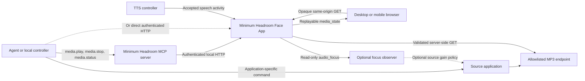
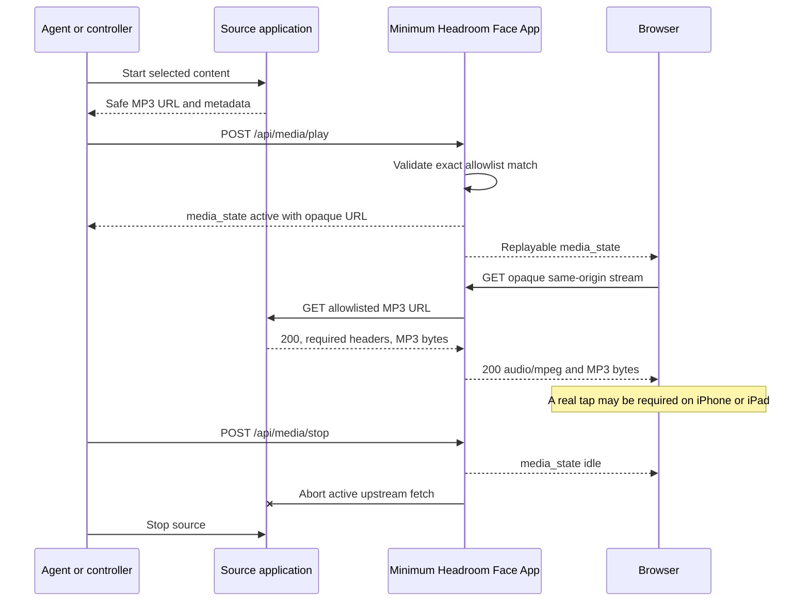
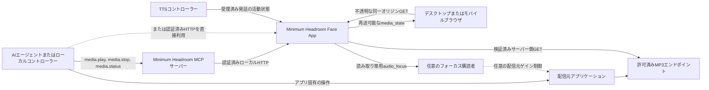
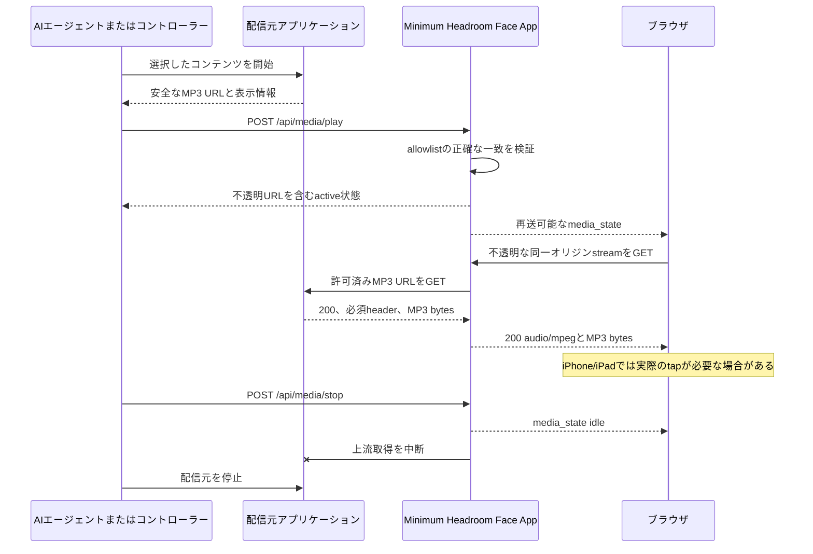

# Generic Browser Media Integration / 汎用ブラウザメディア連携

[English](#english) | [日本語](#japanese)

<a id="english"></a>

## English

This guide explains how an independent audio application can use Minimum Headroom as its authenticated browser playback surface. The source application owns its catalog, playback engine, queue, and MP3 encoder. Minimum Headroom owns one shared media registration, endpoint validation, a same-origin streaming proxy, browser state delivery, and mobile playback recovery.

The integration is source-agnostic. A source can be a music server, radio receiver, ambient sound generator, monitoring feed, or another application that can expose a trusted MP3 response. Minimum Headroom does not need to know the source application's product name or control model.

### What the channel does

The channel accepts one HTTP or HTTPS MP3 source at a time. A local controller registers that source through authenticated HTTP or the generic `media.play` MCP tool. Minimum Headroom keeps the upstream URL on the host, gives browsers an opaque same-origin URL, and forwards the MP3 bytes without transcoding them.

This first version intentionally has only play, stop, and status:

- A valid play replaces the previous registered media item.
- Stop is idempotent and revokes the active opaque stream handle.
- Status reports server intent as `idle`, `active`, or `error`. `active` means registered, not confirmed audible.
- Pause, seek, playlists, catalogs, next/previous, and loop behavior belong to the source application.
- TTS and media use separate native browser audio elements. Minimum Headroom does not mix them or change media volume.

At a declared 128 kbit/s, the encoded payload is approximately 57.6 MB per hour before transport overhead.

### Component and trust boundaries



| Component | Responsibility |
|---|---|
| Source application | Starts and stops its own audio engine, exposes real MP3 bytes, validates its query parameters, and cleans up disconnected clients. |
| Application-specific controller or agent skill | Selects content, starts the source, derives a safe upstream URL, calls Minimum Headroom, and rolls back the source when registration fails. |
| Minimum Headroom | Validates the exact configured endpoint, registers one item, hides the upstream URL, proxies bytes, broadcasts state, and hosts the browser player. |
| Browser | Receives `media_state`, loads the opaque same-origin stream, and handles device autoplay/output behavior. |
| Optional focus observer | Receives only `speech`/`normal` hints and may apply a source-side gain policy. It is not required for playback. |

The source application does not need to implement MCP. A controller can call the source application's own API and then use Minimum Headroom's HTTP API or MCP tools. This separation lets an agent skill expose a friendly catalog while Minimum Headroom remains unaware of that catalog.

Minimum Headroom does not call back into the source application's control API and does not start that application. Its generic `media.play` tool expects an MP3 endpoint that the application-specific controller has already made available. The controller may also start and stop an application service when needed.

### End-to-end lifecycle

A robust controller follows this order:

1. Start or select content in the source application.
2. Obtain an absolute MP3 URL that the Minimum Headroom host can fetch.
3. Validate that the URL came from the source application; do not accept an arbitrary model-supplied URL.
4. Call `POST /api/media/play` or `media.play` with the URL and display metadata.
5. If registration fails, stop the newly started source so it does not run unheard.
6. Treat an `active` response as accepted intent only. Browser autoplay, decoding, and output selection still determine audibility.
7. On shutdown, call `POST /api/media/stop` and stop the source. Make both operations safe to repeat.

If a source uses a generation or session query parameter, issue a new play registration whenever that generation changes. Minimum Headroom permits a query on an allowed endpoint but does not interpret or constrain its fields; the source application must validate them.

### Source MP3 endpoint contract

Configure and control only endpoints you own. For a requested URL such as:

```text
http://127.0.0.1:9000/live.mp3?session=17
```

the source must satisfy this contract:

- Use `http:` or `https:` and return a direct 2xx response. Redirects are rejected.
- Return `Content-Type: audio/mpeg`. Media type parameters are tolerated, but another audio type is not.
- Return exactly `X-Media-Nominal-Bitrate: 128000` after whitespace trimming.
- Send actual MP3 bytes compatible with the browser. Minimum Headroom forwards them unchanged and does not transcode or provide a fallback.
- Treat the nominal-bitrate header as a trusted producer declaration. Minimum Headroom checks the header but does not inspect MP3 frames or rate-limit the connection.
- Start sending headers before the long-lived body and flush encoded data continuously enough for a native `HTMLAudioElement`.
- Handle client disconnect promptly. A browser reload or network change aborts that proxy fetch without invalidating the media registration; a later browser request may open a new source connection.
- Support independent GET consumers if more than one browser may listen. Each browser stream request can create its own upstream GET.
- Validate every query parameter. Allowlisting the pathname does not authorize arbitrary query behavior inside the source.

The source does not need CORS headers because the browser never contacts it directly. It also does not need to implement browser `Range` or `HEAD` behavior: Minimum Headroom handles `HEAD` locally, does not forward downstream `Range`, and returns the live browser stream as `200` with `Accept-Ranges: none`.

### Configure the endpoint allowlist

Media is disabled when `MH_MEDIA_ALLOWED_ENDPOINTS` is empty. Put persistent configuration in the same ignored environment file used by the operator stack, normally `~/.config/minimum-headroom.env`:

```bash
MH_MEDIA_ALLOWED_ENDPOINTS=http://127.0.0.1:9000/live.mp3
```

Multiple entries are comma-separated:

```bash
MH_MEDIA_ALLOWED_ENDPOINTS=http://127.0.0.1:9000/live.mp3,http://127.0.0.1:9100/program.mp3
```

Each configured entry must:

- Be an absolute HTTP or HTTPS URL.
- Contain no username, password, query string, or fragment.
- Name the exact scheme, hostname, effective port, and pathname to trust.

Matching is not a prefix or wildcard. `localhost` and `127.0.0.1` are different hostnames, and sibling paths are not allowed. A requested upstream URL may add a query only after its scheme, hostname, effective port, and pathname match.

For a running operator stack, apply the change with the supported in-place restart:

```bash
./scripts/restart-operator-stack-in-place.sh
```

For a direct Face App process, export the variable before `npm run face-app:start`. Keep the source bound to loopback when it runs on the same host. Tailscale Serve can expose the Minimum Headroom browser origin; the source endpoint itself does not need a LAN bind, public port, CORS rule, or inbound firewall rule.

Startup reports only whether generic media is enabled and the number of accepted endpoints. Invalid configuration entries are ignored, and their raw values are not written to warnings.

### Control with authenticated HTTP

All `/api/media/*` routes pass through the Face App's existing API authentication and Origin policy. If `MH_FACE_AUTH_TOKEN` is configured, a backend controller should send it in an `Authorization: Bearer ...` header. Do not put the token in an upstream URL, media metadata, logs, or committed configuration.

Register one item:

```http
POST /api/media/play
Content-Type: application/json
Authorization: Bearer <MH_FACE_AUTH_TOKEN>

{
  "upstream_url": "http://127.0.0.1:9000/live.mp3?session=17",
  "media_id": "producer:session-17",
  "title": "Ambient program",
  "subtitle": "Local source"
}
```

The request accepts only these four fields. `upstream_url`, `media_id`, and `title` are required; `subtitle` is optional. Limits are 2048 characters for the URL, 128 for `media_id`, and 200 each for title and subtitle. Treat IDs and display text as public browser state and do not place secrets in them.

A successful response resembles:

```json
{
  "v": 1,
  "type": "media_state",
  "state": "active",
  "revision": 4,
  "media_id": "producer:session-17",
  "title": "Ambient program",
  "subtitle": "Local source",
  "stream_url": "/api/media/stream/8b6f...opaque...",
  "mime_type": "audio/mpeg",
  "bitrate": 128000,
  "updated_at": "2026-07-20T01:00:00.000Z",
  "error": null
}
```

The raw `upstream_url` is deliberately absent. Do not persist or construct `stream_url` yourself; it is an active-item-bound, revocable browser handle. A valid handle is available for at most 24 hours and becomes unusable after stop or replacement.

Read state and stop:

```http
GET /api/media/status
Authorization: Bearer <MH_FACE_AUTH_TOKEN>
```

```http
POST /api/media/stop
Content-Type: application/json
Authorization: Bearer <MH_FACE_AUTH_TOKEN>

{}
```

Stop is successful even when already idle. A new valid play aborts existing proxy fetches and replaces the old registration. A rejected play leaves the current valid registration unchanged.

Registration validates the URL and metadata, not the response body. The source is fetched when a browser requests the opaque stream. A missing source, redirect, incorrect response header, or stream failure can therefore change later state to `error` even after play returned `active`.

### Control through MCP and an agent skill

Minimum Headroom exposes:

- `media.play` with `upstream_url`, `media_id`, `title`, and optional `subtitle`.
- `media.stop` with no arguments.
- `media.status` with no arguments.

When `MCP_TOOL_NAME_STYLE=underscore`, the visible aliases are `media_play`, `media_stop`, and `media_status`. Both styles reach the same authenticated HTTP implementation.

Use the normal Minimum Headroom MCP setup described in [Agent Setup](../../README.md#en-agent-setup). The MCP server derives the Face App HTTP origin from `FACE_WS_URL` unless `FACE_HTTP_BASE_URL` is set, and it sends `MH_FACE_AUTH_TOKEN` as a bearer token when configured.

An application-specific skill should usually expose user concepts such as search, stations, scenes, or tracks. Its play operation should:

1. Resolve a user-facing choice to an application-owned opaque ID.
2. Start the source through the application's local control API.
3. Derive the upstream URL from the application's response rather than accepting a free-form URL from the language model.
4. Call `media.play`.
5. Stop the source if Minimum Headroom rejects registration.

Its stop operation should clean up both systems and remain idempotent. Its status result should distinguish source state, Minimum Headroom server state, and confirmed browser audibility; the last one normally cannot be proven from a backend response.

### Playback sequence



### Browser, iPhone, and iPad behavior

The browser owns a dedicated persistent `HTMLAudioElement` at unity gain. It is separate from all TTS elements. A replayed `media_state` lets a newly opened or reloaded browser attach to the current registration.

Mobile browsers may reject `play()` until a real gesture. Minimum Headroom then shows the media panel with a `Resume` button. Open the normal authenticated Minimum Headroom page over HTTPS or localhost, make one real tap, and use `Resume` if playback remains in `tap required`, `error`, or `ended`. Safari and Chrome on iPhone/iPad share the platform's WebKit media rules.

`active` in `/api/media/status` does not guarantee:

- That a browser tab is connected.
- That autoplay was granted.
- That the MP3 decoder accepted the bytes.
- That the selected device or system volume is audible.

The browser's local panel reports `starting`, `playing`, `tap required`, `error`, or `ended`. Those local states are not promoted to authoritative global status.

### Optional TTS audio-focus observer

Playback does not require focus integration. Without it, browser TTS and media can overlap as independent native elements.

A producer that wants to lower its own encoded program while TTS is pending can open the Face App WebSocket with the `mh-audio-focus-v1` subprotocol. When authentication is enabled, add a second protocol:

```text
mh-face-auth-b64.<unpadded-base64url-of-UTF-8-token>
```

For example, in Node:

```js
const token = process.env.MH_FACE_AUTH_TOKEN?.trim();
const protocols = ["mh-audio-focus-v1"];
if (token) {
  protocols.push("mh-face-auth-b64." + Buffer.from(token, "utf8").toString("base64url"));
}

const socket = new WebSocket("ws://127.0.0.1:8765/ws", protocols);
socket.addEventListener("open", () => {
  if (socket.protocol !== "mh-audio-focus-v1") socket.close();
});
socket.addEventListener("message", (event) => {
  const payload = JSON.parse(String(event.data));
  if (payload.type === "audio_focus" && (payload.state === "speech" || payload.state === "normal")) {
    // Apply an application-owned, smoothly ramped gain policy before encoding.
  }
});
```

The observer receives only:

```json
{
  "v": 1,
  "type": "audio_focus",
  "state": "speech",
  "revision": 7,
  "ts": 1784450000000
}
```

The socket is read-only: inbound application messages are ignored, and TTS audio or unrelated Face App events are not delivered. The latest focus state is replayed on connection. Reset the consumer's revision tracking on each new WebSocket because a Face App restart starts a new revision sequence.

`speech` is emitted when accepted backend TTS is active or queued. `normal` is emitted 1.5 seconds after that queue becomes empty. This is advisory backend timing, not sample-accurate browser timing; synthesis, network, MP3, and browser buffers can shift the audible edges. A producer should use smooth ramps, reconnect with bounded backoff, never block playback on focus availability, and fail open to normal gain after a prolonged disconnect.

### Security model

- Keep the source on loopback when it shares the Minimum Headroom host.
- Allow exact endpoint paths only; never generate an allowlist from an untrusted play request.
- Allow only producers you control because the bitrate header is a declaration, not frame-level enforcement.
- Keep `MH_FACE_AUTH_TOKEN` and producer credentials in ignored environment/configuration files.
- Send the Face App token as an HTTP bearer header or protocol-safe WebSocket companion protocol, never as the upstream URL.
- Do not put credentials or fragments in `upstream_url`. Minimum Headroom rejects them.
- Do not put secrets in `media_id`, title, or subtitle; these are broadcast to browser clients.
- Do not expose an arbitrary URL parameter to an AI model. Resolve model-facing IDs through a bounded application-specific API.
- Minimum Headroom never exposes the raw upstream URL to the browser and rejects redirects before forwarding bytes.

### Failure handling and troubleshooting

| Symptom or state | Meaning and action |
|---|---|
| `upstream_not_allowed` | Scheme, hostname, effective port, or pathname does not exactly match `MH_MEDIA_ALLOWED_ENDPOINTS`. Check `localhost` versus `127.0.0.1` and restart after configuration changes. |
| `invalid_media_type` | The source did not return `audio/mpeg`. Fix the source; Minimum Headroom has no codec fallback. |
| `invalid_nominal_bitrate` | The required `X-Media-Nominal-Bitrate: 128000` declaration is missing or different. |
| `upstream_redirect` | The source redirected. Return MP3 directly from the allowlisted path. |
| `upstream_status` or `upstream_error` | The source was unavailable or failed during streaming. Check source lifecycle and disconnect handling. |
| Browser shows `tap required` | Use the visible `Resume` button in a real user gesture. |
| Server says `active` but no sound | Check browser local state, open tab, MP3 validity, output device, and volume. `active` alone is not an audibility acknowledgment. |
| Focus never connects | Verify `ws:`/`wss:` URL, selected `mh-audio-focus-v1` protocol, base64url token encoding, and Face App authentication. Playback should continue at normal gain. |

### Integration acceptance checklist

A third-party integration is ready when all of these are true:

1. The source returns real 128-kbit/s MP3 with both required headers and no redirect.
2. The exact path, and only that path, is in `MH_MEDIA_ALLOWED_ENDPOINTS`.
3. HTTP or MCP play returns `media_state.state = active` without exposing the upstream URL.
4. A browser receives the state and its opaque request returns `200 audio/mpeg`.
5. A physical iPhone or iPad can start audio after a real tap and can recover with `Resume`.
6. Reloading the browser opens a fresh upstream GET without invalidating registration.
7. Stop revokes the handle, aborts upstream delivery, and does not break later TTS.
8. Source-start rollback works when Minimum Headroom rejects play.
9. If focus is implemented, it receives replayed `normal`/`speech` only, reconnects safely, and restores normal gain after loss.
10. Logs, public state, committed files, and documentation contain no auth token, private endpoint, or user-specific source name.

<a id="japanese"></a>

## 日本語

このガイドは、独立した音声アプリケーションが Minimum Headroom を認証済みブラウザ再生面として利用する方法を説明します。配信元アプリケーションは、カタログ、再生エンジン、キュー、MP3 エンコーダーを所有します。Minimum Headroom は、共有メディア登録1件、配信元URLの検証、同一オリジン代理配信、ブラウザへの状態通知、モバイル再生の復旧を担当します。

この連携は配信元に依存しません。音楽サーバー、ラジオ受信機、環境音ジェネレーター、監視音声、その他の信頼できる MP3 応答を公開できるアプリケーションを接続できます。Minimum Headroom が配信元の製品名や操作体系を知る必要はありません。

### このチャネルが担当すること

チャネルが受け付ける HTTP/HTTPS MP3 配信元は同時に1件です。ローカルのコントローラーが、認証済み HTTP または汎用 `media.play` MCP ツールで配信元を登録します。Minimum Headroom は上流URLをホスト内に保持し、ブラウザには不透明な同一オリジンURLだけを渡し、MP3を再エンコードせず中継します。

最初の版は意図的に再生、停止、状態取得だけを提供します。

- 正常な再生登録は、以前のメディア登録を置き換えます。
- 停止は何度呼んでも安全で、現在の不透明ストリームハンドルを無効化します。
- 状態は `idle`、`active`、`error` です。`active` は登録済みという意味で、実際に聞こえたことの確認ではありません。
- 一時停止、シーク、プレイリスト、カタログ、前後移動、ループは配信元アプリケーションの責任です。
- TTS とメディアは別々のブラウザ標準音声要素を使用します。Minimum Headroom は両者をミックスせず、メディア音量も変更しません。

公称128 kbit/sの場合、転送プロトコルのオーバーヘッドを除いたデータ量は約57.6 MB/時です。

### コンポーネントと信頼境界



| コンポーネント | 責任 |
|---|---|
| 配信元アプリケーション | 自身の音声エンジンを起動・停止し、実MP3を配信し、クエリを検証し、切断したクライアントを後始末します。 |
| アプリ固有コントローラー／エージェントスキル | コンテンツを選び、配信元を開始し、安全な上流URLを組み立て、Minimum Headroomを呼び、登録失敗時に配信元をロールバックします。 |
| Minimum Headroom | 設定された正確なエンドポイントを検証し、1件を登録し、上流URLを隠し、音声を代理配信し、状態を通知し、ブラウザプレイヤーを提供します。 |
| ブラウザ | `media_state` を受信し、不透明な同一オリジンストリームを読み込み、端末の自動再生・出力規則に従います。 |
| 任意のフォーカス購読者 | `speech`／`normal` のヒントだけを受け、配信元側で音量方針を適用できます。再生だけなら不要です。 |

配信元アプリケーション自身が MCP を実装する必要はありません。コントローラーが配信元固有APIを呼び、その後で Minimum Headroom の HTTP API または MCP ツールを利用できます。この分離により、エージェントスキルは使いやすいカタログを公開しつつ、Minimum Headroom はそのカタログに依存せずに済みます。

Minimum Headroomは配信元アプリケーションの制御APIをコールバックせず、そのアプリケーションを起動もしません。汎用 `media.play` は、アプリ固有コントローラーがすでに利用可能にしたMP3エンドポイントを受け取ります。必要ならコントローラーがアプリのサービス起動・停止も担当します。

### 一連の処理手順

堅牢なコントローラーは次の順序で処理します。

1. 配信元アプリケーションでコンテンツを開始または選択します。
2. Minimum Headroom のホストから取得できる絶対MP3 URLを受け取ります。
3. URLが配信元アプリケーション自身の応答から得られたことを検証し、言語モデルが自由入力したURLを受け入れないようにします。
4. URLと表示情報を付けて `POST /api/media/play` または `media.play` を呼びます。
5. 登録が失敗したら、新しく起動した配信元を停止し、聞かれない処理を残しません。
6. `active` は再生意図が受理された意味として扱います。実際に聞こえるかは、自動再生、デコード、出力先にも依存します。
7. 終了時は `POST /api/media/stop` と配信元の停止を両方実行し、どちらも反復可能にします。

配信元URLに世代番号やセッション番号のクエリを使う場合は、その値が変わるたびに新しい再生登録を行います。Minimum Headroom は許可済みパスへのクエリを認めますが、その内容を解釈・制限しません。クエリの検証は配信元の責任です。

### 配信元MP3エンドポイントの契約

自分で管理するエンドポイントだけを設定・操作してください。例えば次のURLを使う場合:

```text
http://127.0.0.1:9000/live.mp3?session=17
```

配信元は次の契約を満たします。

- `http:` または `https:` を使い、リダイレクトせず直接2xxを返します。
- `Content-Type: audio/mpeg` を返します。メディアタイプのパラメーターは許容されますが、別の音声形式は拒否されます。
- 空白を除いた値が正確に `X-Media-Nominal-Bitrate: 128000` となるヘッダーを返します。
- ブラウザが再生できる実MP3を送ります。Minimum Headroomはそのまま中継し、再エンコードもフォールバックもしません。
- 公称ビットレートヘッダーは、信頼済み配信元による宣言です。Minimum Headroomはヘッダーを確認しますが、MP3フレーム解析や通信速度制限は行いません。
- 長時間の本文より先にヘッダーを送り、ブラウザ標準 `HTMLAudioElement` が再生できる頻度でエンコード済みデータを継続送信します。
- クライアント切断を速やかに後始末します。ブラウザ再読込やネットワーク変更で代理取得が切断されても登録自体は有効なままで、後のブラウザ要求が新しい上流接続を開く場合があります。
- 複数ブラウザで聞く可能性がある場合、独立したGET利用者を処理します。ブラウザごとのストリーム要求が別の上流GETを作ることがあります。
- すべてのクエリパラメーターを検証します。パスのallowlist登録は、配信元内部の任意クエリ動作を許可するものではありません。

ブラウザは配信元へ直接接続しないため、配信元にCORSヘッダーは不要です。ブラウザ向け `Range` や `HEAD` の実装も不要です。Minimum Headroomは `HEAD` をローカルで処理し、下流の `Range` を上流へ転送せず、ブラウザには `Accept-Ranges: none` 付きの `200` ライブストリームを返します。

### エンドポイントallowlistの設定

`MH_MEDIA_ALLOWED_ENDPOINTS` が空ならメディア機能は無効です。永続設定はオペレータースタックと同じgit管理外の環境ファイル、通常は `~/.config/minimum-headroom.env` に置きます。

```bash
MH_MEDIA_ALLOWED_ENDPOINTS=http://127.0.0.1:9000/live.mp3
```

複数指定はカンマ区切りです。

```bash
MH_MEDIA_ALLOWED_ENDPOINTS=http://127.0.0.1:9000/live.mp3,http://127.0.0.1:9100/program.mp3
```

設定項目には次の制約があります。

- HTTPまたはHTTPSの絶対URLであること。
- ユーザー名、パスワード、クエリ、フラグメントを含まないこと。
- 信頼するscheme、hostname、実効port、pathnameを正確に指定すること。

一致判定は前方一致やワイルドカードではありません。`localhost` と `127.0.0.1` は別のホスト名で、隣接パスも許可されません。要求時の上流URLは、scheme、hostname、実効port、pathnameが一致した後に限りクエリを追加できます。

起動中のオペレータースタックへ反映する場合は、対応済みのin-place再起動を使います。

```bash
./scripts/restart-operator-stack-in-place.sh
```

Face Appを直接起動する場合は、`npm run face-app:start` の前に環境変数をexportします。同一ホストの配信元はループバックへbindしたままにしてください。Tailscale ServeでMinimum Headroomのブラウザoriginを公開しても、配信元自体にLAN bind、公開ポート、CORS規則、外部向けファイアウォール許可は不要です。

起動ログには汎用メディアの有効・無効と受理したエンドポイント数だけが表示されます。不正な設定項目は無視され、生の値は警告ログへ出しません。

### 認証済みHTTPによる操作

すべての `/api/media/*` はFace App既存のAPI認証とOriginポリシーを通ります。`MH_FACE_AUTH_TOKEN` を設定している場合、バックエンドコントローラーは `Authorization: Bearer ...` ヘッダーで送信します。トークンを上流URL、メディア表示情報、ログ、コミット対象設定へ入れないでください。

1件を登録する要求:

```http
POST /api/media/play
Content-Type: application/json
Authorization: Bearer <MH_FACE_AUTH_TOKEN>

{
  "upstream_url": "http://127.0.0.1:9000/live.mp3?session=17",
  "media_id": "producer:session-17",
  "title": "環境音プログラム",
  "subtitle": "ローカル配信元"
}
```

受け付けるフィールドはこの4つだけです。`upstream_url`、`media_id`、`title` は必須、`subtitle` は任意です。上限はURLが2048文字、`media_id` が128文字、titleとsubtitleが各200文字です。IDと表示文字列はブラウザへ公開される状態なので、秘密を入れないでください。

成功応答例:

```json
{
  "v": 1,
  "type": "media_state",
  "state": "active",
  "revision": 4,
  "media_id": "producer:session-17",
  "title": "環境音プログラム",
  "subtitle": "ローカル配信元",
  "stream_url": "/api/media/stream/8b6f...opaque...",
  "mime_type": "audio/mpeg",
  "bitrate": 128000,
  "updated_at": "2026-07-20T01:00:00.000Z",
  "error": null
}
```

生の `upstream_url` は意図的に含まれません。`stream_url` を保存したり、自分で組み立てたりしないでください。現在項目にだけ結び付いた、取り消し可能なブラウザ用ハンドルです。有効期間は最大24時間で、停止や置換後は利用できません。

状態取得と停止:

```http
GET /api/media/status
Authorization: Bearer <MH_FACE_AUTH_TOKEN>
```

```http
POST /api/media/stop
Content-Type: application/json
Authorization: Bearer <MH_FACE_AUTH_TOKEN>

{}
```

すでにidleでも停止は成功します。新しい正常なplayは既存の代理取得を中断して登録を置き換えます。拒否されたplayは現在の正常な登録を変更しません。

登録時に検証するのはURLと表示情報であり、応答本文ではありません。配信元はブラウザが不透明ストリームを要求した時点で取得されます。そのためplayが `active` を返した後でも、配信元不在、リダイレクト、誤った応答ヘッダー、配信失敗により後から状態が `error` へ変わる場合があります。

### MCPとエージェントスキルによる操作

Minimum Headroomは次を提供します。

- `media.play`: `upstream_url`、`media_id`、`title`、任意の `subtitle`。
- `media.stop`: 引数なし。
- `media.status`: 引数なし。

`MCP_TOOL_NAME_STYLE=underscore` の場合、表示名は `media_play`、`media_stop`、`media_status` です。どちらの名前でも同じ認証済みHTTP実装へ到達します。

MCP接続は通常の[エージェント設定](../../README.ja.md#ja-agent-setup)を使います。MCPサーバーは `FACE_HTTP_BASE_URL` がなければ `FACE_WS_URL` からFace AppのHTTP originを導出し、`MH_FACE_AUTH_TOKEN` が設定されていればbearer tokenとして送信します。

アプリ固有スキルは、検索、放送局、シーン、曲など利用者向けの概念を公開するのが適切です。そのplay処理は次を行います。

1. 利用者の選択をアプリ所有の不透明IDへ解決します。
2. アプリのローカル制御APIで配信元を起動します。
3. 言語モデルから自由入力URLを受けず、アプリの応答から上流URLを組み立てます。
4. `media.play` を呼びます。
5. Minimum Headroomが登録を拒否したら配信元を停止します。

stop処理は両方を後始末し、反復可能にします。statusは配信元状態、Minimum Headroomのサーバー状態、ブラウザで実際に聞こえたかを区別してください。通常、最後の項目はバックエンド応答だけでは証明できません。

### 再生シーケンス



### ブラウザ、iPhone、iPadの挙動

ブラウザは、TTS要素とは別の永続的な `HTMLAudioElement` を音量1で保持します。`media_state` が再送されるため、新しく開いたブラウザや再読込したブラウザも現在の登録へ接続できます。

モバイルブラウザは、実際のユーザー操作まで `play()` を拒否することがあります。その場合Minimum Headroomはメディアパネルに `Resume` ボタンを表示します。HTTPSまたはlocalhostの通常の認証済みMinimum Headroom画面を開き、1回実際にタップし、`tap required`、`error`、`ended` のままなら `Resume` を押してください。iPhone/iPadのSafariとChromeは、どちらもプラットフォームのWebKit音声規則に従います。

`/api/media/status` の `active` は次を保証しません。

- ブラウザタブが接続中であること。
- 自動再生が許可されたこと。
- MP3デコーダーがデータを受理したこと。
- 選択中の出力先やシステム音量で聞こえること。

ブラウザのローカルパネルは `starting`、`playing`、`tap required`、`error`、`ended` を表示します。これらのローカル状態は、権威あるグローバル状態には昇格しません。

### 任意のTTS音声フォーカス購読

フォーカス連携は再生に必須ではありません。利用しない場合、ブラウザTTSとメディアは独立した標準音声要素として重なって再生されます。

TTS待機中に自身のエンコード音量を下げたい配信元は、`mh-audio-focus-v1` サブプロトコルでFace App WebSocketへ接続できます。認証が有効なら、次の第2プロトコルを追加します。

```text
mh-face-auth-b64.<UTF-8トークンをpaddingなしbase64url化した値>
```

Nodeの例:

```js
const token = process.env.MH_FACE_AUTH_TOKEN?.trim();
const protocols = ["mh-audio-focus-v1"];
if (token) {
  protocols.push("mh-face-auth-b64." + Buffer.from(token, "utf8").toString("base64url"));
}

const socket = new WebSocket("ws://127.0.0.1:8765/ws", protocols);
socket.addEventListener("open", () => {
  if (socket.protocol !== "mh-audio-focus-v1") socket.close();
});
socket.addEventListener("message", (event) => {
  const payload = JSON.parse(String(event.data));
  if (payload.type === "audio_focus" && (payload.state === "speech" || payload.state === "normal")) {
    // エンコード前に、アプリ自身が滑らかなゲイン方針を適用します。
  }
});
```

購読者が受け取るのは次の形式だけです。

```json
{
  "v": 1,
  "type": "audio_focus",
  "state": "speech",
  "revision": 7,
  "ts": 1784450000000
}
```

このsocketは読み取り専用です。送信したアプリメッセージは無視され、TTS音声や他のFace Appイベントも配信されません。接続時には最新フォーカス状態が再送されます。Face App再起動後はrevision系列も新しくなるため、WebSocketを新規接続するたびに購読側のrevision追跡をリセットしてください。

`speech` は受理済みバックエンドTTSがactiveまたはqueuedになった時に送信されます。キューが空になって1.5秒後に `normal` が送信されます。これはバックエンド基準の助言タイミングで、ブラウザ上のサンプル精度タイミングではありません。合成、ネットワーク、MP3、ブラウザのバッファで聞こえる境界はずれます。配信元は滑らかなランプ、上限付き再接続、フォーカス不在でも再生を止めない設計、長時間切断時に通常音量へ戻すfail-openを採用してください。

### セキュリティモデル

- 同一ホストの配信元はループバック上に置きます。
- 正確なエンドポイントパスだけを許可し、信頼できないplay要求からallowlistを生成しません。
- ビットレートヘッダーはフレーム単位の強制ではなく宣言なので、自分で管理する配信元だけを許可します。
- `MH_FACE_AUTH_TOKEN` と配信元資格情報はgit管理外の環境・設定ファイルに置きます。
- Face AppトークンはHTTP bearerヘッダーまたはプロトコル安全なWebSocket companion protocolで送り、上流URLへ含めません。
- `upstream_url` に資格情報やfragmentを含めません。Minimum Headroomが拒否します。
- `media_id`、title、subtitleはブラウザへ配信されるため秘密を含めません。
- AIモデルへ任意URL引数を公開せず、制限されたアプリ固有APIでモデル向けIDを解決します。
- Minimum Headroomは生の上流URLをブラウザへ公開せず、byteを転送する前にredirectを拒否します。

### 障害対応とトラブルシュート

| 症状・状態 | 意味と対応 |
|---|---|
| `upstream_not_allowed` | scheme、hostname、実効port、pathnameのいずれかが `MH_MEDIA_ALLOWED_ENDPOINTS` と正確に一致していません。`localhost` と `127.0.0.1` の違い、設定後の再起動を確認します。 |
| `invalid_media_type` | 配信元が `audio/mpeg` を返していません。配信元を修正します。コーデックのフォールバックはありません。 |
| `invalid_nominal_bitrate` | `X-Media-Nominal-Bitrate: 128000` 宣言がないか、値が異なります。 |
| `upstream_redirect` | 配信元がredirectしました。許可済みパスから直接MP3を返します。 |
| `upstream_status`／`upstream_error` | 配信元が利用不能、または配信中に失敗しました。配信元のライフサイクルと切断処理を確認します。 |
| ブラウザが `tap required` | 表示された `Resume` を実際のユーザー操作で押します。 |
| サーバーは `active` だが無音 | ブラウザのローカル状態、開いているタブ、MP3妥当性、出力先、音量を確認します。`active` は可聴確認ではありません。 |
| フォーカスが接続しない | `ws:`／`wss:` URL、選択された `mh-audio-focus-v1`、base64url認証、Face App認証を確認します。再生自体は通常音量で継続させます。 |

### 連携受け入れチェックリスト

次をすべて満たせば、第三者アプリ連携の準備は完了です。

1. 配信元がredirectなしで実128-kbit/s MP3と2つの必須ヘッダーを返す。
2. 正確な対象パスだけが `MH_MEDIA_ALLOWED_ENDPOINTS` に入っている。
3. HTTPまたはMCPのplayが上流URLを公開せず `media_state.state = active` を返す。
4. ブラウザが状態を受信し、不透明URLへの要求が `200 audio/mpeg` を返す。
5. 実iPhone/iPadで、実際のtap後に再生でき、`Resume` で復旧できる。
6. ブラウザ再読込が新しい上流GETを開き、登録自体を無効化しない。
7. stopがハンドルを無効化して上流配信を中断し、その後のTTSを壊さない。
8. Minimum Headroomがplayを拒否した場合に、配信元起動をロールバックできる。
9. フォーカスを実装する場合、再送された `normal`／`speech` だけを受け、安全に再接続し、切断後は通常音量へ戻る。
10. ログ、公開状態、コミット対象、文書に認証トークン、私的エンドポイント、利用者固有の配信元名が含まれない。
