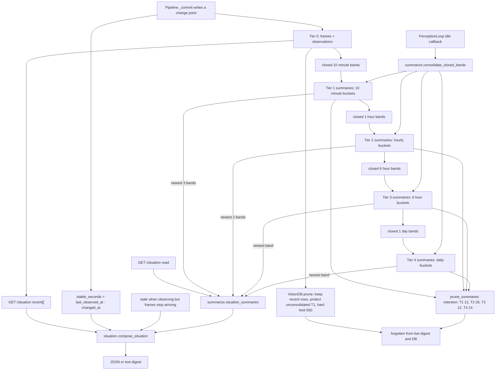
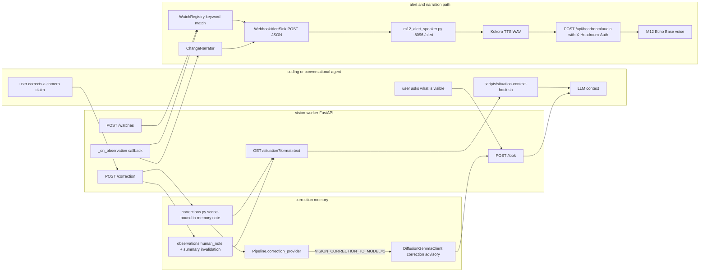

# AtomS3R-M12 Vision Guide

This guide explains the AtomS3R-M12 vision subsystem: a small ambient scene
memory that local coding agents and the conversational LLM can query. The M12
camera provides frames, `vision-worker` turns changed scenes into structured
records with diffusiongemma, SQLite stores the short-term memory, and
`GET /situation` exposes a cheap digest for agents.

## English

### What The Subsystem Does

The M12 vision path is designed for ambient situational awareness, not high-risk
automation. It lets an agent answer what the camera sees now, how long that view
has been stable, what changed recently, whether a keyword watch fired, and
whether a user correction is active.

The worker is split into low-cost layers: `NetworkCaptureSource` pulls JPEGs,
`ChangeGate` avoids unnecessary model calls, `Pipeline` reconciles structured
model observations, `VisionDB` and `FrameStore` persist tier-0 memory,
`summarize.py` builds older-history summaries, and `situation.py` renders the
digest that agents read.

The M12 lens is useful for scenes, objects, and large text. It is not a document
scanner. Fine print, homework pages, dense screens, and small labels should go
through a phone-camera or direct image path instead.

### Perception Flow

This is the live frame-to-record path used by the continuous perception loop and
by stored on-demand looks. The key point is that the cheap gate runs before the
heavy model, while the model's own `changed` verdict is still the authority for
whether a committed row represents a meaningful scene change.

```mermaid
flowchart LR
  subgraph Device["AtomS3R-M12 device"]
    Sensor["Camera sensor"]
    Snapshot["/snapshot HTTP endpoint"]
  end
  subgraph Capture["vision_worker.capture"]
    Net["NetworkCaptureSource.capture"]
    Auth["X-Headroom-Auth header"]
    Rotate["optional JPEG rotation"]
  end
  subgraph Gate["vision_worker.gate"]
    Hash["average hash"]
    Pixel["32px gray pixel diff"]
    Changed{"changed enough?"}
  end
  subgraph Pipeline["vision_worker.pipeline"]
    Window["pending voting window"]
    Observe["model_client.observe"]
    Reconcile["vote.reconcile medoid"]
    Commit{"meaningful change?"}
  end
  subgraph Model["diffusiongemma via vLLM"]
    VLLM["OpenAI-compatible /chat/completions"]
    Record["Observation JSON: is_text, ocr_full, overview, changed, change_from_prev"]
  end
  subgraph Tier0["SQLite tier 0"]
    Frames["frames table + stored JPEG paths"]
    Observations["observations table"]
  end
  Sensor --> Snapshot
  Net -- "HTTP GET with auth token" --> Snapshot
  Auth --> Net
  Snapshot -- "JPEG bytes" --> Rotate
  Rotate --> Hash
  Rotate --> Pixel
  Hash --> Changed
  Pixel --> Changed
  Changed -- "no, no open vote" --> Suppress["gate_suppressed"]
  Changed -- "yes, or open vote needs samples" --> Window
  Window --> Observe
  Observe --> VLLM
  VLLM --> Record
  Record --> Reconcile
  Reconcile --> Commit
  Commit -- "false or duplicate" --> Drop["nochange or dedup suppressed"]
  Commit -- "true or first baseline" --> Frames
  Commit -- "true or first baseline" --> Observations
```

Implementation notes: `run-vision-stack.sh` resolves `VISION_CAMERA_URL` to
`<m12-base>/snapshot`; `NetworkCaptureSource` sends `X-Headroom-Auth` from
`VISION_CAMERA_AUTH_TOKEN` or `MH_FACE_AUTH_TOKEN`; `ChangeGate.is_changed()`
combines average-hash Hamming distance with downscaled pixel diff; and
`Pipeline._commit()` writes the original frame plus the observation row before
firing alert/narration callbacks. The model prompt passes only previous text,
not the previous image, so every diffusiongemma call does one image prefill.

### Memory Lifecycle And Forgetting

The worker keeps two related memories:

- Tier 0: raw change records plus frame paths.
- Tiers 1-4: cached text summaries of closed time buckets.

Recent events stay verbatim. Older events are summarized into coarser buckets.
Forgetting is explicit: old observations are pruned after they are safe to
summarize, and each summary tier has a retention cap.

Tier 0 is the SQLite `frames` table plus `observations` table in `db.py`;
`observations.human_note` can hold a correction stamped onto a past record.
Tier 1 summarizes raw observations in closed 10 minute buckets, tier 2
summarizes tier 1 into hourly buckets, tier 3 summarizes tier 2 into 6 hour
buckets, and tier 4 summarizes tier 3 into daily buckets. `/situation` includes
recent raw changes and the newest populated summary bands: up to 3 tier-1
bands, 2 tier-2 bands, and 1 each for tiers 3 and 4.

LLM summaries are scheduled only when the scene is idle; otherwise reads return
an instant extractive fallback. `stable_seconds` is confirmed stability: it
grows only from successful captures and stops being live when the camera goes
stale. The default raw change window is `VISION_MAX_CHANGES=50`, with protected
unconsolidated tier-1 rows and a hard limit of 500 rows. Summary retention is
`TIER_RETENTION`: tier 1 keeps 12, tier 2 keeps 26, tier 3 keeps 12, and tier 4
keeps 14, giving the coarsest tier roughly a two-week horizon.

### Consumption And Feedback

The memory is useful only when agents can consume it cheaply and humans can
correct it when it is wrong. The diagram shows the prompt hook, `POST /look`,
keyword watches, change narration, and the correction backchannel.

Key details: the hook is opt-in through `MH_SITUATION_INJECT=1`, stores the
`X-Situation-Watermark` header per session, and escalates from a one-line
presence header to a full block only after salient events. `POST /look` captures
a fresh frame; default `store=1` sends it through the normal pipeline, while
`store=0` is ephemeral. Watches are keyword-only today; `kind="enum"` returns
501. `WatchRegistry.evaluate()` uses NFKC normalization and case folding over
overview, OCR, and change text.

`ChangeNarrator` skips low-confidence, baseline, no-change, and too-short lines.
`WebhookAlertSink` posts `{"text": ..., "watch": ...}` to the configured
webhook; the live stack uses `http://127.0.0.1:8096/alert`. The speaker bridge
then synthesizes Kokoro audio and sends WAV bytes to the M12
`/api/headroom/audio` endpoint with `X-Headroom-Auth`.

`POST /correction` rejects requests before any scene exists. Active corrections
are in-memory and scene-bound: they retire on a committed scene change, hash
drift beyond `VISION_CORRECTION_HASH_DRIFT`, or `VISION_CORRECTION_TTL_S`.
The endpoint also stamps `observations.human_note` onto the anchored record and
invalidates summaries that contain it. With `VISION_CORRECTION_TO_MODEL=1`, the
freshest active correction becomes a separate "may be stale" advisory in the
diffusiongemma prompt.

### Ops Quick Reference

Use the reboot-safe stack launcher from the repository root:

    ./scripts/run-vision-stack.sh --check
    ./scripts/run-vision-stack.sh

`--check` starts nothing. It verifies the persistent env file, M12 discovery,
diffusiongemma health, the vision-worker health endpoint, and whether the M12
alert speaker port is already open. The launcher starts or reuses diffusiongemma
vLLM, `vision-worker`, and the M12 alert speaker bridge. It does not start
Voxtral or any ASR path; the operator stack owns ASR.

For live configuration and the environment-variable table, use
[vision-worker/README.md](../../vision-worker/README.md#key-environment-variables).
That README also has the full-stack smoke checklist and the `--check` notes.

Useful health probes after the stack starts:

    curl -s http://127.0.0.1:8095/healthz
    curl -s http://127.0.0.1:8095/situation
    curl -s -X POST http://127.0.0.1:8095/look

Keep the safety boundary visible in agent-facing behavior: this subsystem is
informational and assistive. It samples slowly and runs over the network, so it
must not be used for driving, street crossing, or other safety-critical alerts.

## 日本語

### このサブシステムがすること

M12 vision path は、リスクの高い自動化ではなく、周囲状況をゆるく把握するための仕組みです。カメラが今何を見ているか、その見え方がどれくらい安定しているか、最近何が変わったか、keyword watch が発火したか、ユーザー correction が有効かを agent が答えられるようにします。

worker は低コストな層に分かれています。`NetworkCaptureSource` が JPEG を取得し、`ChangeGate` が不要な model call を避け、`Pipeline` が model の structured observation を整合し、`VisionDB` と `FrameStore` が tier-0 memory を保存します。古い履歴 summary は `summarize.py` が作り、agent が読む digest は `situation.py` が描画します。

M12 のレンズは、場面、物体、大きな文字を見る用途に向いています。document scanner ではありません。細かい印字、宿題の紙面、密な画面、小さなラベルは、スマホカメラや直接画像を渡す経路を使ってください。

### Perception Flow

図は English セクションの Mermaid 図「Perception Flow」を参照してください。

この図は、continuous perception loop と保存される on-demand look が使う live frame から record までの経路を示しています。重要なのは、重い model の前に cheap gate が動く一方で、committed row が意味のある scene change を表すかどうかの最終判断は model 自身の `changed` verdict が持つことです。

実装メモ: `run-vision-stack.sh` は `VISION_CAMERA_URL` を `<m12-base>/snapshot` に解決します。`NetworkCaptureSource` は `VISION_CAMERA_AUTH_TOKEN` または `MH_FACE_AUTH_TOKEN` から `X-Headroom-Auth` を送り、`ChangeGate.is_changed()` は average-hash の Hamming distance と縮小 pixel diff を組み合わせます。`Pipeline._commit()` は元 frame と observation row を保存してから alert/narration callback を発火します。model prompt に渡すのは previous text だけで、previous image は渡しません。そのため diffusiongemma call は毎回 1 回の image prefill を行います。

### Memory Lifecycle And Forgetting

図は English セクションの Mermaid 図「Memory Lifecycle And Forgetting」を参照してください。

worker は 2 種類の関連 memory を持ちます。

- Tier 0: raw change records と frame path。
- Tiers 1-4: closed time bucket ごとの cached text summary。

最近の event は verbatim で残します。古い event はより粗い bucket に summary 化します。forgetting は明示的です。古い observation は summary 化して安全になってから prune され、summary tier ごとに retention cap があります。

Tier 0 は `db.py` 内の SQLite `frames` table と `observations` table です。`observations.human_note` には、過去 record へ紐づけた correction を保持できます。Tier 1 は raw observation を閉じた 10 分 bucket に summary 化し、tier 2 は tier 1 を hourly bucket に、tier 3 は tier 2 を 6 時間 bucket に、tier 4 は tier 3 を daily bucket に summary 化します。`/situation` には、recent raw changes と、値がある最新 summary band が入ります。tier 1 は最大 3 band、tier 2 は最大 2 band、tier 3 と tier 4 は各 1 band です。

LLM summary は scene が idle のときだけ scheduling されます。そうでないとき、read は即時の extractive fallback を返します。`stable_seconds` は確認済みの安定時間です。successful capture からだけ増え、camera が stale になると live ではなくなります。既定の raw change window は `VISION_MAX_CHANGES=50` で、未統合 tier-1 row は保護され、hard limit は 500 rows です。Summary retention は `TIER_RETENTION` で、tier 1 が 12、tier 2 が 26、tier 3 が 12、tier 4 が 14 を保持し、最も粗い tier はおおむね 2 週間の horizon になります。

### Consumption And Feedback

図は English セクションの Mermaid 図「Consumption And Feedback」を参照してください。

この memory が役立つのは、agent が安く consume でき、人間が誤りを correction できる場合だけです。English の図は prompt hook、`POST /look`、keyword watch、change narration、correction backchannel を示しています。

重要な点: hook は `MH_SITUATION_INJECT=1` で opt-in し、session ごとに `X-Situation-Watermark` header を保存します。salient event があるまでは 1 行の presence header に留め、必要になってから full block へ拡張します。`POST /look` は fresh frame を capture します。既定の `store=1` は normal pipeline に通し、`store=0` は ephemeral です。watch は現在 keyword-only で、`kind="enum"` は 501 を返します。`WatchRegistry.evaluate()` は overview、OCR、change text に対して NFKC normalization と case folding を使います。

`ChangeNarrator` は low-confidence、baseline、no-change、短すぎる line を skip します。`WebhookAlertSink` は `{"text": ..., "watch": ...}` を設定済み webhook へ POST します。live stack は `http://127.0.0.1:8096/alert` を使います。その後 speaker bridge が Kokoro audio を合成し、WAV bytes を M12 の `/api/headroom/audio` endpoint へ `X-Headroom-Auth` 付きで送ります。

`POST /correction` は、まだ scene が存在しない場合は request を拒否します。有効な correction は in-memory で scene-bound です。committed scene change、`VISION_CORRECTION_HASH_DRIFT` を超えた hash drift、または `VISION_CORRECTION_TTL_S` によって retire します。この endpoint は anchored record の `observations.human_note` にも correction を stamp し、それを含む summary を invalidate します。`VISION_CORRECTION_TO_MODEL=1` の場合、最も新しい active correction は diffusiongemma prompt 内で別個の「古い可能性がある」advisory になります。

### Ops Quick Reference

repository root から reboot-safe stack launcher を使います。

    ./scripts/run-vision-stack.sh --check
    ./scripts/run-vision-stack.sh

`--check` は何も起動しません。persistent env file、M12 discovery、diffusiongemma health、vision-worker health endpoint、M12 alert speaker port がすでに開いているかを確認します。launcher は diffusiongemma vLLM、`vision-worker`、M12 alert speaker bridge を起動または再利用します。Voxtral や ASR path は起動しません。ASR は operator stack が担当します。

live configuration と environment-variable table は [vision-worker/README.md](../../vision-worker/README.md#key-environment-variables) を参照してください。この README には full-stack smoke checklist と `--check` の注記もあります。

stack 起動後に役立つ health probe:

    curl -s http://127.0.0.1:8095/healthz
    curl -s http://127.0.0.1:8095/situation
    curl -s -X POST http://127.0.0.1:8095/look

agent-facing behavior では safety boundary を見える状態に保ってください。この subsystem は情報提供と補助のためのものです。低頻度で sample し、network 越しに動くため、運転、道路横断、その他 safety-critical alert には使ってはいけません。
