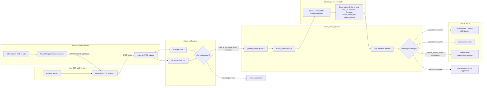
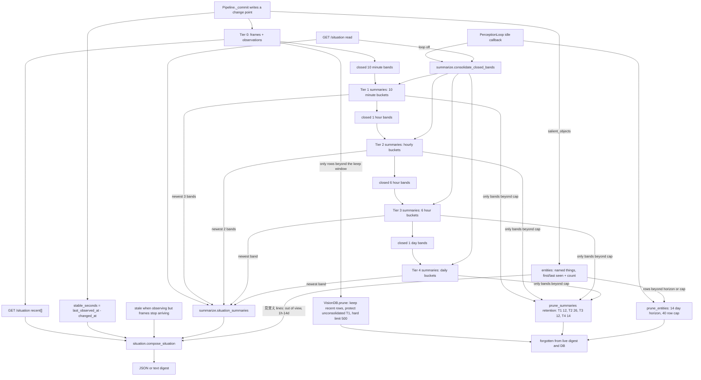
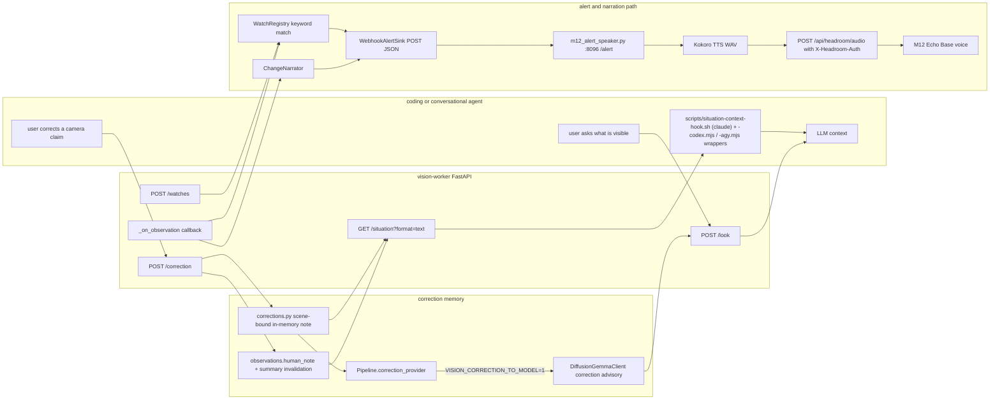

# AtomS3R-M12 Vision Guide

[English](#english) | [日本語](#japanese)

This guide explains the AtomS3R-M12 vision subsystem: a small ambient scene
memory that local coding agents and the conversational LLM can query. The M12
camera provides frames, `vision-worker` turns changed scenes into structured
records with diffusiongemma, SQLite stores the short-term memory, and
`GET /situation` exposes a cheap digest for agents.

## English

### What The Subsystem Does

The M12 vision path is designed for ambient situational awareness, not high-risk
automation. It lets an agent answer what the camera sees now, how long that view
has been stable, what changed recently, which remembered things it could call
back to (`見覚え` entities), whether a keyword watch fired, and whether a user
correction is active.

The worker is split into low-cost layers: `NetworkCaptureSource` pulls JPEGs,
`ChangeGate` avoids unnecessary model calls, `Pipeline` reconciles structured
model observations, `VisionDB` and `FrameStore` persist tier-0 memory,
`summarize.py` builds older-history summaries, and `situation.py` renders the
digest that agents read.

The M12 lens is useful for scenes, objects, and large text. It is not a document
scanner. Fine print, homework pages, dense screens, and small labels should go
through a phone-camera or direct image path instead.

### Perception Flow

This is the live frame-to-record path used by the continuous perception loop and
by stored on-demand looks. The key point is that the cheap gate runs before the
heavy model, while the model's own `changed` verdict is still the authority for
whether a committed row represents a meaningful scene change.

Implementation notes: `run-vision-stack.sh` resolves `VISION_CAMERA_URL` to
`<m12-base>/snapshot`; `NetworkCaptureSource` sends `X-Headroom-Auth` from
`VISION_CAMERA_AUTH_TOKEN` or `MH_FACE_AUTH_TOKEN`; `ChangeGate.is_changed()`
combines average-hash Hamming distance with downscaled pixel diff; and
`Pipeline._commit()` writes the original frame plus the observation row before
firing alert/narration callbacks. The model prompt passes only previous text,
not the previous image, so every diffusiongemma call does one image prefill.

### Memory Lifecycle And Forgetting

The worker keeps three related memories:

- Tier 0: raw change records plus frame paths.
- Tiers 1-4: cached text summaries of closed time buckets.
- Entities: a small callback index of named things (`salient_objects` from the
  vision model, never people), one row per exact name with first/last seen and
  a count. `/situation` returns them as `entities`, and the text digest renders
  up to two `見覚え:` lines about things seen 1 hour to 14 days ago that are
  not in the current view — material for natural conversational callbacks.

Recent events stay verbatim. Older events are summarized into coarser buckets.
Forgetting is explicit: old observations are pruned after they are safe to
summarize, each summary tier has a retention cap, and entities expire 14 days
after they were last seen (40-row cap).

Tier 0 is the SQLite `frames` table plus `observations` table in `db.py`;
`observations.human_note` can hold a correction stamped onto a past record.
Tier 1 summarizes raw observations in closed 10 minute buckets, tier 2
summarizes tier 1 into hourly buckets, tier 3 summarizes tier 2 into 6 hour
buckets, and tier 4 summarizes tier 3 into daily buckets. `/situation` includes
recent raw changes and the newest populated summary bands: up to 3 tier-1
bands, 2 tier-2 bands, and 1 each for tiers 3 and 4.

LLM summaries are scheduled only while perception is not busy: when the loop
is running and the scene is idle, or whenever the loop is stopped (look-only
usage — `/situation` reads then take over the consolidation duty, since there
is no perception cadence to starve). Otherwise reads return an instant
extractive fallback. `stable_seconds` is confirmed stability: it
grows only from successful captures and stops being live when the camera goes
stale. The default raw change window is `VISION_MAX_CHANGES=50`, with protected
unconsolidated tier-1 rows and a hard limit of 500 rows. Summary retention is
`TIER_RETENTION`: tier 1 keeps 12, tier 2 keeps 26, tier 3 keeps 12, and tier 4
keeps 14, giving the coarsest tier roughly a two-week horizon.

### Consumption And Feedback

The memory is useful only when agents can consume it cheaply and humans can
correct it when it is wrong. The diagram shows the prompt hook, `POST /look`,
keyword watches, change narration, and the correction backchannel.

Key details: the hook is opt-in through `MH_SITUATION_INJECT=1`, stores the
`X-Situation-Watermark` header per session, and escalates from a one-line
presence header to a full block only after salient events. Claude Code runs
the shell hook directly (`UserPromptSubmit`); Codex wraps it in
`situation-context-hook-codex.mjs` (`hookSpecificOutput.additionalContext`);
Antigravity wraps it in `situation-context-hook-agy.mjs` (`PreInvocation` →
transient `ephemeralMessage`, watermark keyed by `MH_SITUATION_SESSION_KEY`
derived from the agy conversation id). `POST /look` captures
a fresh frame; default `store=1` sends it through the normal pipeline, while
`store=0` is ephemeral. Watches are keyword-only today; `kind="enum"` returns
501. `WatchRegistry.evaluate()` uses NFKC normalization and case folding over
overview, OCR, and change text.

`ChangeNarrator` skips low-confidence, baseline, no-change, and too-short lines.
`WebhookAlertSink` posts `{"text": ..., "watch": ...}` to the configured
webhook; the live stack uses `http://127.0.0.1:8096/alert`. The speaker bridge
then synthesizes Kokoro audio and sends WAV bytes to the M12
`/api/headroom/audio` endpoint with `X-Headroom-Auth`.

`POST /correction` is also exposed to agents as the MCP `vision_correct`
tool, so a chat correction can reach the memory without shell approvals.
It rejects requests before any scene exists. Active corrections
are in-memory and scene-bound: they retire on a committed scene change, hash
drift beyond `VISION_CORRECTION_HASH_DRIFT`, or `VISION_CORRECTION_TTL_S`.
The endpoint also stamps `observations.human_note` onto the anchored record and
invalidates summaries that contain it. With `VISION_CORRECTION_TO_MODEL=1`, the
freshest active correction becomes a separate "may be stale" advisory in the
diffusiongemma prompt.

### Ops Quick Reference

Use the reboot-safe stack launcher from the repository root:

    ./scripts/run-vision-stack.sh --check
    ./scripts/run-vision-stack.sh

`--check` starts nothing. It verifies the persistent env file, M12 discovery,
diffusiongemma health, the vision-worker health endpoint, and whether the M12
alert speaker port is already open. The launcher starts or reuses diffusiongemma
vLLM, `vision-worker`, and the M12 alert speaker bridge. It does not start
Voxtral or any ASR path; the operator stack owns ASR.

For live configuration and the environment-variable table, use
[vision-worker/README.md](../../vision-worker/README.md#key-environment-variables).
That README also has the full-stack smoke checklist and the `--check` notes.
For the default diffusiongemma/vLLM path, the Hugging Face model-card link, and
the JSON contract required when substituting another OpenAI-compatible vision
endpoint, see
[vision-worker/README.md](../../vision-worker/README.md#real-model-diffusiongemma-via-vllm).

Useful health probes after the stack starts:

    curl -s http://127.0.0.1:8095/healthz
    curl -s http://127.0.0.1:8095/situation
    curl -s -X POST http://127.0.0.1:8095/look

Keep the safety boundary visible in agent-facing behavior: this subsystem is
informational and assistive. It samples slowly and runs over the network, so it
must not be used for driving, street crossing, or other safety-critical alerts.

## 日本語

### このサブシステムがすること

M12 の視覚経路は、リスクの高い自動化ではなく、周囲状況をゆるく把握するための仕組みです。カメラが今何を見ているか、その見え方がどれくらい安定しているか、最近何が変わったか、キーワード監視が反応したか、ユーザーの訂正が有効かをエージェントが答えられるようにします。

ワーカーは低コストな層に分かれています。`NetworkCaptureSource` が JPEG を取得し、`ChangeGate` が不要なモデル呼び出しを避け、`Pipeline` がモデルの構造化された観測結果を整合し、`VisionDB` と `FrameStore` が第 0 層の記憶を保存します。古い履歴の要約は `summarize.py` が作り、エージェントが読む状況要約は `situation.py` が描画します。

M12 のレンズは、場面、物体、大きな文字を見る用途に向いています。文書スキャナーではありません。細かい印字、宿題の紙面、密な画面、小さなラベルは、スマホカメラや画像を直接渡す経路を使ってください。

### 認識の流れ

図は英語セクションの Mermaid 図「Perception Flow」を参照してください。

この図は、継続認識ループと保存対象のオンデマンド観察が使う、ライブフレームから記録までの経路を示しています。重要なのは、重いモデルの前に安価な判定ゲートが動く一方で、保存される行が意味のある場面変化を表すかどうかの最終判断は、モデル自身の `changed` 判定が持つことです。

実装メモ: `run-vision-stack.sh` は `VISION_CAMERA_URL` を `<m12-base>/snapshot` に解決します。`NetworkCaptureSource` は `VISION_CAMERA_AUTH_TOKEN` または `MH_FACE_AUTH_TOKEN` から `X-Headroom-Auth` を送り、`ChangeGate.is_changed()` は平均ハッシュのハミング距離と縮小画像の画素差分を組み合わせます。`Pipeline._commit()` は元フレームと観測行を保存してから、警告と読み上げのコールバックを発火します。モデルプロンプトに渡すのは前回のテキストだけで、前回画像は渡しません。そのため diffusiongemma 呼び出しは毎回 1 回の画像入力処理を行います。

### 記憶のライフサイクルと忘却

図は英語セクションの Mermaid 図「Memory Lifecycle And Forgetting」を参照してください。

ワーカーは 3 種類の関連する記憶を持ちます。

- 第 0 層: 生の変化記録とフレームの保存先。
- 第 1-4 層: 閉じた時間区間ごとのキャッシュ済みテキスト要約。
- エンティティ: 名前の付いた物のコールバック索引です。視覚モデルが返す `salient_objects`（目立つ物。人は含めません）を名前ごとに 1 行で保存し、初回・最終確認時刻と回数を持ちます。`/situation` は `entities` として返し、テキスト要約には「1 時間〜14 日前に見た・今は視界にない物」を最大 2 行の `見覚え:` 行として描画します。会話で自然に話を戻すための素材です。

最近の出来事はそのまま残します。古い出来事は、より粗い時間区間へ要約します。忘却は明示的に行われます。古い観測は要約済みになってから削除され、要約層ごとに保持上限があり、エンティティは最終確認から 14 日で失効します（上限 40 行）。

第 0 層は `db.py` 内の SQLite `frames` テーブルと `observations` テーブルです。`observations.human_note` には、過去の記録へ紐づけた訂正を保持できます。第 1 層は生の観測を閉じた 10 分区間へ要約し、第 2 層は第 1 層を 1 時間区間へ、第 3 層は第 2 層を 6 時間区間へ、第 4 層は第 3 層を 1 日区間へ要約します。`/situation` には、最近の生の変化と、内容がある最新の要約区間が入ります。第 1 層は最大 3 区間、第 2 層は最大 2 区間、第 3 層と第 4 層は各 1 区間です。

LLM による要約は、認識処理が忙しくないときだけ予約されます。具体的には、ループ稼働中で場面が待機状態のとき、またはループが停止しているとき（単発観察だけの使い方では `/situation` の読み取りが統合役を引き継ぎます。奪い合う認識処理が存在しないためです）。それ以外のとき、読み取りは即時に作れる抽出的な代替要約を返します。`stable_seconds` は確認済みの安定時間です。成功した取得からだけ増え、カメラが古い状態になると現在値ではなくなります。生の変化を残す既定件数は `VISION_MAX_CHANGES=50` で、未統合の第 1 層行は保護され、強制上限は 500 行です。要約の保持数は `TIER_RETENTION` で、第 1 層が 12、第 2 層が 26、第 3 層が 12、第 4 層が 14 を保持し、最も粗い層ではおおむね 2 週間を見渡せます。

### 利用とフィードバック

図は英語セクションの Mermaid 図「Consumption And Feedback」を参照してください。

この記憶が役立つのは、エージェントが低コストで利用でき、人間が誤りを訂正できる場合だけです。英語版の図は、プロンプト投入時フック、`POST /look`、キーワード監視、変化の読み上げ、訂正の戻し経路を示しています。

重要な点: フックは `MH_SITUATION_INJECT=1` で明示的に有効化し、セッションごとに `X-Situation-Watermark` ヘッダーを保存します。目立つ出来事があるまでは 1 行の存在通知に留め、必要になってから完全なブロックへ拡張します。Claude Code はシェルフックを直接 `UserPromptSubmit` で実行し、Codex は `situation-context-hook-codex.mjs`（`additionalContext`）、Antigravity は `situation-context-hook-agy.mjs`（`PreInvocation` → 一時的な `ephemeralMessage`、watermark キーは会話 ID 由来の `MH_SITUATION_SESSION_KEY`）でラップします。`POST /look` は新しいフレームを取得します。既定の `store=1` は通常の処理経路に通し、`store=0` は一時的な観察だけを行います。監視は現在キーワードのみで、`kind="enum"` は 501 を返します。`WatchRegistry.evaluate()` は概要、OCR、変化テキストに対して NFKC 正規化と大文字小文字の統一を使います。

`ChangeNarrator` は、信頼度が低い行、初回基準行、変化なしの行、短すぎる行を読み飛ばします。`WebhookAlertSink` は `{"text": ..., "watch": ...}` を設定済み Webhook へ POST します。実行中のスタックは `http://127.0.0.1:8096/alert` を使います。その後、スピーカーブリッジが Kokoro 音声を合成し、WAV バイト列を M12 の `/api/headroom/audio` エンドポイントへ `X-Headroom-Auth` 付きで送ります。

`POST /correction` は MCP ツール `vision_correct` としてもエージェントに公開されており、会話中の訂正をシェル承認なしで記憶へ届けられます。まだ場面が存在しない場合はリクエストを拒否します。有効な訂正はメモリ上にあり、特定の場面に紐づきます。保存済みの場面変化、`VISION_CORRECTION_HASH_DRIFT` を超えるハッシュのずれ、または `VISION_CORRECTION_TTL_S` によって失効します。このエンドポイントは、基準となる記録の `observations.human_note` にも訂正を書き込み、それを含む要約を無効化します。`VISION_CORRECTION_TO_MODEL=1` の場合、最も新しい有効な訂正は、diffusiongemma プロンプト内で別個の「古い可能性がある」助言として渡されます。

### 運用クイックリファレンス

リポジトリのルートから、再起動しても安全なスタック起動スクリプトを使います。

    ./scripts/run-vision-stack.sh --check
    ./scripts/run-vision-stack.sh

`--check` は何も起動しません。永続環境変数ファイル、M12 の発見、diffusiongemma の状態、vision-worker のヘルス確認用エンドポイント、M12 警告スピーカーのポートがすでに開いているかを確認します。起動スクリプトは diffusiongemma vLLM、`vision-worker`、M12 警告スピーカーブリッジを起動または再利用します。Voxtral や ASR 経路は起動しません。ASR はオペレータースタックが担当します。

ライブ設定と環境変数表は [vision-worker/README.md](../../vision-worker/README.md#key-environment-variables) を参照してください。この README には、スタック全体の簡易動作確認チェックリストと `--check` の注記もあります。
標準の diffusiongemma/vLLM 経路、Hugging Face モデルカードへのリンク、別の OpenAI 互換視覚エンドポイントへ差し替える場合に必要な JSON 契約は [vision-worker/README.md](../../vision-worker/README.md#real-model-diffusiongemma-via-vllm) にまとめています。

スタック起動後に役立つヘルス確認:

    curl -s http://127.0.0.1:8095/healthz
    curl -s http://127.0.0.1:8095/situation
    curl -s -X POST http://127.0.0.1:8095/look

エージェント向けの振る舞いでは、安全上の境界を見える形に保ってください。このサブシステムは情報提供と補助のためのものです。低頻度でサンプリングし、ネットワーク越しに動くため、運転、道路横断、その他の安全上重要な警告には使ってはいけません。
